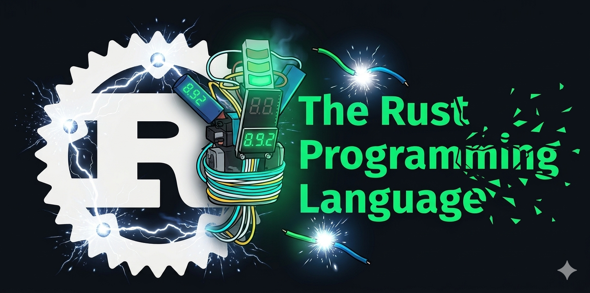

> Fork of [rust-lang/rust](https://github.com/rust-lang/rust). See the [original README](https://github.com/rust-lang/rust/blob/master/README.md).

<div align="center">
  
</div>

# Overloadable Short-Circuiting Operators for Rust

This public fork `rust-lang/rust` adds a `Decisive` trait to `core::ops`, enabling user-defined types to participate in short-circuiting `&&` and `||` expressions. The mechanism is general-purpose (three-valued logic, fuzzy logic, option types, etc.).

The key change is at [7a510a6](https://github.com/eelstork/rust/commit/7a510a641535e0c1c5acc7dfef41e04b4df9ada5)

## Community dicussions

Making `&&` and `||` overloadable has been discussed several times within the Rust ecosystem:

- **[rust-lang/libs-team #144](https://github.com/rust-lang/libs-team/issues/144)** — *Traits for short-circuiting `||` and `&&`*, proposing `And` and `Or` traits using `ControlFlow` for the short-circuit decision. Originally suggested by @scottmcm on Zulip.
- **[rust-lang/rfcs #2722](https://github.com/rust-lang/rfcs/pull/2722)** — @Nokel81's RFC proposing `LogicalOr` and `LogicalAnd` traits with a `ShortCircuit` enum.
- **[Rust Internals: Pre-RFC (2019)](https://internals.rust-lang.org/t/pre-rfc-overload-short-curcuits/10460)** — Early discussion exploring `BoolOr`/`BoolAnd` trait shapes and whether "truthiness" should be a separate trait.
- **[Rust Internals: A different way to override `||` and `&&` (2021)](https://internals.rust-lang.org/t/a-different-way-to-override-and/14627)** — Follow-up reacting to RFC 2722's design.

Rust's own `std::ops` documentation [acknowledges the gap](https://doc.rust-lang.org/std/ops/index.html): `&&` and `||` are not currently overloadable because their short-circuiting semantics don't fit the standard trait-as-function-call model.

This fork takes a simpler approach than those proposals — a single `Decisive` trait with `is_true()` / `is_false()` methods, combined with existing `BitAnd` / `BitOr` — closer to how C# solves the same problem via `operator true`, `operator false`, `operator &`, and `operator |`.

## Re: Classic Behavior Trees and Correctness

The design implemented here enables stateless behavior trees via Active Logic, convergent with Colledanchise and Ögren in [*Behavior Trees in Robotics and AI: An Introduction*](https://arxiv.org/abs/1709.00084) (CRC Press, 2018). The central argument is that BTs derive their formal properties — reactivity, modularity, and analyzability for safety and liveness — from re-evaluating the tree from the root at every tick. Nodes that cache a "running" status and expect to be resumed introduce stale state, which undermines exactly the reactive guarantees that motivated adopting BTs over finite state machines.

Many popular BT implementations (Unreal's BT system, BehaviorTree.CPP, Unity Behavior) lean on persistent running state and blackboards. These are practical choices for specific domains, but they trade away the formal properties that Colledanchise and Ögren analyze. This fork targets the stateless end of the spectrum.

## What Changed

The `Decisive` trait is gated behind `#![feature(decisive_trait)]`. The change touches 18 files:

**Library:**

- `library/core/src/ops/decisive.rs` — The `Decisive` trait with `is_true()` and `is_false()` methods, plus `impl Decisive for bool`.

**Compiler:**

- `rustc_hir_typeck/src/op.rs` — When `&&`/`||` operands aren't `bool`, the type checker now accepts types implementing `Decisive + BitAnd` / `Decisive + BitOr`.
- `rustc_middle/src/thir.rs` — New `OverloadedLogicalOp` variant in the THIR.
- `rustc_mir_build/src/builder/expr/into.rs` — MIR lowering desugars to: evaluate LHS → call `is_false` / `is_true` → branch → short-circuit (return LHS) or continue (`BitAnd::bitand` / `BitOr::bitor`).

**Tests:**

- New `decisive-trait.rs` test passes — verifies short-circuiting, chaining, and `bool` backward compatibility.
- All 56 existing `binop/` tests pass.
- All 44 existing `overloaded/` tests pass.

## Desugaring

```rust
// a && b  desugars to:
{
    let lhs = a;
    if Decisive::is_false(&lhs) { lhs } else { BitAnd::bitand(lhs, b) }
}

// a || b  desugars to:
{
    let lhs = a;
    if Decisive::is_true(&lhs) { lhs } else { BitOr::bitor(lhs, b) }
}
```

For `bool`, this is a no-op — `Decisive` for `bool` is trivially `is_true = *self`, `is_false = !*self`, and `bool` already implements `BitAnd` and `BitOr`.

## Usage

```rust
#![feature(decisive_trait)]
use std::ops::{BitAnd, BitOr, Decisive};

#[derive(Clone, Copy, PartialEq)]
struct Status(i8);

const DONE: Status = Status(1);
const CONT: Status = Status(0);
const FAIL: Status = Status(-1);

impl Decisive for Status {
    fn is_true(&self) -> bool  { self.0 != -1 }  // not failing → short-circuits ||
    fn is_false(&self) -> bool { self.0 != 1 }   // not complete → short-circuits &&
}

impl BitAnd for Status {
    type Output = Status;
    fn bitand(self, rhs: Status) -> Status { rhs }
}

impl BitOr for Status {
    type Output = Status;
    fn bitor(self, rhs: Status) -> Status { rhs }
}

// Sequence — short-circuits on first non-complete:
fn brew_coffee(&mut self) -> Status {
    self.pour_water()
        && self.heat_kettle()
        && self.pour_grounds()
        && self.wait_for_boil()
        && self.pour_hot_water()
}

// Selector — short-circuits on first non-failing:
fn find_drink(&mut self) -> Status {
    self.try_coffee() || self.try_tea() || self.try_water()
}
```

## Why Not Alternatives

| Approach | Problem |
|---|---|
| `&` / `\|` operators | No short-circuiting — both sides always evaluate |
| Macros `seq!(a, b, c)` | Not native syntax, poor composability |
| Method chaining `.and_then()` | Verbose, requires closures |
| `?` operator via custom `Try` | Early-return semantics, not expression-level short-circuiting |

## References

- Colledanchise, M. and Ögren, P. (2018). *Behavior Trees in Robotics and AI: An Introduction*. CRC Press. [arXiv:1709.00084](https://arxiv.org/abs/1709.00084)
- [Active Logic (C#)](https://github.com/active-logic/activelogic-cs) — The original C# implementation leveraging `operator true` / `operator false`.
- [BehaviorTrees reference implementation](https://github.com/eelstork/BehaviorTrees) — Minimal stateless BTs in C#.
