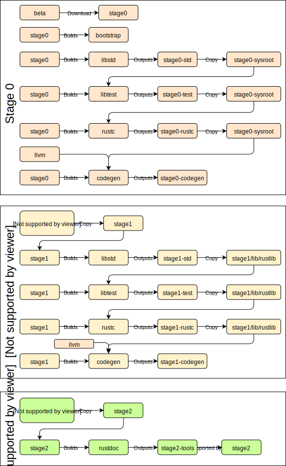

# Bootstrapping the Compiler

This subchapter is about the bootstrapping process.

When running `x.py` you will see output such as:

```txt
Building stage0 std artifacts
Copying stage0 std from stage0
Building stage0 compiler artifacts
Copying stage0 rustc from stage0
Building LLVM for x86_64-apple-darwin
Building stage0 codegen artifacts
Assembling stage1 compiler
Building stage1 std artifacts
Copying stage1 std from stage1
Building stage1 compiler artifacts
Copying stage1 rustc from stage1
Building stage1 codegen artifacts
Assembling stage2 compiler
Uplifting stage1 std
Copying stage2 std from stage1
Generating unstable book md files
Building stage0 tool unstable-book-gen
Building stage0 tool rustbook
Documenting standalone
Building rustdoc for stage2
Documenting book redirect pages
Documenting stage2 std
Building rustdoc for stage1
Documenting stage2 whitelisted compiler
Documenting stage2 compiler
Documenting stage2 rustdoc
Documenting error index
Uplifting stage1 rustc
Copying stage2 rustc from stage1
Building stage2 tool error_index_generator
```

A deeper look into `x.py`'s phases can be seen here:



Keep in mind this diagram is a simplification, i.e. `rustdoc` can be built at
different stages, the process is a bit different when passing flags such as
`--keep-stage`, or if there are non-host targets.

The following tables indicate the outputs of various stage actions:

| Stage 0 Action                                            | Output                                       |
|-----------------------------------------------------------|----------------------------------------------|
| `beta` extracted                                          | `build/HOST/stage0`                          |
| `stage0` builds `bootstrap`                               | `build/bootstrap`                            |
| `stage0` builds `libstd`                                  | `build/HOST/stage0-std/TARGET`               |
| copy `stage0-std` (HOST only)                             | `build/HOST/stage0-sysroot/lib/rustlib/HOST` |
| `stage0` builds `rustc` with `stage0-sysroot`             | `build/HOST/stage0-rustc/HOST`               |
| copy `stage0-rustc (except executable)`                   | `build/HOST/stage0-sysroot/lib/rustlib/HOST` |
| build `llvm`                                              | `build/HOST/llvm`                            |
| `stage0` builds `codegen` with `stage0-sysroot`           | `build/HOST/stage0-codegen/HOST`             |
| `stage0` builds `rustdoc` with `stage0-sysroot`           | `build/HOST/stage0-tools/HOST`               |

`--stage=0` stops here.

| Stage 1 Action                                      | Output                                |
|-----------------------------------------------------|---------------------------------------|
| copy (uplift) `stage0-rustc` executable to `stage1` | `build/HOST/stage1/bin`               |
| copy (uplift) `stage0-codegen` to `stage1`          | `build/HOST/stage1/lib`               |
| copy (uplift) `stage0-sysroot` to `stage1`          | `build/HOST/stage1/lib`               |
| `stage1` builds `libstd`                            | `build/HOST/stage1-std/TARGET`        |
| copy `stage1-std` (HOST only)                       | `build/HOST/stage1/lib/rustlib/HOST`  |
| `stage1` builds `rustc`                             | `build/HOST/stage1-rustc/HOST`        |
| copy `stage1-rustc` (except executable)             | `build/HOST/stage1/lib/rustlib/HOST`  |
| `stage1` builds `codegen`                           | `build/HOST/stage1-codegen/HOST`      |

`--stage=1` stops here.

| Stage 2 Action                            | Output                                                          |
|-------------------------------------------|-----------------------------------------------------------------|
| copy (uplift) `stage1-rustc` executable   | `build/HOST/stage2/bin`                                         |
| copy (uplift) `stage1-sysroot`            | `build/HOST/stage2/lib and build/HOST/stage2/lib/rustlib/HOST`  |
| `stage2` builds `libstd` (except HOST?)   | `build/HOST/stage2-std/TARGET`                                  |
| copy `stage2-std` (not HOST targets)      | `build/HOST/stage2/lib/rustlib/TARGET`                          |
| `stage2` builds `rustdoc`                 | `build/HOST/stage2-tools/HOST`                                  |
| copy `rustdoc`                            | `build/HOST/stage2/bin`                                         |

`--stage=2` stops here.

Note that the convention `x.py` uses is that:
- A "stage N artifact" is an artifact that is _produced_ by the stage N compiler.
- The "stage (N+1) compiler" is assembled from "stage N artifacts".
- A `--stage N` flag means build _with_ stage N.

In short, _stage 0 uses the stage0 compiler to create stage0 artifacts which
will later be uplifted to stage1_.

Every time any of the main artifacts (`std` and `rustc`) are compiled, two
steps are performed.
When `std` is compiled by a stage N compiler, that `std` will be linked to
programs built by the stage N compiler (including `rustc` built later
on). It will also be used by the stage (N+1) compiler to link against itself.
This is somewhat intuitive if one thinks of the stage (N+1) compiler as "just"
another program we are building with the stage N compiler. In some ways, `rustc`
(the binary, not the `rustbuild` step) could be thought of as one of the few
`no_core` binaries out there.

So "stage0 std artifacts" are in fact the output of the downloaded stage0
compiler, and are going to be used for anything built by the stage0 compiler:
e.g. `rustc` artifacts. When it announces that it is "building stage1
std artifacts" it has moved on to the next bootstrapping phase. This pattern
continues in latter stages.

Also note that building host `std` and target `std` are different based on the
stage (e.g. see in the table how stage2 only builds non-host `std` targets.
This is because during stage2, the host `std` is uplifted from the "stage 1"
`std` -- specifically, when "Building stage 1 artifacts" is announced, it is
later copied into stage2 as well (both the compiler's `libdir` and the
`sysroot`).

This `std` is pretty much necessary for any useful work with the compiler.
Specifically, it's used as the `std` for programs compiled by the newly compiled
compiler (so when you compile `fn main() { }` it is linked to the last `std`
compiled with `x.py build --stage 1 src/libstd`).

The `rustc` generated by the stage0 compiler is linked to the freshly-built
`libstd`, which means that for the most part only `std` needs to be cfg-gated,
so that `rustc` can use featured added to std immediately after their addition,
without need for them to get into the downloaded beta. The `libstd` built by the
`stage1/bin/rustc` compiler, also known as "stage1 std artifacts", is not
necessarily ABI-compatible with that compiler.
That is, the `rustc` binary most likely could not use this `std` itself.
It is however ABI-compatible with any programs that the `stage1/bin/rustc`
binary builds (including itself), so in that sense they're paired.

This is also where `--keep-stage 1 src/libstd` comes into play. Since most
changes to the compiler don't actually change the ABI, once you've produced a
`libstd` in stage 1, you can probably just reuse it with a different compiler.
If the ABI hasn't changed, you're good to go, no need to spend the time
recompiling that `std`.
`--keep-stage` simply assumes the previous compile is fine and copies those
artifacts into the appropriate place, skipping the cargo invocation.

The reason we first build `std`, then `rustc`, is largely just
because we want to minimize `cfg(stage0)` in the code for `rustc`.
Currently `rustc` is always linked against a "new" `std` so it doesn't
ever need to be concerned with differences in std; it can assume that the std is
as fresh as possible.

The reason we need to build it twice is because of ABI compatibility.
The beta compiler has it's own ABI, and then the `stage1/bin/rustc` compiler
will produce programs/libraries with the new ABI.
We used to build three times, but because we assume that the ABI is constant
within a codebase, we presume that the libraries produced by the "stage2"
compiler (produced by the `stage1/bin/rustc` compiler) is ABI-compatible with
the `stage1/bin/rustc` compiler's produced libraries.
What this means is that we can skip that final compilation -- and simply use the
same libraries as the `stage2/bin/rustc` compiler uses itself for programs it
links against.

This `stage2/bin/rustc` compiler is shipped to end-users, along with the
`stage 1 {std,rustc}` artifacts.

## Environment Variables

During bootstrapping, there are a bunch of compiler-internal environment
variables that are used. If you are trying to run an intermediate version of
`rustc`, sometimes you may need to set some of these environment variables
manually. Otherwise, you get an error like the following:

```text
thread 'main' panicked at 'RUSTC_STAGE was not set: NotPresent', src/libcore/result.rs:1165:5
```

If `./stageN/bin/rustc` gives an error about environment variables, that
usually means something is quite wrong -- or you're trying to compile e.g.
`librustc` or `libstd` or something that depends on environment variables. In
the unlikely case that you actually need to invoke rustc in such a situation,
you can find the environment variable values by adding the following flag to
your `x.py` command: `--on-fail=print-env`.
