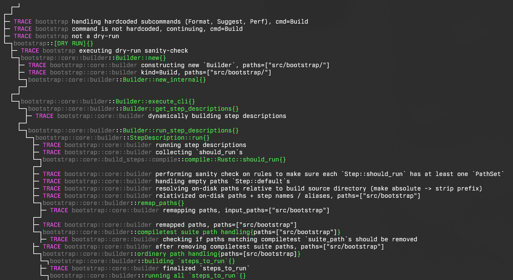

# Debugging bootstrap

> FIXME: this page could be expanded 

## `tracing` in bootstrap

Bootstrap has conditional [`tracing`][tracing] setup to provide structured logging.

[tracing]: https://docs.rs/tracing/0.1.41/tracing/index.html

### Enabling `tracing` output

Bootstrap will conditionally enable `tracing` output if the `BOOTSTRAP_TRACING` env var is set.

Example usage:

```bash
$ BOOTSTRAP_TRACING=TRACE ./x build library --stage 1
```

Example output[^experimental]:



[^experimental]: This shows what's *possible* with the infra in an experimental implementation.

The env var `BOOTSTRAP_TRACING` accepts a [`tracing` env-filter][tracing-env-filter]. The `TRACE` filter will enable *all* `trace` level or less verbose level tracing output.

[tracing-env-filter]: https://docs.rs/tracing-subscriber/0.3.19/tracing_subscriber/filter/struct.EnvFilter.html

### Using `tracing` in bootstrap

Both `tracing::*` macros and the `tracing::instrument` proc-macro attribute need to be gated behind `tracing` feature. Examples:

```rs
#[cfg(feature = "tracing")]
use tracing::{instrument, trace};

struct Foo;

impl Step for Foo {
    type Output = ();

    #[cfg_attr(feature = "tracing", instrument(level = "trace", name = "Foo::should_run", skip_all))]
    fn should_run(run: ShouldRun<'_>) -> ShouldRun<'_> {
        #[cfg(feature = "tracing")]
        trace!(?run, "entered Foo::should_run");

        todo!()
    }

    #[cfg_attr(
        feature = "tracing",
        instrument(
            level = "trace",
            name = "Foo::run",
            skip_all,
            fields(compiler = ?builder.compiler),
        ),
    )]
    fn run(self, builder: &Builder<'_>) -> Self::Output {
        #[cfg(feature = "tracing")]
        trace!(?run, "entered Foo::run");

        todo!()
    }    
}
```

For `#[instrument]`, it's recommended to:

- Gate it behind `trace` level for fine-granularity, possibly `debug` level for core functions.
- Explicitly pick an instrumentation name via `name = ".."` to distinguish between e.g. `run` of different steps.
- Take care to not cause diverging behavior via tracing, e.g. building extra things only when tracing infra is enabled.

### Enabling `tracing` bootstrap feature in rust-analyzer

You can adjust your `settings.json`'s `rust-analyzer.check.overrideCommand` and `rust-analyzer.cargo.buildScripts.overrideCommand` if you want to also enable `logging` cargo feature by default in your editor. This is mostly useful if you want proper r-a completions and such when working on bootstrap itself.

```json
"rust-analyzer.check.overrideCommand": [
    "BOOTSTRAP_TRACING=1", // <- BOOTSTRAP_TRACING=1 won't enable tracing filter, but it will activate bootstrap's `tracing` feature
    "python3",
    "x.py",
    "check",
    "--json-output",
    "--build-dir=build-rust-analyzer"
],
```

```json
"rust-analyzer.cargo.buildScripts.overrideCommand": [
    "BOOTSTRAP_TRACING=1", // <- note this
    "python3",
    "x.py",
    "check",
    "--json-output",
    "--build-dir=build-rust-analyzer"
],
```
