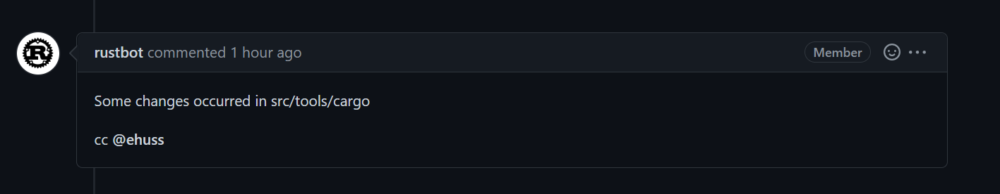
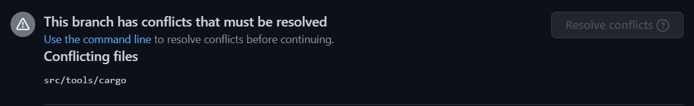
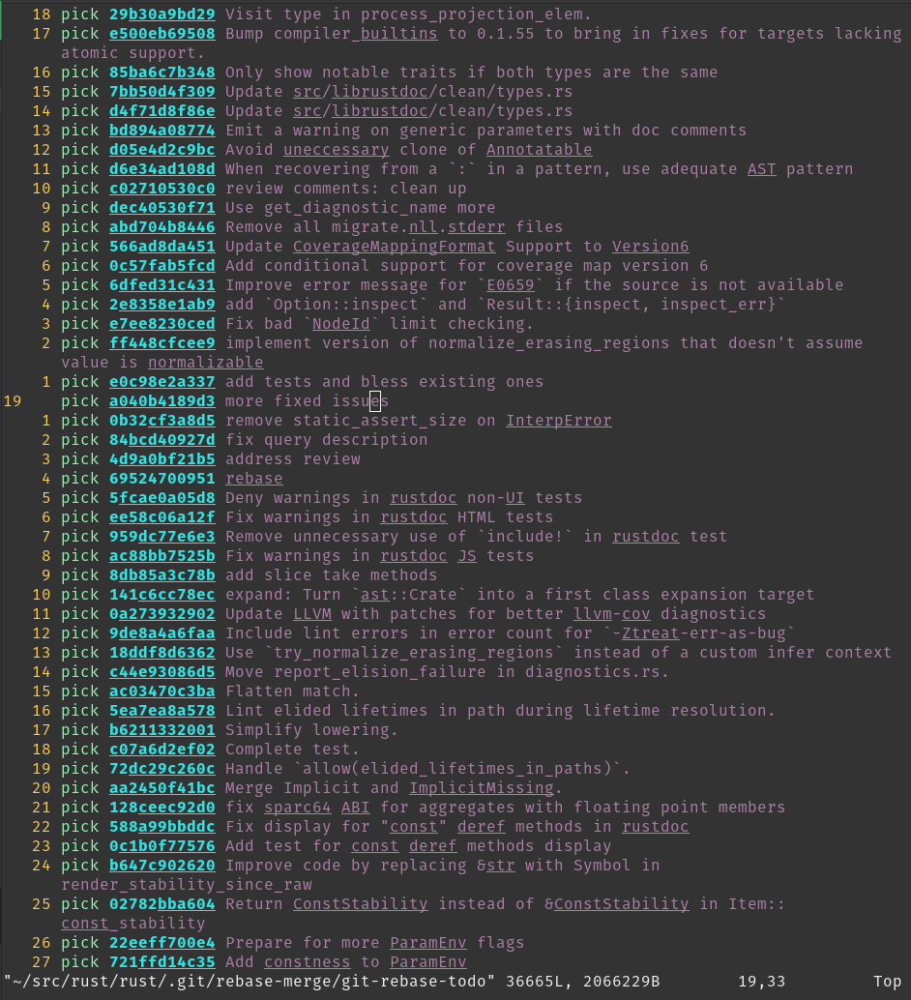
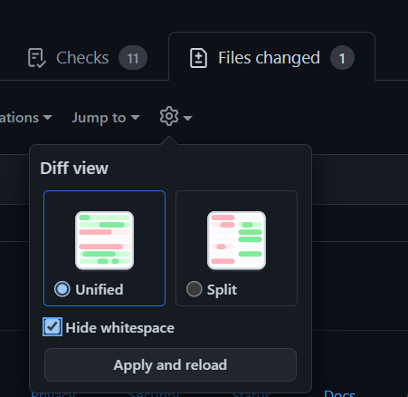

# Using Git

The Rust project uses [Git] to manage its source code. In order to
contribute, you'll need some familiarity with its features so that your changes
can be incorporated into the compiler.

[Git]: https://git-scm.com

The goal of this page is to cover some of the more common questions and
problems new contributors face. Although some Git basics will be covered here,
if you find that this is still a little too fast for you, it might make sense
to first read some introductions to Git, such as the Beginner and Getting
started sections of [this tutorial from Atlassian][atlassian-git]. GitHub also
provides [documentation] and [guides] for beginners, or you can consult the
more in depth [book from Git].

This guide is incomplete. If you run into trouble with git that this page doesn't help with,
please [open an issue] so we can document how to fix it.

[open an issue]: https://github.com/rust-lang/rustc-dev-guide/issues/new
[book from Git]: https://git-scm.com/book/en/v2/
[atlassian-git]: https://www.atlassian.com/git/tutorials/what-is-version-control
[documentation]: https://docs.github.com/en/get-started/quickstart/set-up-git
[guides]: https://guides.github.com/introduction/git-handbook/

## Prerequisites

We'll assume that you've installed Git, forked [rust-lang/rust], and cloned the
forked repo to your PC. We'll use the command line interface to interact
with Git; there are also a number of GUIs and IDE integrations that can
generally do the same things.

[rust-lang/rust]: https://github.com/rust-lang/rust

If you've cloned your fork, then you will be able to reference it with `origin`
in your local repo. It may be helpful to also set up a remote for the official
rust-lang/rust repo via

```console
git remote add upstream https://github.com/rust-lang/rust.git
```

if you're using HTTPS, or

```console
git remote add upstream git@github.com:rust-lang/rust.git
```

if you're using SSH.

**NOTE:** This page is dedicated to workflows for `rust-lang/rust`, but will likely be
useful when contributing to other repositories in the Rust project.


## Standard Process

Below is the normal procedure that you're likely to use for most minor changes
and PRs:

 1. Ensure that you're making your changes on top of master:
 `git checkout master`.
 2. Get the latest changes from the Rust repo: `git pull upstream master --ff-only`.
 (see [No-Merge Policy][no-merge-policy] for more info about this).
 3. Make a new branch for your change: `git checkout -b issue-12345-fix`.
 4. Make some changes to the repo and test them.
 5. Stage your changes via `git add src/changed/file.rs src/another/change.rs`
 and then commit them with `git commit`. Of course, making intermediate commits
 may be a good idea as well. Avoid `git add .`, as it makes it too easy to
 unintentionally commit changes that should not be committed, such as submodule
 updates. You can use `git status` to check if there are any files you forgot
 to stage.
 6. Push your changes to your fork: `git push --set-upstream origin issue-12345-fix`
 (After adding commits, you can use `git push` and after rebasing or
pulling-and-rebasing, you can use `git push --force-with-lease`).
 7. [Open a PR][ghpullrequest] from your fork to `rust-lang/rust`'s master branch.

[ghpullrequest]: https://guides.github.com/activities/forking/#making-a-pull-request

If you end up needing to rebase and are hitting conflicts, see [Rebasing](#rebasing).
If you want to track upstream while working on long-running feature/issue, see
[Keeping things up to date][no-merge-policy].

If your reviewer requests changes, the procedure for those changes looks much
the same, with some steps skipped:

 1. Ensure that you're making changes to the most recent version of your code:
 `git checkout issue-12345-fix`.
 2. Make, stage, and commit your additional changes just like before.
 3. Push those changes to your fork: `git push`.

 [no-merge-policy]: #keeping-things-up-to-date

## Troubleshooting git issues

You don't need to clone `rust-lang/rust` from scratch if it's out of date!
Even if you think you've messed it up beyond repair, there are ways to fix
the git state that don't require downloading the whole repository again.
Here are some common issues you might run into:

### I made a merge commit by accident.

Git has two ways to update your branch with the newest changes: merging and rebasing.
Rust [uses rebasing][no-merge-policy]. If you make a merge commit, it's not too hard to fix:
`git rebase -i upstream/master`.

See [Rebasing](#rebasing) for more about rebasing.

### I deleted my fork on GitHub!

This is not a problem from git's perspective. If you run `git remote -v`,
it will say something like this:

```console
$ git remote -v
origin  git@github.com:jyn514/rust.git (fetch)
origin  git@github.com:jyn514/rust.git (push)
upstream        https://github.com/rust-lang/rust (fetch)
upstream        https://github.com/rust-lang/rust (fetch)
```

If you renamed your fork, you can change the URL like this:

```console
git remote set-url origin <URL>
```

where the `<URL>` is your new fork.

### I changed a submodule by accident

Usually people notice this when rustbot posts a comment on github that `cargo` has been modified:



You might also notice conflicts in the web UI:



The most common cause is that you rebased after a change and ran `git add .` without first running
`x` to update the submodules.  Alternatively, you might have run `cargo fmt` instead of `x fmt`
and modified files in a submodule, then committed the changes.

To fix it, do the following things (if you changed a submodule other than cargo,
replace `src/tools/cargo` with the path to that submodule):

1. See which commit has the accidental changes: `git log --stat -n1 src/tools/cargo`
2. Revert the changes to that commit: `git checkout <my-commit>~ src/tools/cargo`. Type `~`
   literally but replace `<my-commit>` with the output from step 1.
3. Tell git to commit the changes: `git commit --fixup <my-commit>`
4. Repeat steps 1-3 for all the submodules you modified.
    - If you modified the submodule in several different commits, you will need to repeat steps 1-3
    for each commit you modified. You'll know when to stop when the `git log` command shows a commit
    that's not authored by you.
5. Squash your changes into the existing commits: `git rebase --autosquash -i upstream/master`
6. [Push your changes](#standard-process).

### I see "error: cannot rebase" when I try to rebase

These are two common errors to see when rebasing:
```console
error: cannot rebase: Your index contains uncommitted changes.
error: Please commit or stash them.
```
```console
error: cannot rebase: You have unstaged changes.
error: Please commit or stash them.
```

(See <https://git-scm.com/book/en/v2/Getting-Started-What-is-Git%3F#_the_three_states> for the difference between the two.)

This means you have made changes since the last time you made a commit. To be able to rebase, either
commit your changes, or make a temporary commit called a "stash" to have them still not be committed
when you finish rebasing. You may want to configure git to make this "stash" automatically, which
will prevent the "cannot rebase" error in nearly all cases:

```console
git config --global rebase.autostash true
```

See <https://git-scm.com/book/en/v2/Git-Tools-Stashing-and-Cleaning> for more info about stashing.

### I see 'Untracked Files: src/stdarch'?

This is left over from the move to the `library/` directory.
Unfortunately, `git rebase` does not follow renames for submodules, so you
have to delete the directory yourself:

```console
rm -r src/stdarch
```

### I see `<<< HEAD`?

You were probably in the middle of a rebase or merge conflict. See
[Conflicts](#rebasing-and-conflicts) for how to fix the conflict. If you don't care about the changes
and just want to get a clean copy of the repository back, you can use `git reset`:

```console
# WARNING: this throws out any local changes you've made! Consider resolving the conflicts instead.
git reset --hard master
```

### failed to push some refs

`git push` will not work properly and say something like this:

```console
 ! [rejected]        issue-xxxxx -> issue-xxxxx (non-fast-forward)
error: failed to push some refs to 'https://github.com/username/rust.git'
hint: Updates were rejected because the tip of your current branch is behind
hint: its remote counterpart. Integrate the remote changes (e.g.
hint: 'git pull ...') before pushing again.
hint: See the 'Note about fast-forwards' in 'git push --help' for details.
```

The advice this gives is incorrect! Because of Rust's
["no-merge" policy](#no-merge-policy) the merge commit created by `git pull`
will not be allowed in the final PR, in addition to defeating the point of the
rebase! Use `git push --force-with-lease` instead.

### Git is trying to rebase commits I didn't write?

If you see many commits in your rebase list, or merge commits, or commits by other people that you
didn't write, it likely means you're trying to rebase over the wrong branch. For example, you may
have a `rust-lang/rust` remote `upstream`, but ran `git rebase origin/master` instead of `git rebase
upstream/master`. The fix is to abort the rebase and use the correct branch instead:

```console
git rebase --abort
git rebase -i upstream/master
```

<details><summary>Click here to see an example of rebasing over the wrong branch</summary>



</details>

### Quick note about submodules

When updating your local repository with `git pull`, you may notice that sometimes
Git says you have modified some files that you have never edited. For example,
running `git status` gives you something like (note the `new commits` mention):

```console
On branch master
Your branch is up to date with 'origin/master'.

Changes not staged for commit:
  (use "git add <file>..." to update what will be committed)
  (use "git restore <file>..." to discard changes in working directory)
	modified:   src/llvm-project (new commits)
	modified:   src/tools/cargo (new commits)

no changes added to commit (use "git add" and/or "git commit -a")
```

These changes are not changes to files: they are changes to submodules (more on this [later](#git-submodules)).
To get rid of those:

```console
git submodule update
```

Some submodules are not actually needed; for example, `src/llvm-project` doesn't need to be checked
out if you're using `download-ci-llvm`.  To avoid having to keep fetching its history, you can use
`git submodule deinit -f src/llvm-project`, which will also avoid it showing as modified again.

## Rebasing and Conflicts

When you edit your code locally, you are making changes to the version of
rust-lang/rust that existed when you created your feature branch. As such, when
you submit your PR it is possible that some of the changes that have been made
to rust-lang/rust since then are in conflict with the changes you've made.
When this happens, you need to resolve the conflicts before your changes can be
merged. To do that, you need to rebase your work on top of rust-lang/rust.

### Rebasing

To rebase your feature branch on top of the newest version of the master branch
of rust-lang/rust, checkout your branch, and then run this command:

```console
git pull --rebase https://github.com/rust-lang/rust.git master
```

> If you are met with the following error:
> ```console
> error: cannot pull with rebase: Your index contains uncommitted changes.
> error: please commit or stash them.
> ```
> it means that you have some uncommitted work in your working tree. In that
> case, run `git stash` before rebasing, and then `git stash pop` after you
> have rebased and fixed all conflicts.

When you rebase a branch on master, all the changes on your branch are
reapplied to the most recent version of master. In other words, Git tries to
pretend that the changes you made to the old version of master were instead
made to the new version of master. During this process, you should expect to
encounter at least one "rebase conflict." This happens when Git's attempt to
reapply the changes fails because your changes conflicted with other changes
that have been made. You can tell that this happened because you'll see
lines in the output that look like

```console
CONFLICT (content): Merge conflict in file.rs
```

When you open these files, you'll see sections of the form

```console
<<<<<<< HEAD
Original code
=======
Your code
>>>>>>> 8fbf656... Commit fixes 12345
```

This represents the lines in the file that Git could not figure out how to
rebase. The section between `<<<<<<< HEAD` and `=======` has the code from
master, while the other side has your version of the code. You'll need to
decide how to deal with the conflict. You may want to keep your changes,
keep the changes on master, or combine the two.

Generally, resolving the conflict consists of two steps: First, fix the
particular conflict. Edit the file to make the changes you want and remove the
`<<<<<<<`, `=======` and `>>>>>>>` lines in the process. Second, check the
surrounding code. If there was a conflict, its likely there are some logical
errors lying around too! It's a good idea to run `x check` here to make sure
there are no glaring errors.

Once you're all done fixing the conflicts, you need to stage the files that had
conflicts in them via `git add`. Afterwards, run `git rebase --continue` to let
Git know that you've resolved the conflicts and it should finish the rebase.

Once the rebase has succeeded, you'll want to update the associated branch on
your fork with `git push --force-with-lease`.

### Keeping things up to date

The [above section](#rebasing) is a specific
guide on rebasing work and dealing with merge conflicts.
Here is some general advice about how to keep your local repo
up-to-date with upstream changes:

Using `git pull upstream master` while on your local master branch regularly
will keep it up-to-date. You will also want to keep your feature branches
up-to-date as well. After pulling, you can checkout the feature branches
and rebase them:

```console
git checkout master
git pull upstream master --ff-only # to make certain there are no merge commits
git rebase master feature_branch
git push --force-with-lease # (set origin to be the same as local)
```

To avoid merges as per the [No-Merge Policy](#no-merge-policy), you may want to use
`git config pull.ff only` (this will apply the config only to the local repo)
to ensure that Git doesn't create merge commits when `git pull`ing, without
needing to pass `--ff-only` or `--rebase` every time.

You can also `git push --force-with-lease` from master to double-check that your
feature branches are in sync with their state on the Github side.

## Advanced Rebasing

### Squash your commits

"Squashing" commits into each other causes them to be merged into a single
commit. Both the upside and downside of this is that it simplifies the history.
On the one hand, you lose track of the steps in which changes were made, but
the history becomes easier to work with.

If there are no conflicts and you are just squashing to clean up the history,
use `git rebase --interactive --keep-base master`. This keeps the fork point
of your PR the same, making it easier to review the diff of what happened
across your rebases.

Squashing can also be useful as part of conflict resolution.
If your branch contains multiple consecutive rewrites of the same code, or if
the rebase conflicts are extremely severe, you can use
`git rebase --interactive master` to gain more control over the process. This
allows you to choose to skip commits, edit the commits that you do not skip,
change the order in which they are applied, or "squash" them into each other.

Alternatively, you can sacrifice the commit history like this:

```console
# squash all the changes into one commit so you only have to worry about conflicts once
git rebase -i --keep-base master  # and squash all changes along the way
git rebase master
# fix all merge conflicts
git rebase --continue
```

You also may want to squash just the last few commits together, possibly
because they only represent "fixups" and not real changes. For example,
`git rebase --interactive HEAD~2` will allow you to edit the two commits only.

### `git range-diff`

After completing a rebase, and before pushing up your changes, you may want to
review the changes between your old branch and your new one. You can do that
with `git range-diff master @{upstream} HEAD`.

The first argument to `range-diff`, `master` in this case, is the base revision
that you're comparing your old and new branch against. The second argument is
the old version of your branch; in this case, `@upstream` means the version that
you've pushed to GitHub, which is the same as what people will see in your pull
request. Finally, the third argument to `range-diff` is the *new* version of
your branch; in this case, it is `HEAD`, which is the commit that is currently
checked-out in your local repo.

Note that you can also use the equivalent, abbreviated form `git range-diff
master @{u} HEAD`.

Unlike in regular Git diffs, you'll see a `-` or `+` next to another `-` or `+`
in the range-diff output. The marker on the left indicates a change between the
old branch and the new branch, and the marker on the right indicates a change
you've committed. So, you can think of a range-diff as a "diff of diffs" since
it shows you the differences between your old diff and your new diff.

Here's an example of `git range-diff` output (taken from [Git's
docs][range-diff-example-docs]):

```console
-:  ------- > 1:  0ddba11 Prepare for the inevitable!
1:  c0debee = 2:  cab005e Add a helpful message at the start
2:  f00dbal ! 3:  decafe1 Describe a bug
    @@ -1,3 +1,3 @@
     Author: A U Thor <author@example.com>

    -TODO: Describe a bug
    +Describe a bug
    @@ -324,5 +324,6
      This is expected.

    -+What is unexpected is that it will also crash.
    ++Unexpectedly, it also crashes. This is a bug, and the jury is
    ++still out there how to fix it best. See ticket #314 for details.

      Contact
3:  bedead < -:  ------- TO-UNDO
```

(Note that `git range-diff` output in your terminal will probably be easier to
read than in this example because it will have colors.)

Another feature of `git range-diff` is that, unlike `git diff`, it will also
diff commit messages. This feature can be useful when amending several commit
messages so you can make sure you changed the right parts.

`git range-diff` is a very useful command, but note that it can take some time
to get used to its output format. You may also find Git's documentation on the
command useful, especially their ["Examples" section][range-diff-example-docs].

[range-diff-example-docs]: https://git-scm.com/docs/git-range-diff#_examples

## No-Merge Policy

The rust-lang/rust repo uses what is known as a "rebase workflow." This means
that merge commits in PRs are not accepted. As a result, if you are running
`git merge` locally, chances are good that you should be rebasing instead. Of
course, this is not always true; if your merge will just be a fast-forward,
like the merges that `git pull` usually performs, then no merge commit is
created and you have nothing to worry about. Running `git config merge.ff only`
(this will apply the config to the local repo)
once will ensure that all the merges you perform are of this type, so that you
cannot make a mistake.

There are a number of reasons for this decision and like all others, it is a
tradeoff. The main advantage is the generally linear commit history. This
greatly simplifies bisecting and makes the history and commit log much easier
to follow and understand.

## Tips for reviewing

**NOTE**: This section is for *reviewing* PRs, not authoring them.

### Hiding whitespace

Github has a button for disabling whitespace changes that may be useful.
You can also use `git diff -w origin/master` to view changes locally.



### Fetching PRs

To checkout PRs locally, you can use `git fetch upstream pull/NNNNN/head && git checkout
FETCH_HEAD`.

You can also use github's cli tool. Github shows a button on PRs where you can copy-paste the
command to check it out locally. See <https://cli.github.com/> for more info.


### Moving large sections of code

Git and Github's default diff view for large moves *within* a file is quite poor; it will show each
line as deleted and each line as added, forcing you to compare each line yourself. Git has an option
to show moved lines in a different color:

```console
git log -p --color-moved=dimmed-zebra --color-moved-ws=allow-indentation-change
```

See [the docs for `--color-moved`](https://git-scm.com/docs/git-diff#Documentation/git-diff.txt---color-movedltmodegt) for more info.

### range-diff

See [the relevant section for PR authors](#git-range-diff). This can be useful for comparing code
that was force-pushed to make sure there are no unexpected changes.

### Ignoring changes to specific files

Many large files in the repo are autogenerated. To view a diff that ignores changes to those files,
you can use the following syntax (e.g. Cargo.lock):

```console
git log -p ':!Cargo.lock'
```

Arbitrary patterns are supported (e.g. `:!compiler/*`). Patterns use the same syntax as
`.gitignore`, with `:` prepended to indicate a pattern.

## Git submodules

**NOTE**: submodules are a nice thing to know about, but it *isn't* an absolute
prerequisite to contribute to `rustc`. If you are using Git for the first time,
you might want to get used to the main concepts of Git before reading this section.

The `rust-lang/rust` repository uses [Git submodules] as a way to use other
Rust projects from within the `rust` repo. Examples include Rust's fork of
`llvm-project`, `cargo`  and libraries like `stdarch` and `backtrace`.

Those projects are developed and maintained in an separate Git (and GitHub)
repository, and they have their own Git history/commits, issue tracker and PRs.
Submodules allow us to create some sort of embedded sub-repository inside the
`rust` repository and use them like they were directories in the `rust` repository.

Take `llvm-project` for example. `llvm-project` is maintained in the [`rust-lang/llvm-project`]
repository, but it is used in `rust-lang/rust` by the compiler for code generation and
optimization. We bring it in `rust` as a submodule, in the `src/llvm-project` folder.

The contents of submodules are ignored by Git: submodules are in some sense isolated
from the rest of the repository. However, if you try to `cd src/llvm-project` and then
run `git status`:

```console
HEAD detached at 9567f08afc943
nothing to commit, working tree clean
```

As far as git is concerned, you are no longer in the `rust` repo, but in the `llvm-project` repo.
You will notice that we are in "detached HEAD" state, i.e. not on a branch but on a
particular commit.

This is because, like any dependency, we want to be able to control which version to use.
Submodules allow us to do just that: every submodule is "pinned" to a certain
commit, which doesn't change unless modified manually. If you use `git checkout <commit>`
in the `llvm-project` directory and go back to the `rust` directory, you can stage this
change like any other, e.g. by running `git add src/llvm-project`. (Note that if
you *don't* stage the change to commit, then you run the risk that running
`x` will just undo your change by switching back to the previous commit when
it automatically "updates" the submodules.)

This version selection is usually done by the maintainers of the project, and
looks like [this][llvm-update].

Git submodules take some time to get used to, so don't worry if it isn't perfectly
clear yet. You will rarely have to use them directly and, again, you don't need
to know everything about submodules to contribute to Rust. Just know that they
exist and that they correspond to some sort of embedded subrepository dependency
that Git can nicely and fairly conveniently handle for us.

### Hard-resetting submodules

Sometimes you might run into (when you run `git status`)

```console
Changes not staged for commit:
  (use "git add <file>..." to update what will be committed)
  (use "git restore <file>..." to discard changes in working directory)
  (commit or discard the untracked or modified content in submodules)
        modified:   src/llvm-project (new commits, modified content)
```

and when you try to run `git submodule update` it breaks horribly with errors like

```console
error: RPC failed; curl 92 HTTP/2 stream 7 was not closed cleanly: CANCEL (err 8)
error: 2782 bytes of body are still expected
fetch-pack: unexpected disconnect while reading sideband packet
fatal: early EOF
fatal: fetch-pack: invalid index-pack output
fatal: Fetched in submodule path 'src/llvm-project', but it did not contain 5a5152f653959d14d68613a3a8a033fb65eec021. Direct fetching of that commit failed.
```

If you see `(new commits, modified content)` you can run

```console
git submodule foreach git reset --hard
```

and then try `git submodule update` again.

### Deinit git submodules

If that doesn't work, you can try to deinit all git submodules...

```console
git submodule deinit -f --all
```

Unfortunately sometimes your local git submodules configuration can become
completely messed up for some reason.

### Overcoming `fatal: not a git repository: <submodule>/../../.git/modules/<submodule>`

Sometimes, for some forsaken reason, you might run into

```console
fatal: not a git repository: src/gcc/../../.git/modules/src/gcc
```

In this situation, for the given submodule path, i.e. `<submodule_path> =
src/gcc` in this example, you need to:

1. `rm -rf <submodule_path>/.git`
2. `rm -rf .git/modules/<submodule_path>/config`
3. `rm -rf .gitconfig.lock` if somehow the `.gitconfig` lock is orphaned.

Then do something like `./x fmt` to have bootstrap manage the submodule
checkouts for you.

## Ignoring commits during `git blame`

Some commits contain large reformatting changes that don't otherwise change functionality. They can
be instructed to be ignored by `git blame` through
[`.git-blame-ignore-revs`](https://github.com/rust-lang/rust/blob/master/.git-blame-ignore-revs):

1. Configure `git blame` to use `.git-blame-ignore-revs` as the list of commits to ignore: `git
   config blame.ignorerevsfile .git-blame-ignore-revs`
2. Add suitable commits that you wish to be ignored by `git blame`.

Please include a comment for the commit that you add to `.git-blame-ignore-revs` so people can
easily figure out *why* a commit is ignored.

[Git submodules]: https://git-scm.com/book/en/v2/Git-Tools-Submodules
[`rust-lang/llvm-project`]: https://github.com/rust-lang/llvm-project
[llvm-update]: https://github.com/rust-lang/rust/pull/99464/files
