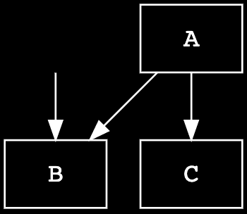

# LLVM Source-Based Code Coverage

<!-- toc -->

`rustc` supports detailed source-based code and test coverage analysis
with a command line option (`-C instrument-coverage`) that instruments Rust
libraries and binaries with additional instructions and data, at compile time.

The coverage instrumentation injects calls to the LLVM intrinsic instruction
[`llvm.instrprof.increment`][llvm-instrprof-increment] at code branches
(based on a MIR-based control flow analysis), and LLVM converts these to
instructions that increment static counters, when executed. The LLVM coverage
instrumentation also requires a [Coverage Map] that encodes source metadata,
mapping counter IDs--directly and indirectly--to the file locations (with
start and end line and column).

Rust libraries, with or without coverage instrumentation, can be linked into
instrumented binaries. When the program is executed and cleanly terminates,
LLVM libraries write the final counter values to a file (`default.profraw` or
a custom file set through environment variable `LLVM_PROFILE_FILE`).

Developers use existing LLVM coverage analysis tools to decode `.profraw`
files, with corresponding Coverage Maps (from matching binaries that produced
them), and generate various reports for analysis, for example:


<br/>

Detailed instructions and examples are documented in the
[rustc book][rustc-book-instrument-coverage].

[llvm-instrprof-increment]: https://llvm.org/docs/LangRef.html#llvm-instrprof-increment-intrinsic
[coverage map]: https://llvm.org/docs/CoverageMappingFormat.html
[rustc-book-instrument-coverage]: https://doc.rust-lang.org/nightly/rustc/instrument-coverage.html

## Rust symbol mangling

`-C instrument-coverage` automatically enables Rust symbol mangling `v0` (as
if the user specified `-C symbol-mangling-version=v0` option when invoking
`rustc`) to ensure consistent and reversible name mangling. This has two
important benefits:

1. LLVM coverage tools can analyze coverage over multiple runs, including some
   changes to source code; so mangled names must be consistent across compilations.
2. LLVM coverage reports can report coverage by function, and even separates
   out the coverage counts of each unique instantiation of a generic function,
   if invoked with multiple type substitution variations.

## Components of LLVM Coverage Instrumentation in `rustc`

### LLVM Runtime Dependency

Coverage data is only generated by running the executable Rust program. `rustc`
statically links coverage-instrumented binaries with LLVM runtime code
([compiler-rt][compiler-rt-profile]) that implements program hooks
(such as an `exit` hook) to write the counter values to the `.profraw` file.

In the `rustc` source tree,
`library/profiler_builtins` bundles the LLVM `compiler-rt` code into a Rust library crate.
Note that when building `rustc`,
`profiler_builtins` is only included when `build.profiler = true` is set in `config.toml`.

When compiling with `-C instrument-coverage`,
[`CrateLoader::postprocess()`][crate-loader-postprocess] dynamically loads
`profiler_builtins` by calling `inject_profiler_runtime()`.

[compiler-rt-profile]: https://github.com/llvm/llvm-project/tree/main/compiler-rt/lib/profile
[crate-loader-postprocess]: https://doc.rust-lang.org/nightly/nightly-rustc/rustc_metadata/creader/struct.CrateLoader.html#method.postprocess

### MIR Pass: `InstrumentCoverage`

Coverage instrumentation is performed on the MIR with a [MIR pass][mir-passes]
called [`InstrumentCoverage`][mir-instrument-coverage]. This MIR pass analyzes
the control flow graph (CFG)--represented by MIR `BasicBlock`s--to identify
code branches, attaches [`FunctionCoverageInfo`] to the function's body,
and injects additional [`Coverage`][coverage-statement] statements into the
`BasicBlock`s.

A MIR `Coverage` statement is a virtual instruction that indicates a counter
should be incremented when its adjacent statements are executed, to count
a span of code ([`CodeRegion`][code-region]). It counts the number of times a
branch is executed, and is referred to by coverage mappings in the function's
coverage-info struct.

Note that many coverage counters will _not_ be converted into
physical counters (or any other executable instructions) in the final binary.
Some of them will be (see [`CoverageKind::CounterIncrement`]),
but other counters can be computed on the fly, when generating a coverage
report, by mapping a `CodeRegion` to a coverage-counter _expression_.

As an example:

```rust
fn some_func(flag: bool) {
    // increment Counter(1)
    ...
    if flag {
        // increment Counter(2)
        ...
    } else {
        // count = Expression(1) = Counter(1) - Counter(2)
        ...
    }
    // count = Expression(2) = Counter(1) + Zero
    //     or, alternatively, Expression(2) = Counter(2) + Expression(1)
    ...
}
```

In this example, four contiguous code regions are counted while only
incrementing two counters.

CFG analysis is used to not only determine _where_ the branches are, for
conditional expressions like `if`, `else`, `match`, and `loop`, but also to
determine where expressions can be used in place of physical counters.

The advantages of optimizing coverage through expressions are more pronounced
with loops. Loops generally include at least one conditional branch that
determines when to break out of a loop (a `while` condition, or an `if` or
`match` with a `break`). In MIR, this is typically lowered to a `SwitchInt`,
with one branch to stay in the loop, and another branch to break out of the
loop. The branch that breaks out will almost always execute less often,
so `InstrumentCoverage` chooses to add a `CounterIncrement` to that branch, and
uses an expression (`Counter(loop) - Counter(break)`) for the branch that
continues.

The `InstrumentCoverage` MIR pass is documented in
[more detail below][instrument-coverage-pass-details].

[mir-passes]: mir/passes.md
[mir-instrument-coverage]: https://github.com/rust-lang/rust/tree/master/compiler/rustc_mir_transform/src/coverage
[`FunctionCoverageInfo`]: https://doc.rust-lang.org/nightly/nightly-rustc/rustc_middle/mir/coverage/struct.FunctionCoverageInfo.html
[code-region]: https://doc.rust-lang.org/nightly/nightly-rustc/rustc_middle/mir/coverage/struct.CodeRegion.html
[`CoverageKind::CounterIncrement`]: https://doc.rust-lang.org/nightly/nightly-rustc/rustc_middle/mir/coverage/enum.CoverageKind.html#variant.CounterIncrement
[coverage-statement]: https://doc.rust-lang.org/nightly/nightly-rustc/rustc_middle/mir/enum.StatementKind.html#variant.Coverage
[instrument-coverage-pass-details]: #implementation-details-of-the-instrumentcoverage-mir-pass

### Counter Injection and Coverage Map Pre-staging

When the compiler enters [the Codegen phase][backend-lowering-mir], with a
coverage-enabled MIR, [`codegen_statement()`][codegen-statement] converts each
MIR `Statement` into some backend-specific action or instruction.
`codegen_statement()` forwards `Coverage` statements to
[`codegen_coverage()`][codegen-coverage]:

```rust
    pub fn codegen_statement(&mut self, mut bx: Bx, statement: &mir::Statement<'tcx>) -> Bx {
        ...
        match statement.kind {
            ...
            mir::StatementKind::Coverage(box ref coverage) => {
                self.codegen_coverage(bx, coverage, statement.source_info.scope);
            }
```

`codegen_coverage()` handles inlined statements and then forwards the coverage
statement to [`Builder::add_coverage`], which handles each `CoverageKind` as
follows:


- For both `CounterIncrement` and `ExpressionUsed`, the underlying counter or
  expression ID is passed through to the corresponding [`FunctionCoverage`]
  struct to indicate that the corresponding regions of code were not removed
  by MIR optimizations.
- For `CoverageKind::CounterIncrement`s, an instruction is injected in the backend
  IR to increment the physical counter, by calling the `BuilderMethod`
  [`instrprof_increment()`][instrprof-increment].

```rust
    fn add_coverage(&mut self, instance: Instance<'tcx>, coverage: &Coverage) {
        ...
        let Coverage { kind } = coverage;
        match *kind {
            CoverageKind::CounterIncrement { id } => {
                func_coverage.mark_counter_id_seen(id);
                ...
                bx.instrprof_increment(fn_name, hash, num_counters, index);
            }
            CoverageKind::ExpressionUsed { id } => {
                func_coverage.mark_expression_id_seen(id);
            }
        }
    }
```

> The function name `instrprof_increment()` is taken from the LLVM intrinsic
call of the same name ([`llvm.instrprof.increment`][llvm-instrprof-increment]),
and uses the same arguments and types; but note that, up to and through this
stage (even though modeled after LLVM's implementation for code coverage
instrumentation), the data and instructions are not strictly LLVM-specific.
>
> But since LLVM is the only Rust-supported backend with the tooling to
process this form of coverage instrumentation, the backend for `Coverage`
statements is only implemented for LLVM, at this time.

[backend-lowering-mir]: backend/lowering-mir.md
[codegen-statement]: https://doc.rust-lang.org/nightly/nightly-rustc/rustc_codegen_ssa/mir/struct.FunctionCx.html#method.codegen_statement
[codegen-coverage]: https://doc.rust-lang.org/nightly/nightly-rustc/rustc_codegen_ssa/mir/struct.FunctionCx.html#method.codegen_coverage
[`Builder::add_coverage`]: https://doc.rust-lang.org/nightly/nightly-rustc/rustc_codegen_llvm/builder/struct.Builder.html#method.add_coverage
[`FunctionCoverage`]: https://doc.rust-lang.org/nightly/nightly-rustc/rustc_codegen_llvm/coverageinfo/map_data/struct.FunctionCoverage.html
[instrprof-increment]: https://doc.rust-lang.org/nightly/nightly-rustc/rustc_codegen_ssa/traits/trait.BuilderMethods.html#tymethod.instrprof_increment

### Coverage Map Generation

With the instructions to increment counters now implemented in LLVM IR,
the last remaining step is to inject the LLVM IR variables that hold the
static data for the coverage map.

`rustc_codegen_llvm`'s [`compile_codegen_unit()`][compile-codegen-unit] calls
[`coverageinfo_finalize()`][coverageinfo-finalize],
which delegates its implementation to the
[`rustc_codegen_llvm::coverageinfo::mapgen`][mapgen-finalize] module.

For each function `Instance` (code-generated from MIR, including multiple
instances of the same MIR for generic functions that have different type
substitution combinations), `mapgen`'s `finalize()` method queries the
`Instance`-associated `FunctionCoverage` for its `Counter`s, `Expression`s,
and `CodeRegion`s; and calls LLVM codegen APIs to generate
properly-configured variables in LLVM IR, according to very specific
details of the [_LLVM Coverage Mapping Format_][coverage-mapping-format]
(Version 6).[^llvm-and-covmap-versions]

[^llvm-and-covmap-versions]:
The Rust compiler (as of <!-- date-check: --> Jul 2023) supports _LLVM Coverage Mapping Format_ 6.
The Rust compiler will automatically use the most up-to-date coverage mapping format
version that is compatible with the compiler's built-in version of LLVM.

```rust
pub fn finalize<'ll, 'tcx>(cx: &CodegenCx<'ll, 'tcx>) {
    ...
    if !tcx.sess.instrument_coverage_except_unused_functions() {
        add_unused_functions(cx);
    }

    let mut function_coverage_map = match cx.coverage_context() {
        Some(ctx) => ctx.take_function_coverage_map(),
        None => return,
    };
    ...
    let mut mapgen = CoverageMapGenerator::new();

    for (instance, function_coverage) in function_coverage_map {
        ...
        let coverage_mapping_buffer = llvm::build_byte_buffer(|coverage_mapping_buffer| {
            mapgen.write_coverage_mapping(expressions, counter_regions, coverage_mapping_buffer);
        });
```
_code snippet trimmed for brevity_

One notable first step performed by `mapgen::finalize()` is the call to
[`add_unused_functions()`][add-unused-functions]:

When finalizing the coverage map, `FunctionCoverage` only has the `CodeRegion`s
and counters for the functions that went through codegen; such as public
functions and "used" functions (functions referenced by other "used" or public
items). Any other functions (considered unused) were still parsed and processed
through the MIR stage.

The set of unused functions is computed via the set difference of all MIR
`DefId`s (`tcx` query `mir_keys`) minus the codegenned `DefId`s (`tcx` query
`codegened_and_inlined_items`). `add_unused_functions()` computes the set of
unused functions, queries the `tcx` for the previously-computed `CodeRegions`,
for each unused MIR, synthesizes an LLVM function (with no internal statements,
since it will not be called), and adds a new `FunctionCoverage`, with
`Unreachable` code regions.

[compile-codegen-unit]: https://doc.rust-lang.org/nightly/nightly-rustc/rustc_codegen_llvm/base/fn.compile_codegen_unit.html
[coverageinfo-finalize]: https://doc.rust-lang.org/nightly/nightly-rustc/rustc_codegen_llvm/context/struct.CodegenCx.html#method.coverageinfo_finalize
[mapgen-finalize]: https://doc.rust-lang.org/nightly/nightly-rustc/rustc_codegen_llvm/coverageinfo/mapgen/fn.finalize.html
[coverage-mapping-format]: https://llvm.org/docs/CoverageMappingFormat.html
[add-unused-functions]: https://doc.rust-lang.org/nightly/nightly-rustc/rustc_codegen_llvm/coverageinfo/mapgen/fn.add_unused_functions.html

## Testing LLVM Coverage

[(See also the compiletest documentation for the `tests/coverage`
test suite.)](./tests/compiletest.md#coverage-tests)

Coverage instrumentation in the MIR is validated by a `mir-opt` test:
[`tests/mir-opt/instrument_coverage.rs`].

Coverage instrumentation in LLVM IR is validated by the [`tests/coverage`]
test suite in `coverage-map` mode.
These tests compile a test program to LLVM IR assembly, and then
use the [`src/tools/coverage-dump`] tool to extract and pretty-print the
coverage mappings that would be embedded in the final binary.

End-to-end testing of coverage instrumentation and coverage reporting is
performed by the [`tests/coverage`] test suite in `coverage-run` mode,
and by the [`tests/coverage-run-rustdoc`] test suite.
These tests compile and run a test program with coverage
instrumentation, then use LLVM tools to convert the coverage data into a
human-readable coverage report.

Finally, the [`coverage-llvmir`] test compiles a simple Rust program
with `-C instrument-coverage` and compares the compiled program's LLVM IR to
expected LLVM IR instructions and structured data for a coverage-enabled
program, including various checks for Coverage Map-related metadata and the LLVM
intrinsic calls to increment the runtime counters.

Expected results for the `coverage`, `coverage-run-rustdoc`,
and `mir-opt` tests can be refreshed by running:

```shell
./x test coverage --bless
./x test coverage-run-rustdoc --bless
./x test tests/mir-opt --bless
```

[`tests/mir-opt/instrument_coverage.rs`]: https://github.com/rust-lang/rust/blob/master/tests/mir-opt/instrument_coverage.rs
[`tests/coverage`]: https://github.com/rust-lang/rust/tree/master/tests/coverage
[`src/tools/coverage-dump`]: https://github.com/rust-lang/rust/tree/master/src/tools/coverage-dump
[`tests/coverage-run-rustdoc`]: https://github.com/rust-lang/rust/tree/master/tests/coverage-run-rustdoc
[`coverage-llvmir`]: https://github.com/rust-lang/rust/tree/master/tests/run-make/coverage-llvmir

## Implementation Details of the `InstrumentCoverage` MIR Pass

The bulk of the implementation of the `InstrumentCoverage` MIR pass is performed
by the [`Instrumentor`][instrumentor]. For each MIR (each non-const, non-inlined
function, generic, or closure), the `Instrumentor`'s constructor prepares a
[`CoverageGraph`][coverage-graph] and then executes
[`inject_counters()`][inject-counters].

```rust
Instrumentor::new(&self.name(), tcx, mir_body).inject_counters();
```

The `CoverageGraph` is a coverage-specific simplification of the MIR control
flow graph (CFG). Its nodes are [`BasicCoverageBlock`s][bcb], which
encompass one or more sequentially-executed MIR `BasicBlock`s
(with no internal branching).

Nodes and edges in the graph can have associated [`BcbCounter`]s, which are
stored in [`CoverageCounters`].

The `Instrumentor`'s `inject_counters()` uses the `CoverageGraph` to
compute the best places to inject coverage counters, as MIR `Statement`s,
with the following steps:

1. [`generate_coverage_spans()`][generate-coverage-spans] computes the minimum set of distinct,
   non-branching code regions, from the MIR. These `CoverageSpan`s
   represent a span of code that must be counted.
2. [`make_bcb_counters()`][make-bcb-counters] generates `BcbCounter::Counter`s and
   `BcbCounter::Expression`s for each `CoverageSpan`, plus additional
   _intermediate expressions_[^intermediate-expressions] that are not associated
   with any `CodeRegion`, but
   are required to compute a final `Expression` value for a `CodeRegion`.
3. Inject the new counters into the MIR, as new `StatementKind::Coverage`
   statements.
4. Attach all other necessary coverage information to the function's body as
  [`FunctionCoverageInfo`].

[^intermediate-expressions]: Intermediate expressions are sometimes required
because `Expression`s are limited to binary additions or subtractions. For
example, `A + (B - C)` might represent an `Expression` count computed from three
other counters, `A`, `B`, and `C`, but computing that value requires an
intermediate expression for `B - C`.

[instrumentor]: https://doc.rust-lang.org/nightly/nightly-rustc/rustc_mir_transform/coverage/struct.Instrumentor.html
[coverage-graph]: https://doc.rust-lang.org/nightly/nightly-rustc/rustc_mir_transform/coverage/graph/struct.CoverageGraph.html
[inject-counters]: https://doc.rust-lang.org/nightly/nightly-rustc/rustc_mir_transform/coverage/struct.Instrumentor.html#method.inject_counters
[bcb]: https://doc.rust-lang.org/nightly/nightly-rustc/rustc_mir_transform/coverage/graph/struct.BasicCoverageBlock.html
[`BcbCounter`]: https://doc.rust-lang.org/nightly/nightly-rustc/rustc_mir_transform/coverage/counters/enum.BcbCounter.html
[`CoverageCounters`]: https://doc.rust-lang.org/nightly/nightly-rustc/rustc_mir_transform/coverage/counters/struct.CoverageCounters.html
[generate-coverage-spans]: https://doc.rust-lang.org/nightly/nightly-rustc/rustc_mir_transform/coverage/spans/struct.CoverageSpans.html#method.generate_coverage_spans
[make-bcb-counters]: https://doc.rust-lang.org/nightly/nightly-rustc/rustc_mir_transform/coverage/counters/struct.BcbCounters.html#method.make_bcb_counters

### The `CoverageGraph`

The [`CoverageGraph`][coverage-graph] is derived from the MIR (`mir::Body`).

```rust
        let basic_coverage_blocks = CoverageGraph::from_mir(mir_body);
```

Like `mir::Body`, the `CoverageGraph` is also a
[`DirectedGraph`][directed-graph]. Both graphs represent the function's
fundamental control flow, with many of the same
[`graph trait`][graph-traits]s, supporting `start_node()`, `num_nodes()`,
`successors()`, `predecessors()`, and `is_dominated_by()`.

For anyone that knows how to work with the [MIR, as a CFG][mir-dev-guide], the
`CoverageGraph` will be familiar, and can be used in much the same way.
The nodes of the `CoverageGraph` are `BasicCoverageBlock`s (BCBs), which
index into an `IndexVec` of `BasicCoverageBlockData`. This is analogous
to the MIR CFG of `BasicBlock`s that index `BasicBlockData`.

Each `BasicCoverageBlockData` captures one or more MIR `BasicBlock`s,
exclusively, and represents the maximal-length sequence of `BasicBlocks`
without conditional branches.

[`compute_basic_coverage_blocks()`][compute-basic-coverage-blocks] builds the
`CoverageGraph` as a coverage-specific simplification of the MIR CFG. In
contrast with the [`SimplifyCfg`][simplify-cfg] MIR pass, this step does
not alter the MIR itself, because the `CoverageGraph` aggressively simplifies
the CFG, and ignores nodes that are not relevant to coverage. For example:

  - The BCB CFG ignores (excludes) branches considered not relevant
    to the current coverage solution. It excludes unwind-related code[^78544]
    that is injected by the Rust compiler but has no physical source
    code to count, which allows a `Call`-terminated BasicBlock
    to be merged with its successor, within a single BCB.
  - A `Goto`-terminated `BasicBlock` can be merged with its successor
    **_as long as_** it has the only incoming edge to the successor
    `BasicBlock`.
  - Some BasicBlock terminators support Rust-specific concerns--like
    borrow-checking--that are not relevant to coverage analysis. `FalseUnwind`,
    for example, can be treated the same as a `Goto` (potentially merged with
    its successor into the same BCB).

[^78544]: (Note, however, that Issue [#78544][rust-lang/rust#78544] considers
providing future support for coverage of programs that intentionally
`panic`, as an option, with some non-trivial cost.)

The BCB CFG is critical to simplifying the coverage analysis by ensuring graph path-based
queries (`is_dominated_by()`, `predecessors`, `successors`, etc.) have branch (control flow)
significance.

[directed-graph]: https://doc.rust-lang.org/nightly/nightly-rustc/rustc_data_structures/graph/trait.DirectedGraph.html
[graph-traits]: https://doc.rust-lang.org/nightly/nightly-rustc/rustc_data_structures/graph/index.html#traits
[mir-dev-guide]: mir/index.md
[compute-basic-coverage-blocks]: https://doc.rust-lang.org/nightly/nightly-rustc/rustc_mir_transform/coverage/graph/struct.CoverageGraph.html#method.compute_basic_coverage_blocks
[simplify-cfg]: https://doc.rust-lang.org/nightly/nightly-rustc/rustc_mir_transform/simplify/enum.SimplifyCfg.html
[rust-lang/rust#78544]: https://github.com/rust-lang/rust/issues/78544

### `CoverageSpans`

The `struct` [`CoverageSpans`][coverage-spans] builds and refines a final set of
[`CoverageSpan`][coverage-span]s, each representing the largest contiguous `Span`
of source within a single BCB. By definition--since each `Span` falls within a
BCB, the `Span` is also non-branching; so if any code in that `Span` has executed,
all code in the `Span` will have executed, the same number of times.

[`CoverageSpans::generate_coverage_spans()`][generate-coverage-spans] constructs
an initial set of `CoverageSpan`s from the `Span`s associated with each MIR
`Statement` and `Terminator`.

The final stage of `generate_coverage_spans()` is handled by
[`to_refined_spans()`][to-refined-spans], which iterates through the `CoverageSpan`s,
merges and de-duplicates them, and returns an optimal, minimal set of `CoverageSpan`s
that can be used to assign coverage `Counter`s or `Expression`s, one-for-one.

[coverage-spans]: https://doc.rust-lang.org/nightly/nightly-rustc/rustc_mir_transform/coverage/spans/struct.CoverageSpans.html
[coverage-span]: https://doc.rust-lang.org/nightly/nightly-rustc/rustc_mir_transform/coverage/spans/struct.CoverageSpan.html
[to-refined-spans]: https://doc.rust-lang.org/nightly/nightly-rustc/rustc_mir_transform/coverage/spans/struct.CoverageSpans.html#method.to_refined_spans

### `make_bcb_counters()`

[`make_bcb_counters()`][make-bcb-counters] traverses the `CoverageGraph` and adds a
`Counter` or `Expression` to every BCB. It uses _Control Flow Analysis_
to determine where an `Expression` can be used in place of a `Counter`.
`Expressions` have no runtime overhead, so if a viable expression (adding or
subtracting two other counters or expressions) can compute the same result as
an embedded counter, an `Expression` is preferred.

[`TraverseCoverageGraphWithLoops`][traverse-coverage-graph-with-loops]
provides a traversal order that ensures all `BasicCoverageBlock` nodes in a
loop are visited before visiting any node outside that loop. The traversal
state includes a `context_stack`, with the current loop's context information
(if in a loop), as well as context for nested loops.

Within loops, nodes with multiple outgoing edges (generally speaking, these
are BCBs terminated in a `SwitchInt`) can be optimized when at least one
branch exits the loop and at least one branch stays within the loop. (For an
`if` or `while`, there are only two branches, but a `match` may have more.)

A branch that does not exit the loop should be counted by `Expression`, if
possible. Note that some situations require assigning counters to BCBs before
they are visited by traversal, so the `counter_kind` (`CoverageKind` for
a `Counter` or `Expression`) may have already been assigned, in which case
one of the other branches should get the `Expression`.

For a node with more than two branches (such as for more than two
`match` patterns), only one branch can be optimized by `Expression`. All
others require a `Counter` (unless its BCB `counter_kind` was previously
assigned).

A branch expression is derived from the equation:

```text
Counter(branching_node) = SUM(Counter(branches))
```

It's important to
be aware that the `branches` in this equation are the outgoing _edges_
from the `branching_node`, but a `branch`'s target node may have other
incoming edges. Given the following graph, for example, the count for
`B` is the sum of its two incoming edges:


<br/>

In this situation, BCB node `B` may require an edge counter for its
"edge from A", and that edge might be computed from an `Expression`,
`Counter(A) - Counter(C)`. But an expression for the BCB _node_ `B`
would be the sum of all incoming edges:

```text
Expression((Counter(A) - Counter(C)) + SUM(Counter(remaining_edges)))
```

Note that this is only one possible configuration. The actual choice
of `Counter` vs. `Expression` also depends on the order of counter
assignments, and whether a BCB or incoming edge counter already has
its `Counter` or `Expression`.

[bcb-counters]: https://doc.rust-lang.org/nightly/nightly-rustc/rustc_mir_transform/coverage/counters/struct.BcbCounters.html
[traverse-coverage-graph-with-loops]: https://doc.rust-lang.org/nightly/nightly-rustc/rustc_mir_transform/coverage/graph/struct.TraverseCoverageGraphWithLoops.html
