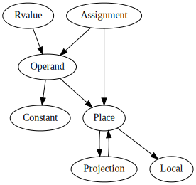

# MIR construction

The lowering of [HIR] to [MIR] occurs for the following (probably incomplete)
list of items:

* Function and closure bodies
* Initializers of `static` and `const` items
* Initializers of enum discriminants
* Glue and shims of any kind
    * Tuple struct initializer functions
    * Drop code (the `Drop::drop` function is not called directly)
    * Drop implementations of types without an explicit `Drop` implementation

The lowering is triggered by calling the [`mir_built`] query. The MIR builder does
not actually use the HIR but operates on the [THIR] instead, processing THIR
expressions recursively.

The lowering creates local variables for every argument as specified in the signature.
Next, it creates local variables for every binding specified (e.g. `(a, b): (i32, String)`)
produces 3 bindings, one for the argument, and two for the bindings. Next, it generates
field accesses that read the fields from the argument and writes the value to the binding
variable.

With this initialization out of the way, the lowering triggers a recursive call
to a function that generates the MIR for the body (a `Block` expression) and
writes the result into the `RETURN_PLACE`.

## `unpack!` all the things

Functions that generate MIR tend to fall into one of two patterns.
First, if the function generates only statements, then it will take a
basic block as argument onto which those statements should be appended.
It can then return a result as normal:

```rust,ignore
fn generate_some_mir(&mut self, block: BasicBlock) -> ResultType {
   ...
}
```

But there are other functions that may generate new basic blocks as well.
For example, lowering an expression like `if foo { 22 } else { 44 }`
requires generating a small "diamond-shaped graph".
In this case, the functions take a basic block where their code starts
and return a (potentially) new basic block where the code generation ends.
The `BlockAnd` type is used to represent this:

```rust,ignore
fn generate_more_mir(&mut self, block: BasicBlock) -> BlockAnd<ResultType> {
    ...
}
```

When you invoke these functions, it is common to have a local variable `block`
that is effectively a "cursor". It represents the point at which we are adding new MIR.
When you invoke `generate_more_mir`, you want to update this cursor.
You can do this manually, but it's tedious:

```rust,ignore
let mut block;
let v = match self.generate_more_mir(..) {
    BlockAnd { block: new_block, value: v } => {
        block = new_block;
        v
    }
};
```

For this reason, we offer a macro that lets you write
`let v = unpack!(block = self.generate_more_mir(...))`.
It simply extracts the new block and overwrites the
variable `block` that you named in the `unpack!`.

## Lowering expressions into the desired MIR

There are essentially four kinds of representations one might want of an expression:

* `Place` refers to a (or part of a) preexisting memory location (local, static, promoted)
* `Rvalue` is something that can be assigned to a `Place`
* `Operand` is an argument to e.g. a `+` operation or a function call
* a temporary variable containing a copy of the value

The following image depicts a general overview of the interactions between the
representations:



[Click here for a more detailed view](mir_detailed.svg)

We start out with lowering the function body to an `Rvalue` so we can create an
assignment to `RETURN_PLACE`, This `Rvalue` lowering will in turn trigger lowering to
`Operand` for its arguments (if any). `Operand` lowering either produces a `const`
operand, or moves/copies out of a `Place`, thus triggering a `Place` lowering. An
expression being lowered to a `Place` can in turn trigger a temporary to be created
if the expression being lowered contains operations. This is where the snake bites its
own tail and we need to trigger an `Rvalue` lowering for the expression to be written
into the local.

## Operator lowering

Operators on builtin types are not lowered to function calls (which would end up being
infinite recursion calls, because the trait impls just contain the operation itself
again). Instead there are `Rvalue`s for binary and unary operators and index operations.
These `Rvalue`s later get codegened to llvm primitive operations or llvm intrinsics.

Operators on all other types get lowered to a function call to their `impl` of the
operator's corresponding trait.

Regardless of the lowering kind, the arguments to the operator are lowered to `Operand`s.
This means all arguments are either constants, or refer to an already existing value
somewhere in a local or static.

## Method call lowering

Method calls are lowered to the same `TerminatorKind` that function calls are.
In [MIR] there is no difference between method calls and function calls anymore.

## Conditions

`if` conditions and `match` statements for `enum`s with variants that have no fields are
lowered to `TerminatorKind::SwitchInt`. Each possible value (so `0` and `1` for `if`
conditions) has a corresponding `BasicBlock` to which the code continues.
The argument being branched on is (again) an `Operand` representing the value of
the if condition.

### Pattern matching

`match` statements for `enum`s with variants that have fields are lowered to
`TerminatorKind::SwitchInt`, too, but the `Operand` refers to a `Place` where the
discriminant of the value can be found. This often involves reading the discriminant
to a new temporary variable.

## Aggregate construction

Aggregate values of any kind (e.g. structs or tuples) are built via `Rvalue::Aggregate`.
All fields are
lowered to `Operator`s. This is essentially equivalent to one assignment
statement per aggregate field plus an assignment to the discriminant in the
case of `enum`s.

[MIR]: ./index.html
[HIR]: ../hir.html
[THIR]: https://doc.rust-lang.org/nightly/nightly-rustc/rustc_mir_build/thir/index.html

[`rustc_mir_build::thir::cx::expr`]: https://doc.rust-lang.org/nightly/nightly-rustc/rustc_mir_build/thir/cx/expr/index.html
[`mir_built`]: https://doc.rust-lang.org/nightly/nightly-rustc/rustc_mir_transform/fn.mir_built.html
