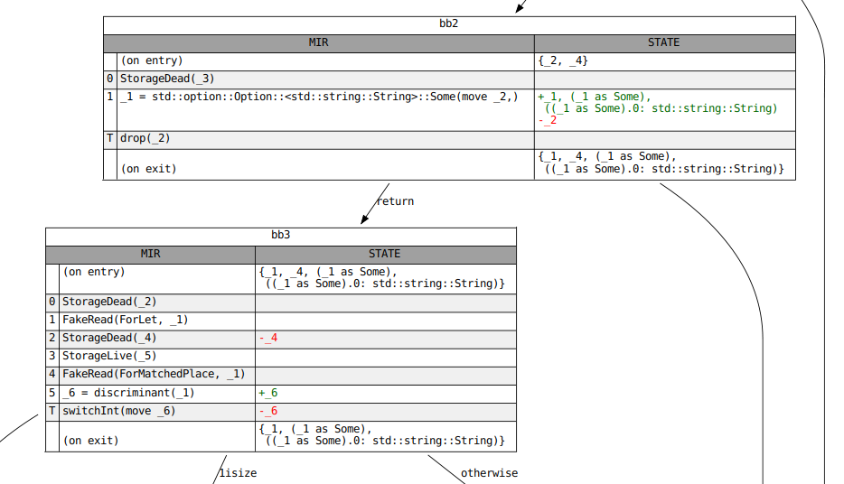

# Dataflow Analysis

<!-- toc -->

If you work on the MIR, you will frequently come across various flavors of
[dataflow analysis][wiki]. `rustc` uses dataflow to find uninitialized
variables, determine what variables are live across a generator `yield`
statement, and compute which `Place`s are borrowed at a given point in the
control-flow graph. Dataflow analysis is a fundamental concept in modern
compilers, and knowledge of the subject will be helpful to prospective
contributors.

However, this documentation is not a general introduction to dataflow analysis.
It is merely a description of the framework used to define these analyses in
`rustc`. It assumes that the reader is familiar with the core ideas as well as
some basic terminology, such as "transfer function", "fixpoint" and "lattice".
If you're unfamiliar with these terms, or if you want a quick refresher,
[*Static Program Analysis*] by Anders Møller and Michael I. Schwartzbach is an
excellent, freely available textbook. For those who prefer audiovisual
learning, we previously recommended a series of short lectures
by the Goethe University Frankfurt on YouTube, but it has since been deleted.
See [this PR][pr-1295] for the context and [this comment][pr-1295-comment]
for the alternative lectures.

## Defining a Dataflow Analysis

The interface for dataflow analyses is split into three traits. The first is
[`AnalysisDomain`], which must be implemented by *all* analyses. In addition to
the type of the dataflow state, this trait defines the initial value of that
state at entry to each block, as well as the direction of the analysis, either
forward or backward. The domain of your dataflow analysis must be a [lattice][]
(strictly speaking a join-semilattice) with a well-behaved `join` operator. See
documentation for the [`lattice`] module, as well as the [`JoinSemiLattice`]
trait, for more information.

You must then provide *either* a direct implementation of the [`Analysis`] trait
*or* an implementation of the proxy trait [`GenKillAnalysis`]. The latter is for
so-called ["gen-kill" problems], which have a simple class of transfer function
that can be applied very efficiently. Analyses whose domain is not a `BitSet`
of some index type, or whose transfer functions cannot be expressed through
"gen" and "kill" operations, must implement `Analysis` directly, and will run
slower as a result. All implementers of `GenKillAnalysis` also implement
`Analysis` automatically via a default `impl`.


```text
 AnalysisDomain
       ^
       |          | = has as a supertrait
       |          . = provides a default impl for
       |
   Analysis
     ^   ^
     |   .
     |   .
     |   .
 GenKillAnalysis

```

### Transfer Functions and Effects

The dataflow framework in `rustc` allows each statement (and terminator) inside
a basic block to define its own transfer function. For brevity, these
individual transfer functions are known as "effects". Each effect is applied
successively in dataflow order, and together they define the transfer function
for the entire basic block. It's also possible to define an effect for
particular outgoing edges of some terminators (e.g.
[`apply_call_return_effect`] for the `success` edge of a `Call`
terminator). Collectively, these are referred to as "per-edge effects".

The only meaningful difference (besides the "apply" prefix) between the methods
of the `GenKillAnalysis` trait and the `Analysis` trait is that an `Analysis`
has direct, mutable access to the dataflow state, whereas a `GenKillAnalysis`
only sees an implementer of the `GenKill` trait, which only allows the `gen`
and `kill` operations for mutation.

### "Before" Effects

Observant readers of the documentation may notice that there are actually *two*
possible effects for each statement and terminator, the "before" effect and the
unprefixed (or "primary") effect. The "before" effects are applied immediately
before the unprefixed effect **regardless of the direction of the analysis**.
In other words, a backward analysis will apply the "before" effect and then the
"primary" effect when computing the transfer function for a basic block, just
like a forward analysis.

The vast majority of analyses should use only the unprefixed effects: Having
multiple effects for each statement makes it difficult for consumers to know
where they should be looking. However, the "before" variants can be useful in
some scenarios, such as when the effect of the right-hand side of an assignment
statement must be considered separately from the left-hand side.

### Convergence

Your analysis must converge to "fixpoint", otherwise it will run forever.
Converging to fixpoint is just another way of saying "reaching equilibrium".
In order to reach equilibrium, your analysis must obey some laws. One of the
laws it must obey is that the bottom value[^bottom-purpose] joined with some
other value equals the second value. Or, as an equation:

> *bottom* join *x* = *x*

Another law is that your analysis must have a "top value" such that

> *top* join *x* = *top*

Having a top value ensures that your semilattice has a finite height, and the
law state above ensures that once the dataflow state reaches top, it will no
longer change (the fixpoint will be top).

[^bottom-purpose]: The bottom value's primary purpose is as the initial dataflow
    state. Each basic block's entry state is initialized to bottom before the
    analysis starts.

## A Brief Example

This section provides a brief example of a simple data-flow analysis at a high
level. It doesn't explain everything you need to know, but hopefully it will
make the rest of this page clearer.

Let's say we want to do a simple analysis to find if `mem::transmute` may have
been called by a certain point in the program. Our analysis domain will just
be a `bool` that records whether `transmute` has been called so far. The bottom
value will be `false`, since by default `transmute` has not been called. The top
value will be `true`, since our analysis is done as soon as we determine that
`transmute` has been called. Our join operator will just be the boolean OR (`||`)
operator. We use OR and not AND because of this case:

```
let x = if some_cond {
    std::mem::transmute<i32, u32>(0_i32); // transmute was called!
} else {
    1_u32; // transmute was not called
};

// Has transmute been called by this point? We conservatively approximate that
// as yes, and that is why we use the OR operator.
println!("x: {}", x);
```

## Inspecting the Results of a Dataflow Analysis

Once you have constructed an analysis, you must pass it to an [`Engine`], which
is responsible for finding the steady-state solution to your dataflow problem.
You should use the [`into_engine`] method defined on the `Analysis` trait for
this, since it will use the more efficient `Engine::new_gen_kill` constructor
when possible.

Calling `iterate_to_fixpoint` on your `Engine` will return a `Results`, which
contains the dataflow state at fixpoint upon entry of each block. Once you have
a `Results`, you can inspect the dataflow state at fixpoint at any point in
the CFG. If you only need the state at a few locations (e.g., each `Drop`
terminator) use a [`ResultsCursor`]. If you need the state at *every* location,
a [`ResultsVisitor`] will be more efficient.

```text
                         Analysis
                            |
                            | into_engine(…)
                            |
                          Engine
                            |
                            | iterate_to_fixpoint()
                            |
                         Results
                         /     \
 into_results_cursor(…) /       \  visit_with(…)
                       /         \
               ResultsCursor  ResultsVisitor
```

For example, the following code uses a [`ResultsVisitor`]...


```rust,ignore
// Assuming `MyVisitor` implements `ResultsVisitor<FlowState = MyAnalysis::Domain>`...
let mut my_visitor = MyVisitor::new();

// inspect the fixpoint state for every location within every block in RPO.
let results = MyAnalysis::new()
    .into_engine(tcx, body, def_id)
    .iterate_to_fixpoint()
    .visit_in_rpo_with(body, &mut my_visitor);
```

whereas this code uses [`ResultsCursor`]:

```rust,ignore
let mut results = MyAnalysis::new()
    .into_engine(tcx, body, def_id)
    .iterate_to_fixpoint()
    .into_results_cursor(body);

// Inspect the fixpoint state immediately before each `Drop` terminator.
for (bb, block) in body.basic_blocks().iter_enumerated() {
    if let TerminatorKind::Drop { .. } = block.terminator().kind {
        results.seek_before_primary_effect(body.terminator_loc(bb));
        let state = results.get();
        println!("state before drop: {:#?}", state);
    }
}
```

### Graphviz Diagrams

When the results of a dataflow analysis are not what you expect, it often helps
to visualize them. This can be done with the `-Z dump-mir` flags described in
[Debugging MIR]. Start with `-Z dump-mir=F -Z dump-mir-dataflow`, where `F` is
either "all" or the name of the MIR body you are interested in.

These `.dot` files will be saved in your `mir_dump` directory and will have the
[`NAME`] of the analysis (e.g. `maybe_inits`) as part of their filename. Each
visualization will display the full dataflow state at entry and exit of each
block, as well as any changes that occur in each statement and terminator.  See
the example below:



["gen-kill" problems]: https://en.wikipedia.org/wiki/Data-flow_analysis#Bit_vector_problems
[*Static Program Analysis*]: https://cs.au.dk/~amoeller/spa/
[Debugging MIR]: ./debugging.html
[`AnalysisDomain`]: https://doc.rust-lang.org/nightly/nightly-rustc/rustc_mir_dataflow/trait.AnalysisDomain.html
[`Analysis`]: https://doc.rust-lang.org/nightly/nightly-rustc/rustc_mir_dataflow/trait.Analysis.html
[`Engine`]: https://doc.rust-lang.org/nightly/nightly-rustc/rustc_mir_dataflow/struct.Engine.html
[`GenKillAnalysis`]: https://doc.rust-lang.org/nightly/nightly-rustc/rustc_mir_dataflow/trait.GenKillAnalysis.html
[`JoinSemiLattice`]: https://doc.rust-lang.org/nightly/nightly-rustc/rustc_mir_dataflow/lattice/trait.JoinSemiLattice.html
[`NAME`]: https://doc.rust-lang.org/nightly/nightly-rustc/rustc_mir_dataflow/trait.AnalysisDomain.html#associatedconstant.NAME
[`ResultsCursor`]: https://doc.rust-lang.org/nightly/nightly-rustc/rustc_mir_dataflow/struct.ResultsCursor.html
[`ResultsVisitor`]: https://doc.rust-lang.org/nightly/nightly-rustc/rustc_mir_dataflow/trait.ResultsVisitor.html
[`apply_call_return_effect`]: https://doc.rust-lang.org/nightly/nightly-rustc/rustc_mir_dataflow/trait.Analysis.html#tymethod.apply_call_return_effect
[`into_engine`]: https://doc.rust-lang.org/nightly/nightly-rustc/rustc_mir_dataflow/trait.Analysis.html#method.into_engine
[`lattice`]: https://doc.rust-lang.org/nightly/nightly-rustc/rustc_mir_dataflow/lattice/index.html
[pr-1295]: https://github.com/rust-lang/rustc-dev-guide/pull/1295
[pr-1295-comment]: https://github.com/rust-lang/rustc-dev-guide/pull/1295#issuecomment-1118131294
[lattice]: https://en.wikipedia.org/wiki/Lattice_(order)
[wiki]: https://en.wikipedia.org/wiki/Data-flow_analysis#Basic_principles
