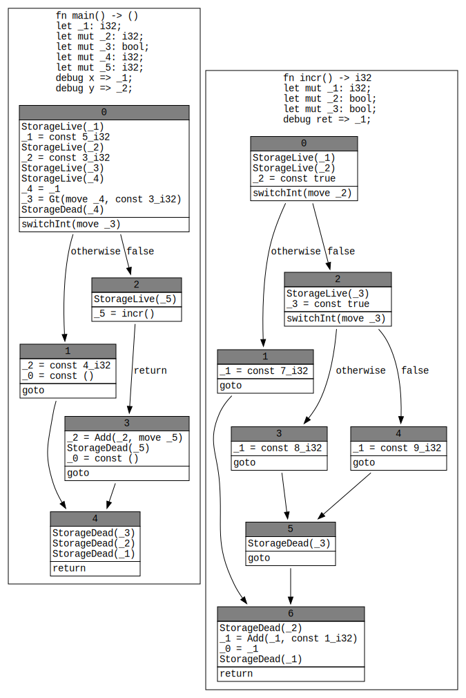

# MIR Debugging

The `-Z dump-mir` flag can be used to dump a text representation of the MIR.
The following optional flags, used in combination with `-Z dump-mir`, enable
additional output formats, including:

* `-Z dump-mir-graphviz` - dumps a `.dot` file that represents MIR as a
control-flow graph
* `-Z dump-mir-dataflow` - dumps a `.dot` file showing the [dataflow state] at
  each point in the control-flow graph

`-Z dump-mir=F` is a handy compiler option that will let you view the MIR for
each function at each stage of compilation. `-Z dump-mir` takes a **filter** `F`
which allows you to control which functions and which passes you are
interested in. For example:

```bash
> rustc -Z dump-mir=foo ...
```

This will dump the MIR for any function whose name contains `foo`; it
will dump the MIR both before and after every pass. Those files will
be created in the `mir_dump` directory. There will likely be quite a
lot of them!

```bash
> cat > foo.rs
fn main() {
    println!("Hello, world!");
}
^D
> rustc -Z dump-mir=main foo.rs
> ls mir_dump/* | wc -l
     161
```

The files have names like `rustc.main.000-000.CleanEndRegions.after.mir`. These
names have a number of parts:

```text
rustc.main.000-000.CleanEndRegions.after.mir
      ---- --- --- --------------- ----- either before or after
      |    |   |   name of the pass
      |    |   index of dump within the pass (usually 0, but some passes dump intermediate states)
      |    index of the pass
      def-path to the function etc being dumped
```

You can also make more selective filters. For example, `main & CleanEndRegions`
will select for things that reference *both* `main` and the pass
`CleanEndRegions`:

```bash
> rustc -Z dump-mir='main & CleanEndRegions' foo.rs
> ls mir_dump
rustc.main.000-000.CleanEndRegions.after.mir	rustc.main.000-000.CleanEndRegions.before.mir
```
<!--- TODO: Change NoLandingPads. [#1232](https://github.com/rust-lang/rustc-dev-guide/issues/1232) -->
Filters can also have `|` parts to combine multiple sets of
`&`-filters. For example `main & CleanEndRegions | main &
NoLandingPads` will select *either* `main` and `CleanEndRegions` *or*
`main` and `NoLandingPads`:

```bash
> rustc -Z dump-mir='main & CleanEndRegions | main & NoLandingPads' foo.rs
> ls mir_dump
rustc.main-promoted[0].002-000.NoLandingPads.after.mir
rustc.main-promoted[0].002-000.NoLandingPads.before.mir
rustc.main-promoted[0].002-006.NoLandingPads.after.mir
rustc.main-promoted[0].002-006.NoLandingPads.before.mir
rustc.main-promoted[1].002-000.NoLandingPads.after.mir
rustc.main-promoted[1].002-000.NoLandingPads.before.mir
rustc.main-promoted[1].002-006.NoLandingPads.after.mir
rustc.main-promoted[1].002-006.NoLandingPads.before.mir
rustc.main.000-000.CleanEndRegions.after.mir
rustc.main.000-000.CleanEndRegions.before.mir
rustc.main.002-000.NoLandingPads.after.mir
rustc.main.002-000.NoLandingPads.before.mir
rustc.main.002-006.NoLandingPads.after.mir
rustc.main.002-006.NoLandingPads.before.mir
```

(Here, the `main-promoted[0]` files refer to the MIR for "promoted constants"
that appeared within the `main` function.)

The `-Z unpretty=mir-cfg` flag can be used to create a graphviz MIR
control-flow diagram for the whole crate:



TODO: anything else?

[dataflow state]: ./dataflow.html#graphviz-diagrams
