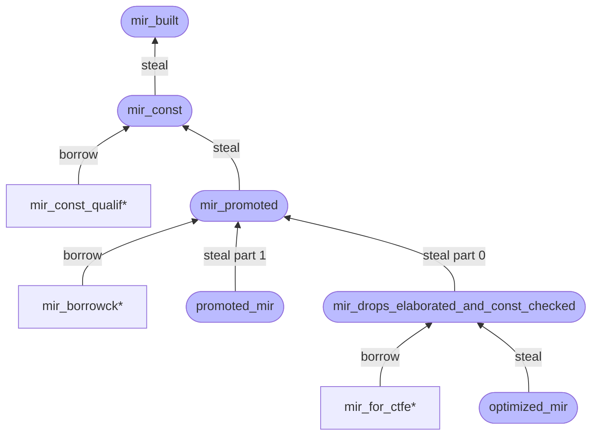

# MIR queries and passes

If you would like to get the MIR:

- for a function - you can use the `optimized_mir` query (typically used by codegen) or the `mir_for_ctfe` query (typically used by compile time function evaluation, i.e., *CTFE*);
- for a promoted - you can use the `promoted_mir` query.

These will give you back the final, optimized MIR. For foreign def-ids, we simply read the MIR
from the other crate's metadata. But for local def-ids, the query will
construct the optimized MIR by requesting a pipeline of upstream queries[^query].
Each query will contain a series of passes.
This section describes how those queries and passes work and how you can extend them.

To produce the optimized MIR for a given def-id `D`, `optimized_mir(D)`
goes through several suites of passes, each grouped by a
query. Each suite consists of passes which perform linting, analysis, transformation or
optimization. Each query represent a useful intermediate point
where we can access the MIR dialect for type checking or other purposes:

- `mir_built(D)` – it gives the initial MIR just after it's built;
- `mir_const(D)` – it applies some simple transformation passes to make MIR ready for
  const qualification;
- `mir_promoted(D)` - it extracts promotable temps into separate MIR bodies, and also makes MIR
  ready for borrow checking;
- `mir_drops_elaborated_and_const_checked(D)` - it performs borrow checking, runs major
  transformation passes (such as drop elaboration) and makes MIR ready for optimization;
- `optimized_mir(D)` – it performs all enabled optimizations and reaches the final state.

[^query]: See the [Queries](../query.md) chapter for the general concept of query.

## Implementing and registering a pass

A `MirPass` is some bit of code that processes the MIR, typically transforming it along the way
somehow. But it may also do other things like linting (e.g., [`CheckPackedRef`][lint1],
[`CheckConstItemMutation`][lint2], [`FunctionItemReferences`][lint3], which implement `MirLint`) or
optimization (e.g., [`SimplifyCfg`][opt1], [`RemoveUnneededDrops`][opt2]). While most MIR passes
are defined in the [`rustc_mir_transform`][mirtransform] crate, the `MirPass` trait itself is
[found][mirpass] in the `rustc_middle` crate, and it basically consists of one primary method,
`run_pass`, that simply gets an `&mut Body` (along with the `tcx`).
The MIR is therefore modified in place (which helps to keep things efficient).

A basic example of a MIR pass is [`RemoveStorageMarkers`], which walks
the MIR and removes all storage marks if they won't be emitted during codegen. As you
can see from its source, a MIR pass is defined by first defining a
dummy type, a struct with no fields:

```rust
pub struct RemoveStorageMarkers;
```

for which we implement the `MirPass` trait. We can then insert
this pass into the appropriate list of passes found in a query like
`mir_built`, `optimized_mir`, etc. (If this is an optimization, it
should go into the `optimized_mir` list.)

Another example of a simple MIR pass is [`CleanupPostBorrowck`][cleanup-pass], which walks
the MIR and removes all statements that are not relevant to code generation. As you can see from
its [source][cleanup-source], it is defined by first defining a dummy type, a struct with no
fields:

```rust
pub struct CleanupPostBorrowck;
```

for which we implement the `MirPass` trait:

```rust
impl<'tcx> MirPass<'tcx> for CleanupPostBorrowck {
    fn run_pass(&self, tcx: TyCtxt<'tcx>, body: &mut Body<'tcx>) {
        ...
    }
}
```

We [register][pass-register] this pass inside the `mir_drops_elaborated_and_const_checked` query.
(If this is an optimization, it should go into the `optimized_mir` list.)

If you are writing a pass, there's a good chance that you are going to
want to use a [MIR visitor]. MIR visitors are a handy way to walk all
the parts of the MIR, either to search for something or to make small
edits.

## Stealing

The intermediate queries `mir_const()` and `mir_promoted()` yield up
a `&'tcx Steal<Body<'tcx>>`, allocated using `tcx.alloc_steal_mir()`.
This indicates that the result may be **stolen** by a subsequent query – this is an
optimization to avoid cloning the MIR. Attempting to use a stolen
result will cause a panic in the compiler. Therefore, it is important
that you do not accidentally read from these intermediate queries without
the consideration of the dependency in the MIR processing pipeline.

Because of this stealing mechanism, some care must be taken to
ensure that, before the MIR at a particular phase in the processing
pipeline is stolen, anyone who may want to read from it has already
done so.

Concretely, this means that if you have a query `foo(D)`
that wants to access the result of `mir_promoted(D)`, you need to have `foo(D)`
calling the `mir_const(D)` query first. This will force it
to execute even though you don't directly require its result.

> This mechanism is a bit dodgy. There is a discussion of more elegant
alternatives in [rust-lang/rust#41710].

### Overview

Below is an overview of the stealing dependency in the MIR processing pipeline[^part]:



The stadium-shape queries (e.g., `mir_built`) with a deep color are the primary queries in the
pipeline, while the rectangle-shape queries (e.g., `mir_const_qualif*`[^star]) with a shallow color
are those subsequent queries that need to read the results from `&'tcx Steal<Body<'tcx>>`. With the
stealing mechanism, the rectangle-shape queries must be performed before any stadium-shape queries,
that have an equal or larger height in the dependency tree, ever do.

[^part]: The `mir_promoted` query will yield up a tuple
`(&'tcx Steal<Body<'tcx>>, &'tcx Steal<IndexVec<Promoted, Body<'tcx>>>)`, `promoted_mir` will steal
part 1 (`&'tcx Steal<IndexVec<Promoted, Body<'tcx>>>`) and `mir_drops_elaborated_and_const_checked`
will steal part 0 (`&'tcx Steal<Body<'tcx>>`). And their stealing is irrelevant to each other,
i.e., can be performed separately.

[^star]: Note that the `*` suffix in the queries represent a set of queries with the same prefix.
For example, `mir_borrowck*` represents `mir_borrowck`, `mir_borrowck_const_arg` and
`mir_borrowck_opt_const_arg`.

### Example

As an example, consider MIR const qualification. It wants to read the result produced by the
`mir_const` query. However, that result will be **stolen** by the `mir_promoted` query at some
time in the pipeline. Before `mir_promoted` is ever queried, calling the `mir_const_qualif` query
will succeed since `mir_const` will produce (if queried the first time) or cache (if queried
multiple times) the `Steal` result and the result is **not** stolen yet. After `mir_promoted` is
queried, the result would be stolen and calling the `mir_const_qualif` query to read the result
would cause a panic.

Therefore, with this stealing mechanism, `mir_promoted` should guarantee any `mir_const_qualif*`
queries are called before it actually steals, thus ensuring that the reads have already happened
(remember that [queries are memoized](../query.html), so executing a query twice
simply loads from a cache the second time).

[rust-lang/rust#41710]: https://github.com/rust-lang/rust/issues/41710
[mirpass]: https://doc.rust-lang.org/nightly/nightly-rustc/rustc_mir_transform/pass_manager/trait.MirPass.html
[lint1]: https://doc.rust-lang.org/nightly/nightly-rustc/rustc_mir_transform/check_packed_ref/struct.CheckPackedRef.html
[lint2]: https://doc.rust-lang.org/nightly/nightly-rustc/rustc_mir_transform/check_const_item_mutation/struct.CheckConstItemMutation.html
[lint3]: https://doc.rust-lang.org/nightly/nightly-rustc/rustc_mir_transform/function_item_references/struct.FunctionItemReferences.html
[opt1]: https://doc.rust-lang.org/nightly/nightly-rustc/rustc_mir_transform/simplify/enum.SimplifyCfg.html
[opt2]: https://doc.rust-lang.org/nightly/nightly-rustc/rustc_mir_transform/remove_unneeded_drops/struct.RemoveUnneededDrops.html
[mirtransform]: https://doc.rust-lang.org/nightly/nightly-rustc/rustc_mir_transform/
[`RemoveStorageMarkers`]: https://doc.rust-lang.org/nightly/nightly-rustc/rustc_mir_transform/remove_storage_markers/struct.RemoveStorageMarkers.html
[cleanup-pass]: https://doc.rust-lang.org/nightly/nightly-rustc/rustc_mir_transform/cleanup_post_borrowck/struct.CleanupPostBorrowck.html
[cleanup-source]: https://github.com/rust-lang/rust/blob/e2b52ff73edc8b0b7c74bc28760d618187731fe8/compiler/rustc_mir_transform/src/cleanup_post_borrowck.rs#L27
[pass-register]: https://github.com/rust-lang/rust/blob/e2b52ff73edc8b0b7c74bc28760d618187731fe8/compiler/rustc_mir_transform/src/lib.rs#L413
[MIR visitor]: ./visitor.html
