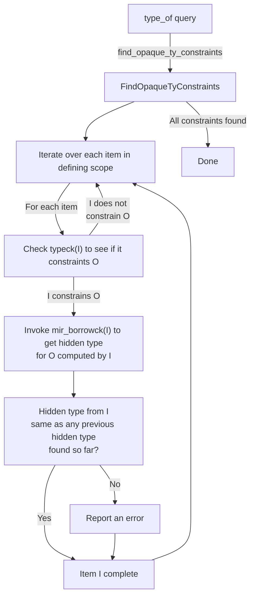
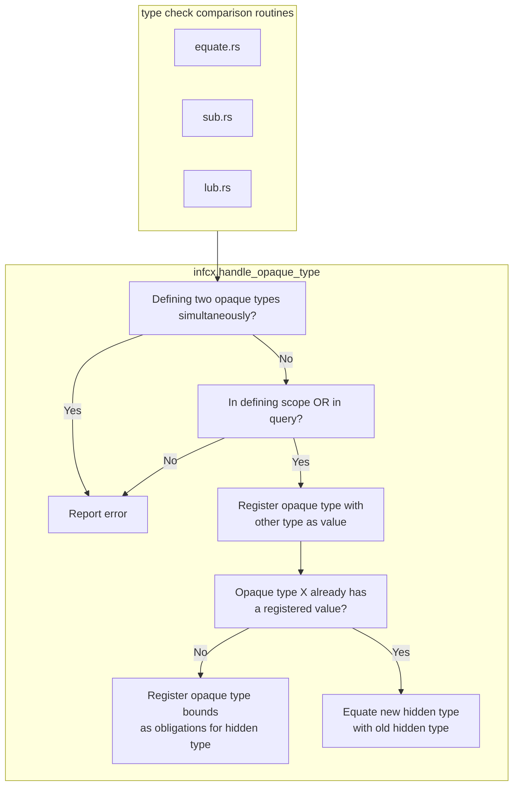

# Inference of opaque types (`impl Trait`)

This page describes how the compiler infers the [hidden type] for an [opaque type].
This kind of type inference is particularly complex because,
unlike other kinds of type inference,
it can work across functions and function bodies.

[hidden type]: ./borrow_check/region_inference/member_constraints.html?highlight=%22hidden%20type%22#member-constraints
[opaque type]: ./opaque-types-type-alias-impl-trait.md

## Running example

To help explain how it works, let's consider an example.

```rust
#![feature(type_alias_impl_trait)]
mod m {
    pub type Seq<T> = impl IntoIterator<Item = T>;

    #[define_opaque(Seq)]
    pub fn produce_singleton<T>(t: T) -> Seq<T> {
        vec![t]
    }

    #[define_opaque(Seq)]
    pub fn produce_doubleton<T>(t: T, u: T) -> Seq<T> {
        vec![t, u]
    }
}

fn is_send<T: Send>(_: &T) {}

pub fn main() {
    let elems = m::produce_singleton(22);

    is_send(&elems);

    for elem in elems {
        println!("elem = {:?}", elem);
    }
}
```

In this code, the *opaque type* is `Seq<T>`.
Its defining scope is the module `m`.
Its *hidden type* is `Vec<T>`,
which is inferred from `m::produce_singleton` and `m::produce_doubleton`.

In the `main` function, the opaque type is out of its defining scope.
When `main` calls `m::produce_singleton`, it gets back a reference to the opaque type `Seq<i32>`.
The `is_send` call checks that `Seq<i32>: Send`.
`Send` is not listed amongst the bounds of the impl trait,
but because of auto-trait leakage, we are able to infer that it holds.
The `for` loop desugaring requires that `Seq<T>: IntoIterator`,
which is provable from the bounds declared on `Seq<T>`.

### Type-checking `main`

Let's start by looking what happens when we type-check `main`.
Initially we invoke `produce_singleton` and the return type is an opaque type
[`OpaqueTy`](https://doc.rust-lang.org/nightly/nightly-rustc/rustc_hir/hir/enum.ItemKind.html#variant.OpaqueTy).

#### Type-checking the for loop

The for loop desugars the `in elems` part to `IntoIterator::into_iter(elems)`.
`elems` is of type `Seq<T>`, so the type checker registers a `Seq<T>: IntoIterator` obligation.
This obligation is trivially satisfied,
because `Seq<T>` is an opaque type (`impl IntoIterator<Item = T>`) that has a bound for the trait.
Similar to how a `U: Foo` where bound allows `U` to trivially satisfy `Foo`,
opaque types' bounds are available to the type checker and are used to fulfill obligations.

The type of `elem` in the for loop is inferred to be `<Seq<T> as IntoIterator>::Item`, which is `T`.
At no point is the type checker interested in the hidden type.

#### Type-checking the `is_send` call

When trying to prove auto trait bounds,
we first repeat the process as above,
to see if the auto trait is in the bound list of the opaque type.
If that fails, we reveal the hidden type of the opaque type,
but only to prove this specific trait bound, not in general.
Revealing is done by invoking the `type_of` query on the `DefId` of the opaque type.
The query will internally request the hidden types from the defining function(s)
and return that (see [the section on `type_of`](#within-the-type_of-query) for more details).

#### Flowchart of type checking steps

```mermaid
flowchart TD
    TypeChecking["type checking `main`"]
    subgraph TypeOfSeq["type_of(Seq<T>) query"]
        WalkModuleHir["Walk the HIR for the module `m`\nto find the hidden types from each\nfunction/const/static within"]
        VisitProduceSingleton["visit `produce_singleton`"]
        InterimType["`produce_singleton` hidden type is `Vec<T>`\nkeep searching"]
        VisitProduceDoubleton["visit `produce_doubleton`"]
        CompareType["`produce_doubleton` hidden type is also Vec<T>\nthis matches what we saw before ✅"]
        Done["No more items to look at in scope\nReturn `Vec<T>`"]
    end

    BorrowCheckProduceSingleton["`borrow_check(produce_singleton)`"]
    TypeCheckProduceSingleton["`type_check(produce_singleton)`"]

    BorrowCheckProduceDoubleton["`borrow_check(produce_doubleton)`"]
    TypeCheckProduceDoubleton["`type_check(produce_doubleton)`"]

    Substitute["Substitute `T => u32`,\nyielding `Vec<i32>` as the hidden type"]
    CheckSend["Check that `Vec<i32>: Send` ✅"]

    TypeChecking -- trait code for auto traits --> TypeOfSeq
    TypeOfSeq --> WalkModuleHir
    WalkModuleHir --> VisitProduceSingleton
    VisitProduceSingleton --> BorrowCheckProduceSingleton
    BorrowCheckProduceSingleton --> TypeCheckProduceSingleton
    TypeCheckProduceSingleton --> InterimType
    InterimType --> VisitProduceDoubleton
    VisitProduceDoubleton --> BorrowCheckProduceDoubleton
    BorrowCheckProduceDoubleton --> TypeCheckProduceDoubleton
    TypeCheckProduceDoubleton --> CompareType --> Done
    Done --> Substitute --> CheckSend
```

### Within the `type_of` query

The `type_of` query, when applied to an opaque type O, returns the hidden type.
That hidden type is computed by combining the results
from each constraining function within the defining scope of O.



### Relating an opaque type to another type

There is one central place where an opaque type gets its hidden type constrained,
and that is the `handle_opaque_type` function.
Amusingly it takes two types, so you can pass any two types,
but one of them should be an opaque type.
The order is only important for diagnostics.



### Interactions with queries

When queries handle opaque types,
they cannot figure out whether they are in a defining scope,
so they just assume they are.

The registered hidden types are stored into the `QueryResponse` struct
in the `opaque_types` field (the function
`take_opaque_types_for_query_response` reads them out).

When the `QueryResponse` is instantiated into the surrounding infcx in
`query_response_substitution_guess`,
we convert each hidden type constraint by invoking `handle_opaque_type` (as above).

There is one bit of "weirdness".
The instantiated opaque types have an order
(if one opaque type was compared with another,
and we have to pick one opaque type to use as the one that gets its hidden type assigned).
We use the one that is considered "expected".
But really both of the opaque types may have defining uses.
When the query result is instantiated,
that will be re-evaluated from the context that is using the query.
The final context (typeck of a function, mir borrowck or wf-checks)
will know which opaque type can actually be instantiated
and then handle it correctly.

### Within the MIR borrow checker

The MIR borrow checker relates things via `nll_relate` and only cares about regions.
Any type relation will trigger the binding of hidden types,
so the borrow checker is doing the same thing as the type checker,
but ignores obviously dead code (e.g. after a panic).
The borrow checker is also the source of truth when it comes to hidden types,
as it is the only one who can properly figure out what lifetimes on the hidden type correspond
to which lifetimes on the opaque type declaration.

## Backwards compatibility hacks

`impl Trait` in return position has various quirks that were not part
of any RFCs and are likely accidental stabilization.
To support these,
the `replace_opaque_types_with_inference_vars` is being used to reintroduce the previous behaviour.

There are three backwards compatibility hacks:

1. All return sites share the same inference variable,
   so some return sites may only compile if another return site uses a concrete type.
    ```rust
    fn foo() -> impl Debug {
        if false {
            return std::iter::empty().collect();
        }
        vec![42]
    }
    ```
2. Associated type equality constraints for `impl Trait` can be used
   as long as the hidden type  satisfies the trait bounds on the associated type.
   The opaque `impl Trait` signature does not need to satisfy them.

    ```rust
    trait Duh {}

    impl Duh for i32 {}

    trait Trait {
        type Assoc: Duh;
    }

    // the fact that `R` is the `::Output` projection on `F` causes
    // an intermediate inference var to be generated which is then later
    // compared against the actually found `Assoc` type.
    impl<R: Duh, F: FnMut() -> R> Trait for F {
        type Assoc = R;
    }

    // The `impl Send` here is then later compared against the inference var
    // created, causing the inference var to be set to `impl Send` instead of
    // the hidden type. We already have obligations registered on the inference
    // var to make it uphold the `: Duh` bound on `Trait::Assoc`. The opaque
    // type does not implement `Duh`, even if its hidden type does.
    // Lazy TAIT would error out, but we inserted a hack to make it work again,
    // keeping backwards compatibility.
    fn foo() -> impl Trait<Assoc = impl Send> {
        || 42
    }
    ```
3. Closures cannot create hidden types for their parent function's `impl Trait`.
   This point is mostly moot,
   because of point 1 introducing inference vars,
   so the closure only ever sees the inference var, but should we fix 1, this will become a problem.
