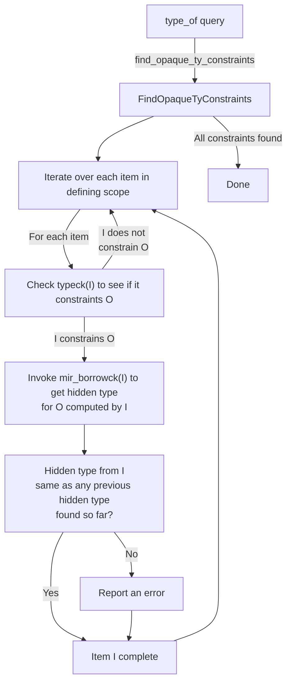
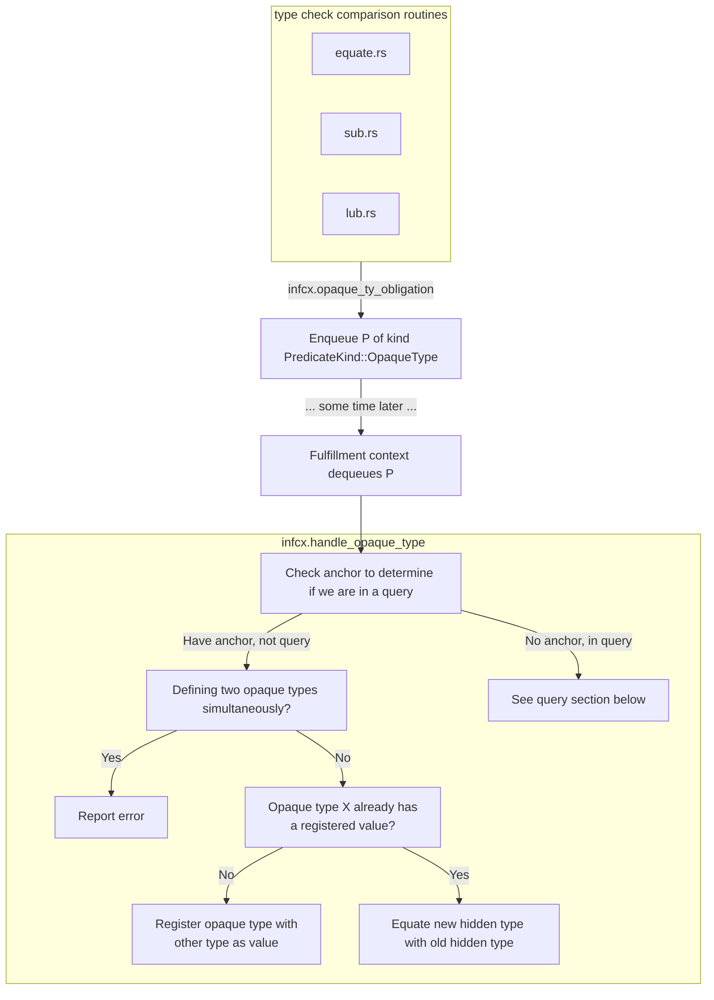
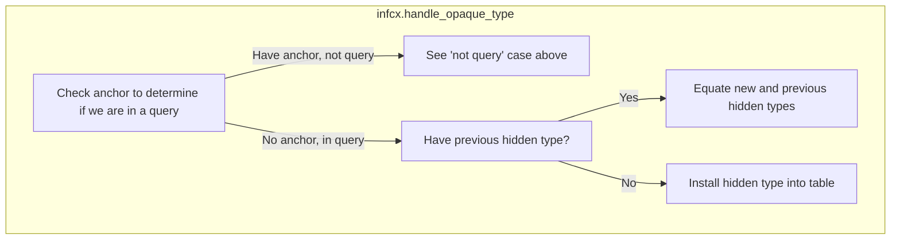

# Inference of opaque types (type alias `impl Trait`)

This page describes how the compiler infers the hidden type for an opaque type.
This kind of type inference is particularly complex because,
unlike other kinds of type inference,
it works across functions and function bodies.

## Running example

To help explain how it works, let's start with a simple example.

###

```rust
mod m {
    pub type Seq<T> = impl IntoIterator<Item = T>;
    
    pub fn produce_singleton<T>(t: T) -> Seq<T> { 
        vec![t]
    }

    pub fn produce_doubleton<T>(t: T, u: T) -> Seq<T> { 
        vec![t, u]
    }
}

fn is_send<T: Send>(_: &T) {}

pub fn main() {
    let elems = m::produce_singleton(22);
    
    is_send(&elems);

    for elem in elems {
        println!("elem = {:?}", elem);
    }
}
```

* In this example, the opaque type is `Seq<T>`:
    * Its defining scope is the module `m`.
    * Its hidden type is  `Vec<T>`, which is inferred from:
        * `m::produce_singleton`
        * `m::produce_doubleton`
* In the `main` function, the opaque type is out of scope:
    * When `main` calls `m::produce_singleton`, it gets back a reference to the opaque type `Seq<i32>`.
    * The `is_send` call checks that `Seq<i32>: Send`. `Send` is not listed amongst the bounds of the impl trait, but because of auto-trait leakage, we are able to infer that it holds.
    * The for loop desugaring requires that `Seq<T>: IntoIterator`, which is provable from the bounds declared on `Seq<T>`.

### Type-checking `main`

Let's start by looking what happens when we type-check `main`. Initially we invoke `produce_singleton` and the return type is an opaque type [`OpaqueTy`](https://doc.rust-lang.org/nightly/nightly-rustc/rustc_hir/enum.ItemKind.html#variant.OpaqueTy). 

#### Type-checking the for loop

* Explain how the for loop works:
    * We look at the bounds, we are able to type check it as is

#### Type-checking the `is_send` call

* Explain how it invokes `type_of`
    * We look at the bounds, we are able to type check it as is

```mermaid
flowchart TD
    TypeChecking["type checking `main`"]
    subgraph TypeOfSeq["type_of(Seq<T>) query"]
        WalkModuleHir["Walk the HIR for the module `m`\nto find the hidden types from each\nfunction within"]
        VisitProduceSingleton["visit `produce_singleton`"]
        InterimType["`produce_singleton` hidden type is `Vec<T>`\nkeep searching"]
        VisitProduceDoubleton["visit `produce_doubleton`"]
        CompareType["`produce_doubleton` hidden type is also Vec<T>\nthis matches what we saw before ✅"]
        Done["Return `Vec<T>`"]
    end
    
    BorrowCheckProduceSingleton["`borrow_check(produce_singleton)`"]
    TypeCheckProduceSingleton["`type_check(produce_singleton)`"]

    BorrowCheckProduceDoubleton["`borrow_check(produce_doubleton)`"]
    TypeCheckProduceDoubleton["`type_check(produce_doubleton)`"]
    
    Substitute["Substitute `T => u32`,\nyielding `Vec<i32>` as the hidden type"]
    CheckSend["Check that `Vec<i32>: Send` ✅"]

    TypeChecking -- trait code for auto traits --> TypeOfSeq
    TypeOfSeq --> WalkModuleHir
    WalkModuleHir --> VisitProduceSingleton
    VisitProduceSingleton --> BorrowCheckProduceSingleton
    BorrowCheckProduceSingleton --> TypeCheckProduceSingleton
    TypeCheckProduceSingleton --> InterimType
    InterimType --> VisitProduceDoubleton
    VisitProduceDoubleton --> BorrowCheckProduceDoubleton
    BorrowCheckProduceDoubleton --> TypeCheckProduceDoubleton
    TypeCheckProduceDoubleton --> CompareType --> Done
    Done --> Substitute --> CheckSend    
```

### Within the `type_of` query

The `type_of` query, when applied to an opaque type O, returns the hidden type. That hidden type is computed by combining the results from each constraining function within defining scope of O. 



### Within the ordinary type check of a single function



### Interactions with queries

When queries encounter a `opaque_ty_obligation`, they do not try to process them, but instead just store the constraints into the infcx.



The registered hidden types are stored into the `QueryResponse` struct in the `opaque_types` field (the function `take_opaque_types_for_query_response` reads them out).

When the `QueryResponse` is instantiated into the surrounding infcx in `query_response_substitution_guess`, we convert each hidden type constraint by invoking `handle_opaque_type` (as above).

There is one bit of "weirdness".
The instantiated opaque types are stored in a *map*,
and we have to pick one opaque type to use as the key of that map.
We use the one that is considered "expected".
But really both of the opaque types may have defining uses.
When the query result is instantiated,
that will be re-evaluated from the context that is using the query.

### Within the MIR borrow checker

The MIR borrow checker relates things via `nll_relate`...

