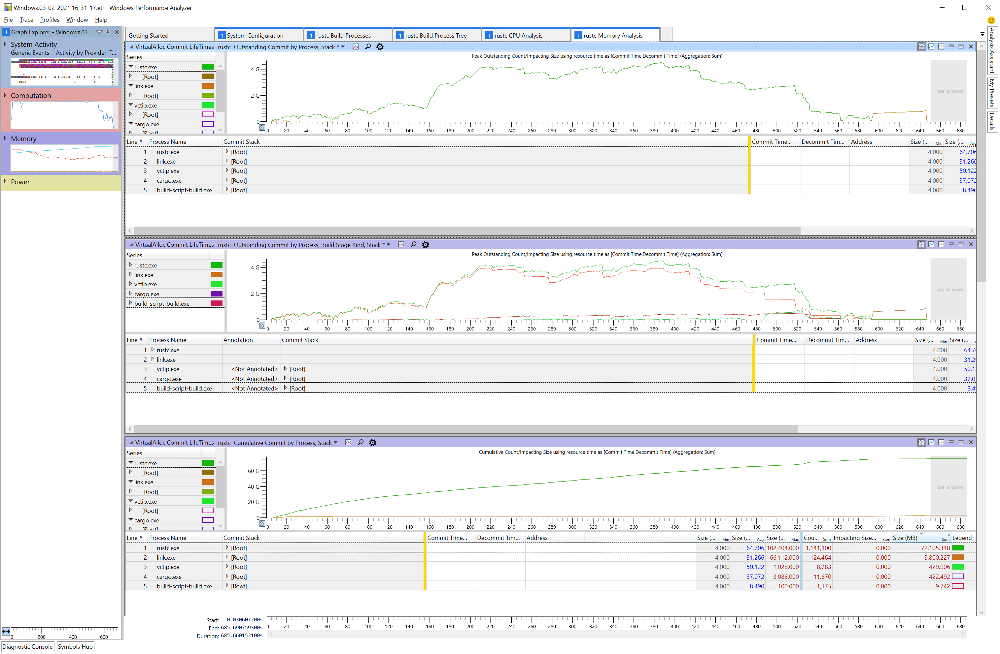
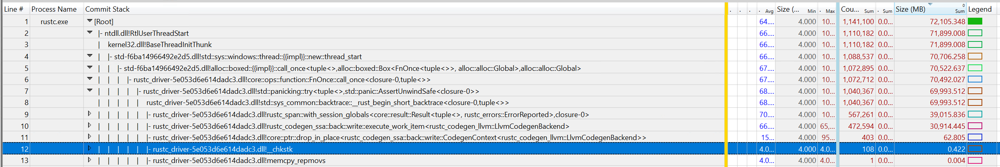

# Profiling on Windows

## Introducing WPR and WPA

High-level performance analysis (including memory usage) can be performed with the Windows
Performance Recorder (WPR) and Windows Performance Analyzer (WPA). As the names suggest, WPR is for
recording system statistics (in the form of event trace log a.k.a. ETL files), while WPA is for
analyzing these ETL files.

WPR collects system wide statistics, so it won't just record things relevant to rustc but also
everything else that's running on the machine. During analysis, we can filter to just the things we
find interesting.

These tools are quite powerful but also require a bit of learning
before we can successfully profile the Rust compiler.

Here we will explore how to use WPR and WPA for analyzing the Rust compiler as well as provide
links to useful "profiles" (i.e., settings files that tweak the defaults for WPR and WPA) that are
specifically designed to make analyzing rustc easier.

### Installing WPR and WPA

You can install WPR and WPA as part of the Windows Performance Toolkit which itself is an option as
part of downloading the Windows Assessment and Deployment Kit (ADK). You can download the ADK
installer [here](https://go.microsoft.com/fwlink/?linkid=2086042). Make sure to select the Windows
Performance Toolkit (you don't need to select anything else).

## Recording

In order to perform system analysis, you'll first need to record your system with WPR. Open WPR and
at the bottom of the window select the "profiles" of the things you want to record. For looking
into memory usage of the rustc bootstrap process, we'll want to select the following items:

* CPU usage
* VirtualAlloc usage

You might be tempted to record "Heap usage" as well, but this records every single heap allocation
and can be very, very expensive. For high-level analysis, it might be best to leave that turned
off.

Now we need to get our setup ready to record. For memory usage analysis, it is best to record the
stage 2 compiler build with a stage 1 compiler build with debug symbols. Having symbols in the
compiler we're using to build rustc will aid our analysis greatly by allowing WPA to resolve Rust
symbols correctly. Unfortunately, the stage 0 compiler does not have symbols turned on which is why
we'll need to build a stage 1 compiler and then a stage 2 compiler ourselves.

To do this, make sure you have set `debuginfo-level = 1` in your `bootstrap.toml` file. This tells
rustc to generate debug information which includes stack frames when bootstrapping.

Now you can build the stage 1 compiler: `x build --stage 1 -i library` or however
else you want to build the stage 1 compiler.

Now that the stage 1 compiler is built, we can record the stage 2 build. Go back to WPR, click the
"start" button and build the stage 2 compiler (e.g., `x build --stage=2 -i library`).
When this process finishes, stop the recording.

Click the Save button and once that process is complete, click the "Open in WPA" button which
appears.

> Note: The trace file is fairly large so it can take WPA some time to finish opening the file.

## Analysis

Now that our ETL file is open in WPA, we can analyze the results. First, we'll want to apply the
pre-made "profile" which will put WPA into a state conducive to analyzing rustc bootstrap. Download
the profile [here](https://github.com/wesleywiser/rustc-bootstrap-wpa-analysis/releases/download/1/rustc.generic.wpaProfile).
Select the "Profiles" menu at the top, then "apply" and then choose the downloaded profile.

You should see something resembling the following:

Next, we will need to tell WPA to load and process debug symbols so that it can properly demangle
the Rust stack traces. To do this, click "Trace" and then choose "Load Symbols". This step can take
a while.

Once WPA has loaded symbols for rustc, we can expand the rustc.exe node and begin drilling down
into the stack with the largest allocations.

To do that, we'll expand the `[Root]` node in the "Commit Stack" column and continue expanding
until we find interesting stack frames.

> Tip: After selecting the node you want to expand, press the right arrow key. This will expand the
node and put the selection on the next largest node in the expanded set. You can continue pressing
the right arrow key until you reach an interesting frame.

In this sample, you can see calls through codegen are allocating ~30gb of memory in total
throughout this profile.

## Other Analysis Tabs

The profile also includes a few other tabs which can be helpful:

- System Configuration
    - General information about the system the capture was recorded on.
- rustc Build Processes
    - A flat list of relevant processes such as rustc.exe, cargo.exe, link.exe etc.
    - Each process lists its command line arguments.
    - Useful for figuring out what a specific rustc process was working on.
- rustc Build Process Tree
    - Timeline showing when processes started and exited.
- rustc CPU Analysis
    - Contains charts preconfigured to show hotspots in rustc.
    - These charts are designed to support analyzing where rustc is spending its time.
- rustc Memory Analysis
    - Contains charts preconfigured to show where rustc is allocating memory.
