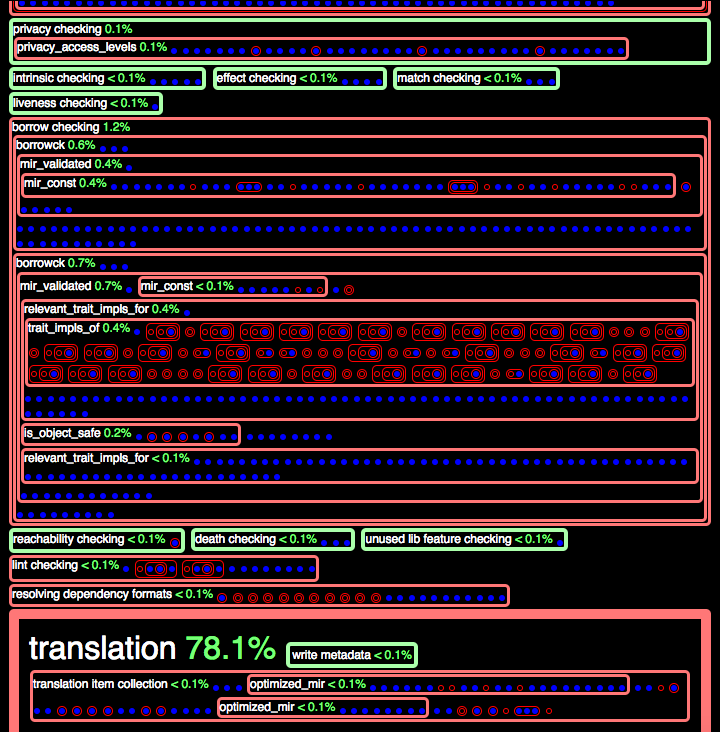

# Profiling Queries

<!-- toc -->

In an effort to support _incremental compilation_, the latest design of the Rust
compiler consists of a _query-based_ model.

The details of this model are outside the scope of this document,
however, we explain [some background of this model](#background), in an effort
to explain how we profile its performance. We intend this profiling effort to
address [issue 42678](https://github.com/rust-lang/rust/issues/42678).

## Quick Start

### 0. Enable debug assertions

```
./configure --enable-debug-assertions
```

### 1. Compile `rustc`

Compile the compiler, up to at least stage 1:

```
./x.py build library/std
```

### 2. Run `rustc`, with flags

Run the compiler on a source file, supplying two additional debugging flags with
`-Z`:

```
rustc -Z profile-queries -Z incremental=cache foo.rs
```

Regarding the two additional parameters:

- `-Z profile-queries` tells the compiler to run a separate thread that profiles
  the queries made by the main compiler thread(s).
- `-Z incremental=cache` tells the compiler to "cache" various files that
  describe the compilation dependencies, in the subdirectory `cache`.

This command will generate the following files:

- `profile_queries.html` consists of an HTML-based representation of the
  [trace of queries](#trace-of-queries).
- `profile_queries.counts.txt` consists of a histogram, where each histogram
  "bucket" is a query provider.

### 3. Run `rustc`, with `-Z time-passes`:

- This additional flag will add all timed passes to the output files mentioned
  above, in step 2. As described below, these passes appear visually distinct
  from the queries in the HTML output (they appear as green boxes, via
  CSS).

### 4. Inspect the output

- 4(a). Open the HTML file (`profile_queries.html`) with a browser. See
  [this section](#interpret-the-html-output) for an explanation of this file.
- 4(b). Open the data file (`profile_queries.counts.txt`) with a text editor, or
  spreadsheet. See [this section](#interpret-the-data-output) for an explanation
  of this file.

## Interpret the HTML Output

### Example 0

The following image gives some example output, from tracing the queries of
`hello_world.rs` (a single `main` function, that prints `"hello world"` via the
macro `println!`). This image only shows a short prefix of the total output; the
_actual_ output is much longer.

[][profile-example-html]
[View full HTML output][profile-example-html]. Note; it could take up
to a second to properly render depending on your browser.

Here is the corresponding [text output](./example-0.counts.txt).

[profile-example-html]: ./example-0.html

### Example 0 explanation

The trace of the queries has a formal structure; see
[Trace of Queries](#trace-of-queries) for details.

We style this formal structure as follows:

- **Timed passes:** Green boxes, when present (via `-Z time-passes`), represent
  _timed passes_ in the compiler. As of <!-- date: 2021-01 --> January 2021
  these passes are not queries, but may be replaced by queries in future versions.
- **Labels:** Some green and red boxes are labeled with text. Where they are
  present, the labels give the following information:
  - The [query's _provider_](#queries), sans its _key_ and its _result_, which
    are often too long to include in these labels.
  - The _duration_ of the provider, as a fraction of the total time (for the
    entire trace). This fraction includes the query's entire extent (that is,
    the sum total of all of its sub-queries).
- **Query hits:** Blue dots represent query hits. They consist of leaves in the
  trace's tree. (CSS class: `hit`).
- **Query misses:** Red boxes represent query misses. They consist of internal
  nodes in the trace's tree. (CSS class: `miss`).
- **Nesting structure:** Many red boxes contain _nested boxes and dots_. This
  nesting structure reflects that some providers _depend on_ results from other
  providers, which consist of their nested children.
- Some red boxes are _labeled_ with text, and have highlighted borders (light
  red, and bolded). (See [heuristics](#heuristics) for details).

## Heuristics

Heuristics-based CSS Classes:

- `important` -- Trace nodes are `important` if they have an extent of 6 (or
  more), _or_ they have a duration fraction of one percent (or more). These
  numbers are simple heuristics (hard-coded, but easy to modify).
  Important nodes are styled with textual labels, and highlighted borders (light
  red, and bolded).

- `frac-50`, `-40`, ... -- Trace nodes whose total duration (self and children)
  take a large fraction of the total duration, at or above 50%, 40%, and so on.
  We style nodes these with larger font and padding.

## Interpret the Data Output

The file `profile_queries.counts.txt` contains a table of information about the
queries, organized around their providers.

For each provider (or timed pass, when `-Z time-passes` is present), we produce:

- A total **count** --- the total number of times this provider was queried

- A total **duration** --- the total number of seconds spent running this
  provider, _including_ all providers it may depend on. To get a sense of this
  dependency structure, and inspect a more fine-grained view of these durations,
  see [this section](#interpret-the-html-output).

These rows are **sorted by total duration**, in descending order.

### Counts: Example 0

The following example `profile_queries.counts.txt` file results from running on
a hello world program (a single main function that uses `println` to print
`"hello world"`).

As explained above, the columns consist of `provider/pass`, `count`, `duration`:

```
translation,1,0.891
symbol_name,2658,0.733
def_symbol_name,2556,0.268
item_attrs,5566,0.162
type_of,6922,0.117
generics_of,8020,0.084
serialize dep graph,1,0.079
relevant_trait_impls_for,50,0.063
def_span,24875,0.061
expansion,1,0.059
const checking,1,0.055
adt_def,1141,0.048
trait_impls_of,32,0.045
is_copy_raw,47,0.045
is_foreign_item,2638,0.042
fn_sig,2172,0.033
adt_dtorck_constraint,2,0.023
impl_trait_ref,2434,0.023
typeck_tables_of,29,0.022
item-bodies checking,1,0.017
typeck_item_bodies,1,0.017
is_default_impl,2320,0.017
borrow checking,1,0.014
borrowck,4,0.014
mir_validated,4,0.013
adt_destructor,10,0.012
layout_raw,258,0.010
load_dep_graph,1,0.007
item-types checking,1,0.005
mir_const,2,0.005
name resolution,1,0.004
is_object_safe,35,0.003
is_sized_raw,89,0.003
parsing,1,0.003
is_freeze_raw,11,0.001
privacy checking,1,0.001
privacy_access_levels,5,0.001
resolving dependency formats,1,0.001
adt_sized_constraint,9,0.001
wf checking,1,0.001
liveness checking,1,0.001
compute_incremental_hashes_map,1,0.001
match checking,1,0.001
type collecting,1,0.001
param_env,31,0.000
effect checking,1,0.000
trait_def,140,0.000
lowering ast -> hir,1,0.000
predicates_of,70,0.000
extern_crate,319,0.000
lifetime resolution,1,0.000
is_const_fn,6,0.000
intrinsic checking,1,0.000
translation item collection,1,0.000
impl_polarity,15,0.000
creating allocators,1,0.000
language item collection,1,0.000
crate injection,1,0.000
early lint checks,1,0.000
indexing hir,1,0.000
maybe creating a macro crate,1,0.000
coherence checking,1,0.000
optimized_mir,6,0.000
is_panic_runtime,33,0.000
associated_item_def_ids,7,0.000
needs_drop_raw,10,0.000
lint checking,1,0.000
complete gated feature checking,1,0.000
stability index,1,0.000
region_maps,11,0.000
super_predicates_of,8,0.000
coherent_trait,2,0.000
AST validation,1,0.000
loop checking,1,0.000
static item recursion checking,1,0.000
variances_of,11,0.000
associated_item,5,0.000
plugin loading,1,0.000
looking for plugin registrar,1,0.000
stability checking,1,0.000
describe_def,15,0.000
variance testing,1,0.000
codegen unit partitioning,1,0.000
looking for entry point,1,0.000
checking for inline asm in case the target doesn't support it,1,0.000
inherent_impls,1,0.000
crate_inherent_impls,1,0.000
trait_of_item,7,0.000
crate_inherent_impls_overlap_check,1,0.000
attribute checking,1,0.000
internalize symbols,1,0.000
impl wf inference,1,0.000
death checking,1,0.000
reachability checking,1,0.000
reachable_set,1,0.000
is_exported_symbol,3,0.000
is_mir_available,2,0.000
unused lib feature checking,1,0.000
maybe building test harness,1,0.000
recursion limit,1,0.000
write allocator module,1,0.000
assert dep graph,1,0.000
plugin registration,1,0.000
write metadata,1,0.000
```

# Background

We give some background about the query model of the Rust compiler.

## Def IDs

In the query model, many queries have a key that consists of a Def ID. The Rust
compiler uses Def IDs to distinguish definitions in the input Rust program.

From the compiler source code (`compiler/rustc_span/src/def_id.rs`):

```
/// A DefId identifies a particular *definition*, by combining a crate
/// index and a def index.
#[derive(Clone, Eq, Ord, PartialOrd, PartialEq, RustcEncodable, RustcDecodable, Hash, Copy)]
pub struct DefId {
    pub krate: CrateNum,
    pub index: DefIndex,
}
```

## Queries

A query relates a _key_ to a _result_, either by invoking a _provider_ that
computes this result, or by reusing a cached result that was provided earlier.
We explain each term in more detail:

- Query **Provider**: Each kind of query has a pre-defined _provider_, which
  refers to the compiler behavior that provides an answer to the query. These
  providers may nest; see [trace of queries](#trace-of-queries) for more
  information about this nesting structure.
   _Example providers:_
  - `typeck` -- Typecheck a Def ID; produce "tables" of type
    information.
  - `borrowck` -- Borrow-check a Def ID.
  - `optimized_mir` -- Generate an optimized MIR for a Def ID; produce MIR.
  - For more examples, see [Example 0](#counts-example-0).
- Query **Key**: The input/arguments to the provider. Often, this consists of a
  particular [Def ID](#def-ids).
- Query **Result**: The output of the provider.

## Trace of Queries

Formally, a _trace_ of the queries consists of a _tree_, where sub-trees
represent sub-traces. In particular, the nesting structure of the trace of
queries describes how the queries depend on one another.

Even more precisely, this tree represents a directed acyclic graph (DAG), where
shared sub-graphs consist of tree nodes that occur multiple times in the tree,
first as "cache misses" and later as "cache hits".

**Cache hits and misses.** The trace is a tree with the following possible tree
nodes:

- Query, with cache **miss**: The query's result is **unknown**, and its
  provider runs to compute it. In this case, the dynamic extent of the query's
  trace consists of the traced behavior of its provider.
- Query, with cache **hit**: The query's result is **known**, and is reused; its
  provider does not rerun. These nodes are leaves in the trace, since they have
  no dynamic extent. These leaves also represent where the tree, represented as
  a DAG, would _share_ a sub-graph (namely, the sub-graph of the query that was
  reused from the cache).

**Tree node metrics.** To help determine how to style this tree, we define the
following tree node metrics:

- **Depth**: The number of **ancestors** of the node in its path from the tree
  root.
- **Extent**: The number of **immediate children** of the node.

Intuitively, a dependency tree is "good" for incremental caching when the depth
and extent of each node is relatively small. It is pathological when either of
these metrics grows too large. For instance, a tree node whose extent consists
of 1M immediate children means that if and when this node is re-computed, all 1M
children must be re-queried, at the very least (some may also require
recomputation, too).

## External Links

Related design ideas, and tracking issues:

- Design document:
  [On-demand Rustc incremental design doc](https://github.com/nikomatsakis/rustc-on-demand-incremental-design-doc/blob/master/0000-rustc-on-demand-and-incremental.md)
- Tracking Issue:
  ["Red/Green" dependency tracking in compiler](https://github.com/rust-lang/rust/issues/42293)

More discussion and issues:

- [GitHub issue #42633](https://github.com/rust-lang/rust/issues/42633)
- [Incremental Compilation Beta](https://internals.rust-lang.org/t/incremental-compilation-beta/4721)
- [Incremental Compilation Announcement](https://blog.rust-lang.org/2016/09/08/incremental.html)
