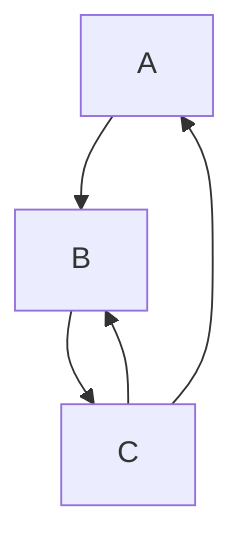

# Caching in the new trait solver

Caching results of the trait solver is necessary for performance.
We have to make sure that it is sound. Caching is handled by the
[`SearchGraph`]

[`SearchGraph`]: https://github.com/rust-lang/rust/blob/7606c13961ddc1174b70638e934df0439b7dc515/compiler/rustc_trait_selection/src/solve/search_graph.rs#L102-L117

## The global cache

At its core, the cache is fairly straightforward. When evaluating a goal, we
check whether it's in the global cache. If so, we reuse that entry. If not, we
compute the goal and then store its result in the cache.

To handle incremental compilation the computation of a goal happens inside of
[`DepGraph::with_anon_task`][`with_anon_task`] which creates a new `DepNode` which depends on all queries
used inside of this computation. When accessing the global cache we then read this
`DepNode`, manually adding a dependency edge to all the queries used: [source][wdn].

### Dealing with overflow

Hitting the recursion limit is not fatal in the new trait solver but instead simply
causes it to return ambiguity: [source][overflow]. Whether we hit the recursion limit
can therefore change the result without resulting in a compilation failure. This
means we must consider the remaining available depth when accessing a cache result.

We do this by storing more information in the cache entry. For goals whose evaluation
did not reach the recursion limit, we simply store its reached depth: [source][req-depth].
These results can freely be used as long as the current `available_depth` is higher than
its `reached_depth`: [source][req-depth-ck]. We then update the reached depth of the
current goal to make sure that whether we've used the global cache entry is not
observable: [source][update-depth].

For goals which reach the recursion limit we currently only use the cached result if the
available depth *exactly matches* the depth of the entry. The cache entry for each goal
therefore contains a separate result for each remaining depth: [source][rem-depth].[^1]

## Handling cycles

The trait solver has to support cycles. These cycles are either inductive or coinductive,
depending on the participating goals. See the [chapter on coinduction] for more details.
We distinguish between the cycle heads and the cycle root: a stack entry is a
cycle head if it recursively accessed. The *root* is the deepest goal on the stack which
is involved in any cycle. Given the following dependency tree, `A` and `B` are both cycle
heads, while only `A` is a root.

The result of cycle participants depends on the result of goals still on the stack.
However, we are currently computing that result, so its result is still unknown. This is
handled by evaluating cycle heads until we reach a fixpoint. In the first iteration, we
return either success or overflow with no constraints, depending on whether the cycle is
coinductive: [source][initial-prov-result]. After evaluating the head of a cycle, we
check whether its [`provisional_result`] is equal to the result of this iteration. If so,
we've finished evaluating this cycle and return its result. If not, we update the provisional
result and reevaluate the goal: [source][fixpoint]. After the first iteration it does not
matter whether cycles are coinductive or inductive. We always use the provisional result.

### Only caching cycle roots

We cannot move the result of any cycle participant to the global cache until we've
finished evaluating the cycle root. However, even after we've completely evaluated the
cycle, we are still forced to discard the result of all participants apart from the root
itself.

We track the query dependencies of all global cache entries. This causes the caching of
cycle participants to be non-trivial. We cannot simply reuse the `DepNode` of the cycle
root.[^2] If we have a cycle `A -> B -> A`, then the `DepNode` for `A` contains a dependency
from `A -> B`. Reusing this entry for `B` may break if the source is changed. The `B -> A`
edge may not exist anymore and `A` may have been completely removed. This can easily result
in an ICE.

However, it's even worse as the result of a cycle can change depending on which goal is
the root: [example][unstable-result-ex]. This forces us to weaken caching even further.
We must not use a cache entry of a cycle root, if there exists a stack entry, which was
a participant of its cycle involving that root. We do this by storing all cycle participants
of a given root in its global cache entry and checking that it contains no element of the
stack: [source][cycle-participants].

### The provisional cache

TODO: write this :3

- stack dependence of provisional results
- edge case: provisional cache impacts behavior

[`with_anon_task`]: https://github.com/rust-lang/rust/blob/7606c13961ddc1174b70638e934df0439b7dc515/compiler/rustc_trait_selection/src/solve/search_graph.rs#L391
[wdn]: https://github.com/rust-lang/rust/blob/7606c13961ddc1174b70638e934df0439b7dc515/compiler/rustc_middle/src/traits/solve/cache.rs#L78
[overflow]: https://github.com/rust-lang/rust/blob/7606c13961ddc1174b70638e934df0439b7dc515/compiler/rustc_trait_selection/src/solve/search_graph.rs#L276
[req-depth]: https://github.com/rust-lang/rust/blob/7606c13961ddc1174b70638e934df0439b7dc515/compiler/rustc_middle/src/traits/solve/cache.rs#L102
[req-depth-ck]: https://github.com/rust-lang/rust/blob/7606c13961ddc1174b70638e934df0439b7dc515/compiler/rustc_middle/src/traits/solve/cache.rs#L76-L86
[update-depth]: https://github.com/rust-lang/rust/blob/7606c13961ddc1174b70638e934df0439b7dc515/compiler/rustc_trait_selection/src/solve/search_graph.rs#L308
[rem-depth]: https://github.com/rust-lang/rust/blob/7606c13961ddc1174b70638e934df0439b7dc515/compiler/rustc_middle/src/traits/solve/cache.rs#L124
[^1]: This is overly restrictive: if all nested goals return the overflow response with some
available depth `n`, then their result should be the same for any depths smaller than `n`.
We can implement this optimization in the future.

[chapter on coinduction]: ./coinduction.md
[`provisional_result`]: https://github.com/rust-lang/rust/blob/7606c13961ddc1174b70638e934df0439b7dc515/compiler/rustc_trait_selection/src/solve/search_graph.rs#L57
[initial-prov-result]: https://github.com/rust-lang/rust/blob/7606c13961ddc1174b70638e934df0439b7dc515/compiler/rustc_trait_selection/src/solve/search_graph.rs#L366-L370
[fixpoint]: https://github.com/rust-lang/rust/blob/7606c13961ddc1174b70638e934df0439b7dc515/compiler/rustc_trait_selection/src/solve/search_graph.rs#L425-L446
[^2]: summarizing the relevant [Zulip thread]

[zulip thread]: https://rust-lang.zulipchat.com/#narrow/stream/364551-t-types.2Ftrait-system-refactor/topic/global.20cache
[unstable-result-ex]: https://github.com/rust-lang/rust/blob/7606c13961ddc1174b70638e934df0439b7dc515/tests/ui/traits/next-solver/cycles/coinduction/incompleteness-unstable-result.rs#L4-L16
[cycle-participants]: https://github.com/rust-lang/rust/blob/7606c13961ddc1174b70638e934df0439b7dc515/compiler/rustc_middle/src/traits/solve/cache.rs#L72-L74
