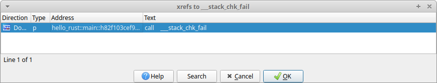

# Exploit Mitigations

This chapter documents the exploit mitigations supported by the Rust
compiler, and is by no means an extensive survey of the Rust programming
language’s security features.

This chapter is for software engineers working with the Rust programming
language, and assumes prior knowledge of the Rust programming language and
its toolchain.


## Introduction

The Rust programming language provides memory[1] and thread[2] safety
guarantees via its ownership[3], references and borrowing[4], and slice
types[5] features. However, Unsafe Rust[6] introduces unsafe blocks, unsafe
functions and methods, unsafe traits, and new types that are not subject to
the borrowing rules.

Parts of the Rust standard library are implemented as safe abstractions over
unsafe code (and historically have been vulnerable to memory corruption[7]).
Furthermore, the Rust code and documentation encourage creating safe
abstractions over unsafe code. This can cause a false sense of security if
unsafe code is not properly reviewed and tested.

Unsafe Rust introduces features that do not provide the same memory and
thread safety guarantees. This causes programs or libraries to be
susceptible to memory corruption (CWE-119)[8] and concurrency issues
(CWE-557)[9]. Modern C and C++ compilers provide exploit mitigations to
increase the difficulty to exploit vulnerabilities resulting from these
issues. Therefore, the Rust compiler must also support these exploit
mitigations in order to mitigate vulnerabilities resulting from the use of
Unsafe Rust. This chapter documents these exploit mitigations and how they
apply to Rust.

This chapter does not discuss the effectiveness of these exploit mitigations
as they vary greatly depending on several factors besides their design and
implementation, but rather describe what they do, so their effectiveness can
be understood within a given context.


## Exploit mitigations

This section documents the exploit mitigations applicable to the Rust
compiler when building programs for the Linux operating system on the AMD64
architecture and equivalent.<sup id="fnref:1" role="doc-noteref"><a
href="#fn:1" class="footnote">1</a></sup>

The Rust Programming Language currently has no specification. The Rust
compiler (i.e., rustc) is the language reference implementation. All
references to “the Rust compiler” in this chapter refer to the language
reference implementation.

Table I \
Summary of exploit mitigations supported by the Rust compiler when building
programs for the Linux operating system on the AMD64 architecture and
equivalent.

| Exploit mitigation | Supported and enabled by default | Since |
| - | - | - |
| Position-independent executable | Yes | 0.12.0 (2014-10-09) |
| Integer overflow checks | Yes (enabled when debug assertions are enabled, and disabled when debug assertions are disabled) | 1.1.0 (2015-06-25) |
| Non-executable memory regions | Yes | 1.8.0 (2016-04-14) |
| Stack clashing protection | Yes | 1.20.0 (2017-08-31) |
| Read-only relocations and immediate binding | Yes | 1.21.0 (2017-10-12) |
| Heap corruption protection | Yes | 1.32.0 (2019-01-17) (via operating system default or specified allocator) |
| Stack smashing protection | Yes | Nightly |
| Forward-edge control flow protection | Yes | Nightly |
| Backward-edge control flow protection (e.g., shadow and safe stack) | Yes | Nightly |

<small id="fn:1">1\. See
<https://github.com/rust-lang/rust/tree/master/compiler/rustc_target/src/spec>
for a list of targets and their default options. <a href="#fnref:1"
class="reversefootnote" role="doc-backlink">↩</a></small>


### Position-independent executable

Position-independent executable increases the difficulty of the use of code
reuse exploitation techniques, such as return-oriented programming (ROP) and
variants, by generating position-independent code for the executable, and
instructing the dynamic linker to load it similarly to a shared object at a
random load address, thus also benefiting from address-space layout
randomization (ASLR). This is also referred to as “full ASLR”.

The Rust compiler supports position-independent executable, and enables it
by default since version 0.12.0 (2014-10-09)[10]–[13].

```text
$ readelf -h target/release/hello-rust | grep Type:
  Type:                              DYN (Shared object file)
```
Fig. 1. Checking if an executable is a position-independent executable.

An executable with an object type of `ET_DYN` (i.e., shared object) and not
`ET_EXEC` (i.e., executable) is a position-independent executable (see Fig.
1).


### Integer overflow checks

Integer overflow checks protects programs from undefined and unintended
behavior (which may cause vulnerabilities) by checking for results of signed
and unsigned integer computations that cannot be represented in their type,
resulting in an overflow or wraparound.

The Rust compiler supports integer overflow checks, and enables it when
debug assertions are enabled since version 1.1.0 (2015-06-25)[14]–[20].

```compile_fail
fn main() {
    let u: u8 = 255;
    println!("u: {}", u + 1);
}
```
Fig. 2. hello-rust-integer program.

```text
$ cargo run
   Compiling hello-rust-integer v0.1.0 (/home/rcvalle/hello-rust-integer)
    Finished dev [unoptimized + debuginfo] target(s) in 0.23s
     Running `target/debug/hello-rust-integer`
thread 'main' panicked at 'attempt to add with overflow', src/main.rs:3:23
note: run with `RUST_BACKTRACE=1` environment variable to display a backtrace.
```
Fig. 3. Build and execution of hello-rust-integer with debug assertions
enabled.

```text
$ cargo run --release
   Compiling hello-rust-integer v0.1.0 (/home/rcvalle/hello-rust-integer)
    Finished release [optimized] target(s) in 0.23s
     Running `target/release/hello-rust-integer`
u: 0
```
Fig. 4. Build and execution of hello-rust-integer with debug assertions
disabled.

Integer overflow checks are enabled when debug assertions are enabled (see
Fig. 3), and disabled when debug assertions are disabled (see Fig. 4). To
enable integer overflow checks independently, use the option to control
integer overflow checks, scoped attributes, or explicit checking methods
such as `checked_add`<sup id="fnref:2" role="doc-noteref"><a href="#fn:2"
class="footnote">2</a></sup>.

It is recommended that explicit wrapping methods such as `wrapping_add` be
used when wrapping semantics are intended, and that explicit checking and
wrapping methods always be used when using Unsafe Rust.

<small id="fn:2">2\. See [the `u32` docs](../std/primitive.u32.html)
for more information on the checked, overflowing, saturating, and wrapping
methods (using u32 as an example). <a href="#fnref:2"
class="reversefootnote" role="doc-backlink">↩</a></small>


### Non-executable memory regions

Non-executable memory regions increase the difficulty of exploitation by
limiting the memory regions that can be used to execute arbitrary code. Most
modern processors provide support for the operating system to mark memory
regions as non executable, but it was previously emulated by software, such
as in grsecurity/PaX's
[PAGEEXEC](https://pax.grsecurity.net/docs/pageexec.txt) and
[SEGMEXEC](https://pax.grsecurity.net/docs/segmexec.txt), on processors that
did not provide support for it. This is also known as “No Execute (NX) Bit”,
“Execute Disable (XD) Bit”, “Execute Never (XN) Bit”, and others.

The Rust compiler supports non-executable memory regions, and enables it by
default since its initial release, version 0.1 (2012-01-20)[21], [22], but
has regressed since then[23]–[25], and enforced by default since version
1.8.0 (2016-04-14)[25].

```text
$ readelf -l target/release/hello-rust | grep -A 1 GNU_STACK
  GNU_STACK      0x0000000000000000 0x0000000000000000 0x0000000000000000
                 0x0000000000000000 0x0000000000000000  RW     0x10
```
Fig. 5. Checking if non-executable memory regions are enabled for a given
binary.

The presence of an element of type `PT_GNU_STACK` in the program header
table with the `PF_X` (i.e., executable) flag unset indicates non-executable
memory regions<sup id="fnref:3" role="doc-noteref"><a href="#fn:3"
class="footnote">3</a></sup> are enabled for a given binary (see Fig. 5).
Conversely, the presence of an element of type `PT_GNU_STACK` in the program
header table with the `PF_X` flag set or the absence of an element of type
`PT_GNU_STACK` in the program header table indicates non-executable memory
regions are not enabled for a given binary.

<small id="fn:3">3\. See the Appendix section for more information on why it
affects other memory regions besides the stack. <a href="#fnref:3"
class="reversefootnote" role="doc-backlink">↩</a></small>


### Stack clashing protection

Stack clashing protection protects the stack from overlapping with another
memory region—allowing arbitrary data in both to be overwritten using each
other—by reading from the stack pages as the stack grows to cause a page
fault when attempting to read from the guard page/region. This is also
referred to as “stack probes” or “stack probing”.

The Rust compiler supports stack clashing protection via stack probing, and
enables it by default since version 1.20.0 (2017-08-31)[26]–[29].


Fig. 6. IDA Pro listing cross references to `__rust_probestack` in
hello-rust.

```rust
fn hello() {
    println!("Hello, world!");
}

fn main() {
    let _: [u64; 1024] = [0; 1024];
    hello();
}
```
Fig 7. Modified hello-rust.


Fig. 8. IDA Pro listing cross references to `__rust_probestack` in modified
hello-rust.

To check if stack clashing protection is enabled for a given binary, search
for cross references to `__rust_probestack`. The `__rust_probestack` is
called in the prologue of functions whose stack size is larger than a page
size (see Fig. 6), and can be forced for illustration purposes by modifying
the hello-rust example as seen in Fig. 7 and Fig. 8.


### Read-only relocations and immediate binding

**Read-only relocations** protect segments containing relocations and
relocation information (i.e., `.init_array`, `.fini_array`, `.dynamic`, and
`.got`) from being overwritten by marking these segments read only. This is
also referred to as “partial RELRO”.

The Rust compiler supports read-only relocations, and enables it by default
since version 1.21.0 (2017-10-12)[30], [31].

```text
$ readelf -l target/release/hello-rust | grep GNU_RELRO
  GNU_RELRO      0x000000000002ee00 0x000000000002fe00 0x000000000002fe00
```
Fig. 9. Checking if read-only relocations is enabled for a given binary.

The presence of an element of type `PT_GNU_RELRO` in the program header
table indicates read-only relocations are enabled for a given binary (see
Fig. 9). Conversely, the absence of an element of type `PT_GNU_RELRO` in the
program header table indicates read-only relocations are not enabled for a
given binary.

**Immediate binding** protects additional segments containing relocations
(i.e., `.got.plt`) from being overwritten by instructing the dynamic linker
to perform all relocations before transferring control to the program during
startup, so all segments containing relocations can be marked read only
(when combined with read-only relocations). This is also referred to as
“full RELRO”.

The Rust compiler supports immediate binding, and enables it by default
since version 1.21.0 (2017-10-12)[30], [31].

```text
$ readelf -d target/release/hello-rust | grep BIND_NOW
 0x000000000000001e (FLAGS)              BIND_NOW
```
Fig. 10. Checking if immediate binding is enabled for a given binary.

The presence of an element with the `DT_BIND_NOW` tag and the `DF_BIND_NOW`
flag<sup id="fnref:4" role="doc-noteref"><a href="#fn:4"
class="footnote">4</a></sup> in the dynamic section indicates immediate
binding is enabled for a given binary (see Fig. 10). Conversely, the absence
of an element with the `DT_BIND_NOW` tag and the `DF_BIND_NOW` flag in the
dynamic section indicates immediate binding is not enabled for a given
binary.

The presence of both an element of type `PT_GNU_RELRO` in the program header
table and of an element with the `DT_BIND_NOW` tag and the `DF_BIND_NOW`
flag in the dynamic section indicates full RELRO is enabled for a given
binary (see Fig. 9 and Fig. 10).

<small id="fn:4">4\. And the `DF_1_NOW` flag for some link editors. <a
href="#fnref:4" class="reversefootnote" role="doc-backlink">↩</a></small>


### Heap corruption protection

Heap corruption protection protects memory allocated dynamically by
performing several checks, such as checks for corrupted links between list
elements, invalid pointers, invalid sizes, double/multiple “frees” of the
same memory allocated, and many corner cases of these. These checks are
implementation specific, and vary per allocator.

[ARM Memory Tagging Extension
(MTE)](https://community.arm.com/developer/ip-products/processors/b/processors-ip-blog/posts/enhancing-memory-safety),
when available, will provide hardware assistance for a probabilistic
mitigation to detect memory safety violations by tagging memory allocations,
and automatically checking that the correct tag is used on every memory
access.

Rust’s default allocator has historically been
[jemalloc](http://jemalloc.net/), and it has long been the cause of issues
and the subject of much discussion[32]–[38]. Consequently, it has been
removed as the default allocator in favor of the operating system’s standard
C library default allocator<sup id="fnref:5" role="doc-noteref"><a
href="#fn:5" class="footnote">5</a></sup> since version 1.32.0
(2019-01-17)[39].

```rust,no_run
fn main() {
    let mut x = Box::new([0; 1024]);

    for i in 0..1026 {
        unsafe {
            let elem = x.get_unchecked_mut(i);
            *elem = 0x4141414141414141u64;
        }
    }
}
```
Fig. 11. hello-rust-heap program.

```text
$ cargo run
   Compiling hello-rust-heap v0.1.0 (/home/rcvalle/hello-rust-heap)
    Finished dev [unoptimized + debuginfo] target(s) in 0.25s
     Running `target/debug/hello-rust-heap`
free(): invalid next size (normal)
Aborted
```
Fig. 12. Build and execution of hello-rust-heap with debug assertions
enabled.

```text
$ cargo run --release
   Compiling hello-rust-heap v0.1.0 (/home/rcvalle/hello-rust-heap)
    Finished release [optimized] target(s) in 0.25s
     Running `target/release/hello-rust-heap`
free(): invalid next size (normal)
Aborted
```
Fig. 13. Build and execution of hello-rust-heap with debug assertions
disabled.

Heap corruption checks are being performed when using the default allocator
(i.e., the GNU Allocator) as seen in Fig. 12 and Fig. 13.

<small id="fn:5">5\. Linux's standard C library default allocator is the GNU
Allocator, which is derived from ptmalloc (pthreads malloc) by Wolfram
Gloger, which in turn is derived from dlmalloc (Doug Lea malloc) by Doug
Lea. <a href="#fnref:5" class="reversefootnote"
role="doc-backlink">↩</a></small>


### Stack smashing protection

Stack smashing protection protects programs from stack-based buffer
overflows by inserting a random guard value between local variables and the
saved return instruction pointer, and checking if this value has changed
when returning from a function. This is also known as “Stack Protector” or
“Stack Smashing Protector (SSP)”.

The Rust compiler supports stack smashing protection on nightly builds[42].


Fig. 14. IDA Pro listing cross references to `__stack_chk_fail` in
hello-rust.

To check if stack smashing protection is enabled for a given binary, search
for cross references to `__stack_chk_fail`. The presence of these
cross-references in Rust-compiled code (e.g., `hello_rust::main`) indicates
that the stack smashing protection is enabled (see Fig. 14).


### Forward-edge control flow protection

Forward-edge control flow protection protects programs from having its
control flow changed/hijacked by performing checks to ensure that
destinations of indirect branches are one of their valid destinations in the
control flow graph. The comprehensiveness of these checks vary per
implementation. This is also known as “forward-edge control flow integrity
(CFI)”.

Newer processors provide hardware assistance for forward-edge control flow
protection, such as ARM Branch Target Identification (BTI), ARM Pointer
Authentication, and Intel Indirect Branch Tracking (IBT) as part of Intel
Control-flow Enforcement Technology (CET). However, ARM BTI and Intel IBT
-based implementations are less comprehensive than software-based
implementations such as [LLVM ControlFlowIntegrity
(CFI)](https://clang.llvm.org/docs/ControlFlowIntegrity.html), and the
commercially available [grsecurity/PaX Reuse Attack Protector
(RAP)](https://grsecurity.net/rap_faq).

The Rust compiler supports forward-edge control flow protection on nightly
builds[40]-[41] <sup id="fnref:6" role="doc-noteref"><a href="#fn:6"
class="footnote">6</a></sup>.

```text
$ readelf -s -W target/debug/rust-cfi | grep "\.cfi"
    12: 0000000000005170    46 FUNC    LOCAL  DEFAULT   14 _RNvCsjaOHoaNjor6_8rust_cfi7add_one.cfi
    15: 00000000000051a0    16 FUNC    LOCAL  DEFAULT   14 _RNvCsjaOHoaNjor6_8rust_cfi7add_two.cfi
    17: 0000000000005270   396 FUNC    LOCAL  DEFAULT   14 _RNvCsjaOHoaNjor6_8rust_cfi4main.cfi
...
```
Fig. 15. Checking if LLVM CFI is enabled for a given binary[41].

The presence of symbols suffixed with ".cfi" or the `__cfi_init` symbol (and
references to `__cfi_check`) indicates that LLVM CFI (i.e., forward-edge control
flow protection) is enabled for a given binary. Conversely, the absence of
symbols suffixed with ".cfi" or the `__cfi_init` symbol (and references to
`__cfi_check`) indicates that LLVM CFI is not enabled for a given binary (see
Fig. 15).

<small id="fn:6">6\. It also supports Control Flow Guard (CFG) on Windows (see
<https://github.com/rust-lang/rust/issues/68793>). <a href="#fnref:6"
class="reversefootnote" role="doc-backlink">↩</a></small>


### Backward-edge control flow protection

**Shadow stack** protects saved return instruction pointers from being
overwritten by storing a copy of them on a separate (shadow) stack, and
using these copies as authoritative values when returning from functions.
This is also known as “ShadowCallStack” and “Return Flow Guard”, and is
considered an implementation of backward-edge control flow protection (or
“backward-edge CFI”).

**Safe stack** protects not only the saved return instruction pointers, but
also register spills and some local variables from being overwritten by
storing unsafe variables, such as large arrays, on a separate (unsafe)
stack, and using these unsafe variables on the separate stack instead. This
is also known as “SafeStack”, and is also considered an implementation of
backward-edge control flow protection.

Both shadow and safe stack are intended to be a more comprehensive
alternatives to stack smashing protection as they protect the saved return
instruction pointers (and other data in the case of safe stack) from
arbitrary writes and non-linear out-of-bounds writes.

Newer processors provide hardware assistance for backward-edge control flow
protection, such as ARM Pointer Authentication, and Intel Shadow Stack as
part of Intel CET.

The Rust compiler supports shadow stack for aarch64 only
<sup id="fnref:7" role="doc-noteref"><a href="#fn:7" class="footnote">7</a></sup>
on nightly Rust compilers [43]-[44]. Safe stack is available on nightly
Rust compilers [45]-[46].

```text
$ readelf -s target/release/hello-rust | grep __safestack_init
  1177: 00000000000057b0   444 FUNC    GLOBAL DEFAULT    9 __safestack_init
```
Fig. 16. Checking if LLVM SafeStack is enabled for a given binary.

The presence of the `__safestack_init` symbol indicates that LLVM SafeStack
is enabled for a given binary (see Fig. 16). Conversely, the absence of the
`__safestack_init` symbol indicates that LLVM SafeStack is not enabled for a
given binary.

<small id="fn:7">7\. The shadow stack implementation for the AMD64
architecture and equivalent in LLVM was removed due to performance and
security issues. <a href="#fnref:7" class="reversefootnote"
role="doc-backlink">↩</a></small>


## Appendix

As of the latest version of the [Linux Standard Base (LSB) Core
Specification](https://refspecs.linuxfoundation.org/LSB_5.0.0/LSB-Core-generic/LSB-Core-generic/progheader.html),
the `PT_GNU_STACK` program header indicates whether the stack should be
executable, and the absence of this header indicates that the stack should
be executable. However, the Linux kernel currently sets the
`READ_IMPLIES_EXEC` personality upon loading any executable with the
`PT_GNU_STACK` program header and the `PF_X `flag set or with the absence of
this header, resulting in not only the stack, but also all readable virtual
memory mappings being executable.

An attempt to fix this [was made in
2012](https://lore.kernel.org/lkml/f298f914-2239-44e4-8aa1-a51282e7fac0@zmail15.collab.prod.int.phx2.redhat.com/),
and another [was made in
2020](https://lore.kernel.org/kernel-hardening/20200327064820.12602-1-keescook@chromium.org/).
The former never landed, and the latter partially fixed it, but introduced
other issues—the absence of the `PT_GNU_STACK` program header still causes
not only the stack, but also all readable virtual memory mappings to be
executable in some architectures, such as IA-32 and equivalent (or causes
the stack to be non-executable in some architectures, such as AMD64 and
equivalent, contradicting the LSB).

The `READ_IMPLIES_EXEC` personality needs to be completely separated from
the `PT_GNU_STACK` program header by having a separate option for it (or
setarch -X could just be used whenever `READ_IMPLIES_EXEC` is needed), and
the absence of the `PT_GNU_STACK` program header needs to have more secure
defaults (unrelated to `READ_IMPLIES_EXEC`).


## References

1. D. Hosfelt. “Fearless security: memory safety.” Mozilla Hacks.
   <https://hacks.mozilla.org/2019/01/fearless-security-memory-safety/>.

2. D. Hosfelt. “Fearless security: thread safety.” Mozilla Hacks.
   <https://hacks.mozilla.org/2019/02/fearless-security-thread-safety/>.

3. S. Klabnik and C. Nichols. “What Is Ownership?.” The Rust Programming
   Language. [https://doc.rust-lang.org/book/ch04-01-what-is-ownership.html](../book/ch04-01-what-is-ownership.html).

4. S. Klabnik and C. Nichols. “References and Borrowing.” The Rust
   Programming Language.
   [https://doc.rust-lang.org/book/ch04-02-references-and-borrowing.html](../book/ch04-02-references-and-borrowing.html).

5. S. Klabnik and C. Nichols. “The Slice Type.” The Rust Programming
   Language. [https://doc.rust-lang.org/book/ch04-03-slices.html](../book/ch04-03-slices.html).

6. S. Klabnik and C. Nichols. “Unsafe Rust.” The Rust Programming Language.
   [https://doc.rust-lang.org/book/ch19-01-unsafe-rust.html](../book/ch19-01-unsafe-rust.html).

7. S. Davidoff. “How Rust’s standard library was vulnerable for years and
   nobody noticed.” Medium.
   <https://medium.com/@shnatsel/how-rusts-standard-library-was-vulnerable-for-years-and-nobody-noticed-aebf0503c3d6>.

8. “Improper restriction of operations within the bounds of a memory buffer
   (CWE-119).” MITRE CWE List.
   <https://cwe.mitre.org/data/definitions/119.html>.

9. “Concurrency issues (CWE-557).” MITRE CWE List.
   <https://cwe.mitre.org/data/definitions/557.html>.

10. K. McAllister. “Memory exploit mitigations #15179.” GitHub.
    <https://github.com/rust-lang/rust/issues/15179>.

11. K. McAllister. “RFC: Memory exploit mitigation #145.” GitHub.
    <https://github.com/rust-lang/rfcs/pull/145>.

12. K. McAllister. “RFC: Memory exploit mitigation.” GitHub.
    <https://github.com/kmcallister/rfcs/blob/hardening/active/0000-memory-exploit-mitigation.md>.

13. D. Micay. “Enable PIE by default on Linux for full ASLR #16340.” GitHub.
    <https://github.com/rust-lang/rust/pull/16340>.

14. N. Matsakis. “Integer overflow #560.” GitHub.
    <https://github.com/rust-lang/rfcs/pull/560>.

15. G. Lehel and N. Matsakis. “Integer overflow.” GitHub.
    <https://rust-lang.github.io/rfcs/0560-integer-overflow.html>.

16. A. Turon. “Tracking issue for integer overflow (RFC 560) #22020.”
    GitHub. <https://github.com/rust-lang/rust/issues/22020>.

17. H. Wilson. “Myths and legends about integer overflow in Rust.” Huon on
    the Internet.
    <http://huonw.github.io/blog/2016/04/myths-and-legends-about-integer-overflow-in-rust/>.

18. B. Anderson. “Stabilize -C overflow-checks #1535.” GitHub.
    <https://github.com/rust-lang/rfcs/pull/1535>.

19. B. Anderson. “Stable overflow checks.” GitHub.
    <https://github.com/brson/rfcs/blob/overflow/text/0000-stable-overflow-checks.md>.

20. N. Froyd. “Add -C overflow-checks option #40037.” GitHub.
    <https://github.com/rust-lang/rust/pull/40037>.

21. R. Á. de Espíndola. “rustc requires executable stack #798.” GitHub.
    <https://github.com/rust-lang/rust/issues/798>.

22. A. Seipp. “Make sure librustrt.so is linked with a non-executable stack.
    #1066.” GitHub. <https://github.com/rust-lang/rust/pull/1066>.

23. D. Micay. “Rust binaries should not have an executable stack #5643.”
    GitHub. <https://github.com/rust-lang/rust/issues/5643>.

24. D. Micay. “Mark the assembly object stacks as non-executable #5647.”
    GitHub. <https://github.com/rust-lang/rust/pull/5647>.

25. A. Clark. “Explicitly disable stack execution on linux and bsd #30859.”
    GitHub. <https://github.com/rust-lang/rust/pull/30859>.

26. “Replace stack overflow checking with stack probes #16012.” GitHub.
    <https://github.com/rust-lang/rust/issues/16012>.

27. B. Striegel. “Extend stack probe support to non-tier-1 platforms, and
    clarify policy for mitigating LLVM-dependent unsafety #43241.” GitHub.
    <https://github.com/rust-lang/rust/issues/43241>.

28. A. Crichton. “rustc: Implement stack probes for x86 #42816.” GitHub.
    <https://github.com/rust-lang/rust/pull/42816>.

29. A. Crichton. “Add \_\_rust\_probestack intrinsic #175.” GitHub.
    <https://github.com/rust-lang/compiler-builtins/pull/175>.

30. B. Anderson. “Consider applying -Wl,-z,relro or -Wl,-z,relro,-z,now by
    default #29877.” GitHub. <https://github.com/rust-lang/rust/issues/29877>.

31. J. Löthberg. “Add support for full RELRO #43170.” GitHub.
    <https://github.com/rust-lang/rust/pull/43170>.

32. N. Matsakis. “Allocators in Rust.” Baby Steps.
    <http://smallcultfollowing.com/babysteps/blog/2014/11/14/allocators-in-rust/>.

33. A. Crichton. “RFC: Allow changing the default allocator #1183.” GitHub.
    <https://github.com/rust-lang/rfcs/pull/1183>.

34. A. Crichton. “RFC: Swap out jemalloc.” GitHub.
    <https://rust-lang.github.io/rfcs/1183-swap-out-jemalloc.html>.

35. A. Crichton. “Tracking issue for changing the global, default allocator
    (RFC 1974) #27389.” GitHub.
    <https://github.com/rust-lang/rust/issues/27389>.

36. S. Fackler. “Prepare global allocators for stabilization #1974.” GitHub.
    <https://github.com/rust-lang/rfcs/pull/1974>.

37. A. Crichton. “RFC: Global allocators.” GitHub.
    <https://rust-lang.github.io/rfcs/1974-global-allocators.html>.

38. B. Anderson. “Switch the default global allocator to System, remove
    alloc\_jemalloc, use jemallocator in rustc #36963.” GitHub.
    <https://github.com/rust-lang/rust/issues/36963>.

39. A. Crichton. “Remove the alloc\_jemalloc crate #55238.” GitHub.
    <https://github.com/rust-lang/rust/pull/55238>.

40. R. de C Valle. “Tracking Issue for LLVM Control Flow Integrity (CFI) Support
    for Rust #89653.” GitHub. <https://github.com/rust-lang/rust/issues/89653>.

41. “ControlFlowIntegrity.” The Rust Unstable Book.
    [https://doc.rust-lang.org/unstable-book/compiler-flags/sanitizer.html#controlflowintegrity](../unstable-book/compiler-flags/sanitizer.html#controlflowintegrity).

42. bbjornse. “add codegen option for using LLVM stack smash protection #84197.”
    GitHub. <https://github.com/rust-lang/rust/pull/84197>

43. ivanloz. “Add support for LLVM ShadowCallStack. #98208.” GitHub.
    <https://github.com/rust-lang/rust/pull/98208>.

44. “ShadowCallStack.” The Rust Unstable Book.
    [https://doc.rust-lang.org/unstable-book/compiler-flags/sanitizer.html#shadowcallstack](../unstable-book/compiler-flags/sanitizer.html#shadowcallstack).

45. W. Wiser. “Add support for LLVM SafeStack #112000” GitHub.
    <https://github.com/rust-lang/rust/pull/112000>

46. “SafeStack.” The Rust Unstable Book.
    [https://doc.rust-lang/org/unstable-book/compiler-flags/sanitizer.html#safestack](../unstable-book/compiler-flags/sanitizer.html#safestack).
