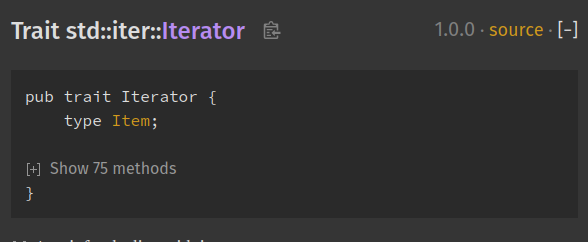
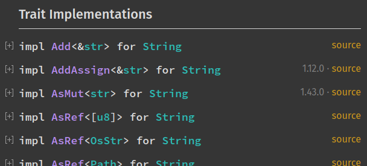

# Rustdoc in-doc settings

Rustdoc's HTML output includes a settings menu, and this chapter describes what
each setting in this menu does.

It can be accessed by clicking on the gear button
(<i class="fa fa-cog" aria-hidden="true"></i>) in the upper right.

## Changing displayed theme

It is possible to change the theme. If you pick the "system preference", you
will be able to see two new sub-menus: "Preferred light theme" and "Preferred
dark theme". It means that if your system preference is set to "light", then
rustdoc will use the theme you selected in "Preferred light theme".

## Auto-hide item contents for large items

If the type definition contains more than 12 items, and this setting is enabled,
it'll collapse them by default. You can see them by clicking on the `[+]` button
to expand them.

A good example of this setting in use can be seen in the
[`Iterator`](https://doc.rust-lang.org/stable/std/iter/trait.Iterator.html) doc
page:

## Auto-hide item methods' documentation

If enabled, this setting will collapse all trait implementations blocks. It is
convenient if you just want an overview of all the methods available. You can
still see a method's documentation by expanding it.

## Auto-hide trait implementation documentation

If enabled, this setting will collapse all trait implementations blocks (you can
see them in the "Trait Implementations" section). It is convenient if you just
want an overview of all the trait implemented on a type. You can still see
a trait implementation's associated items by expanding it.

Example:

## Directly go to item in search if there is only one result

If this setting is enabled, you will directly be taken to the result page if
your search only returned one element. Useful if you know exactly what you're
looking for and want to be taken there directly and not waste time selecting the
only search result.

## Show line numbers on code examples

If enabled, this setting will add line numbers to the code examples in the
documentation. It provides a visual aide for the code reading.

## Disable keyboard shortcuts

If this setting is enabled, the keyboard shortcuts will be disabled. It's useful
in case some of these shortcuts are already used by a web extension you're
using.

To see the full list of the rustdoc keyboard shortcuts, you can open the help
menu (the button with the question mark on the left of the setting menu button).
