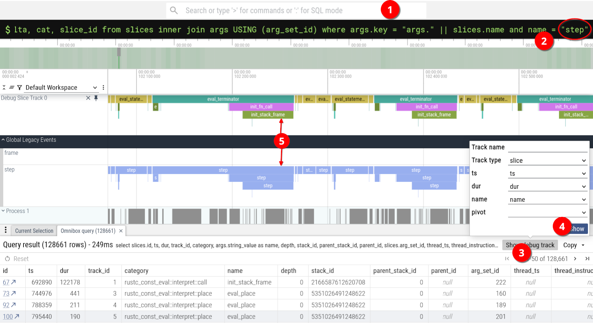

# Documentation for the tracing infrastructure in Miri

Miri can be traced to understand how much time is spent in its various components (e.g. borrow tracker, data race checker, etc.). When tracing is enabled, running Miri will create a `.json` trace file that can be opened and analyzed in [Perfetto](https://ui.perfetto.dev/). For any questions regarding this documentation you may contact [Stypox](https://rust-lang.zulipchat.com/#narrow/dm/627563-Stypox) on Zulip.

## Obtaining a trace file

### From the Miri codebase

All of the tracing functionality in Miri is gated by the `"tracing"` feature flag to ensure it does not create any overhead when unneeded. To compile Miri with this feature enabled, you can pass `--features=tracing` to `./miri`. Then, to make running Miri actually produce a trace file, you also need to set the `MIRI_TRACING` environment variable. For example:

```sh
MIRI_TRACING=1 ./miri run --features=tracing ./tests/pass/hello.rs
```

### From the rustc codebase

If you are building Miri from within the rustc tree, you need to enable the `"tracing"` feature by adding this line to `bootstrap.toml`:

```toml
build.tool.miri.features = ["tracing"]
```

And then you could run the following:

```sh
MIRI_TRACING=1 ./x.py run miri --stage 1 --args ./src/tools/miri/tests/pass/hello.rs
```

### The trace file

After running Miri with tracing enabled you will get a `.json` trace file that contains a list of all events and spans that occurred throughout the execution. The file follows [this format](https://docs.google.com/document/d/1CvAClvFfyA5R-PhYUmn5OOQtYMH4h6I0nSsKchNAySU/preview).

## Analyzing a trace file

To analyze traces you can use [Perfetto UI](https://ui.perfetto.dev/), a trace analyzer made by Google that was originally a part of the Chrome browser. Just open Perfetto and drag and drop the `.json` file there. Official documentation for the controls in the UI can be found [here](https://perfetto.dev/docs/visualization/perfetto-ui).

### The timeline

You will see the boxes "Global Legacy Events" and "Process 1" on the left of the workspace: after clicking on either of them their timeline will expand and you will be able to zoom in and look at individual spans (and events).

- "Process 1" contains tracing spans for the various components of Miri, all in a single timeline line (e.g. borrow tracker, data race checker, etc.)
- "Global Legacy Events" contains auxiliary spans on two separate lines that allow understanding what code is being executed at any point in time:
    - "frame": what is the current stack frame in the interpreted program
    - "step": what statement/terminator in the MIR of the interpreted program is being executed

Spans are represented as colored boxes in the timeline, while instantaneous events are represented by tiny arrows. (Events exist because rustc and Miri also use the `tracing` crate for debug logging, and those logs turn into events in the trace.)


### Span/event data

You can click on a span or an event to get more information about it, including some arguments that were passed when the span/event was entered/fired. In the following screenshot you can see the details of a "layouting" span that was generated by the following line in Miri's code:

```rust
let _trace = enter_trace_span!(M, layouting::fn_abi_of_instance, ?instance, ?extra_args);
```


### SQL tables

Perfetto supports querying the span/event database using SQL queries (see the [docs](https://perfetto.dev/docs/analysis/perfetto-sql-syntax)). Just type `:` in the search bar at the top to enter SQL mode, and then you will be able to enter SQL queries there. The relevant SQL tables are:
- `slices`: contains all spans and events; events can be distinguished from spans since their `dur` is 0. Relevant columns are:
    - `id`: a unique primary-key ID for the span (assigned by Perfetto, not present in the trace file)
    - `ts` and `dur`: the beginning and duration of the span, in nanoseconds
    - `name`: the name of the span
    - `parent_id`: the parent span ID, or null if there is no parent (assigned by Perfetto based on the timing at which spans occur, i.e. two nested spans must be one the child of the other)
    - `arg_set_id`: a foreign key into the table of arguments (1-to-N)
- `args`: contains all of the arguments of the various events/spans. Relevant columns are:
    - `arg_set_id`: the key used to join the slices and args tables
    - `key`: the name of the argument prepended with "args."
    - `display_value`: the value of the argument

Some useful queries are provided in the following sections.

### Enhancing the timeline

On the "Process 1" timeline line there are some spans with the same name, that are actually generated from different places in Miri's code. In those cases the span name indicates the component that was invoked (e.g. the data race checker), but not the specific function that was run. To inspect the specific function, we store a "subname" in an argument with the same name as the span, which unfortunately can be seen only after clicking on the span.

To make it quicker to look at subnames, you can add a new timeline line that specifically shows the subnames for spans with a specific name. To do so:
1. select any span with the name you care about (call this name `$NAME`)
2. click on the dropdown highlighted in blue next on the argument with name `$NAME` (or `args.$NAME`)
3. click on "Visualize argument values"
4. a new timeline line will appear with only spans originally named `$NAME`, but now with the subname displayed instead

The following screenshot shows the 4 steps for spans named "data_race":


### Visualizing which "frame" or "step" is being executed

Unfortunately the instructions in [Enhancing the timeline](#enhancing-the-timeline) only work well with spans under "Process 1", but misbehave with spans under "Global Legacy Events" (see the screenshot below). This might be a bug in Perfetto, but nevertheless a workaround is available:

1. click on the search bar at the top and write `:` to enter SQL mode
2. copy-paste the following SQL, replace "SPAN_NAME" at the end with either "frame" or "step" (i.e. one of the two span names under "Global Legacy Events"), and press Enter to execute it:
    ```sql
    select slices.id, ts, dur, track_id, category, args.string_value as name, depth, stack_id, parent_stack_id, parent_id, slices.arg_set_id, thread_ts, thread_instruction_count, thread_instruction_delta, cat, slice_id
    from slices inner join args using (arg_set_id)
    where args.key = "args." || name and name = "SPAN_NAME"
    ```
3. at the top-right of the box at the bottom, click on "Show debug track"
4. press on "Show" in the popup that just appeared
5. a new debug track will appear with the names of steps or frames

What the SQL does is to select only spans with the name "SPAN_NAME" and keep all of the span fields untouched, except for the name which is replaced with the subname. As explained in [Enhancing the timeline](#enhancing-the-timeline), remember that the subname is stored in an argument with the same name as the span.




### Compute aggregate statistics

The simplest way to get aggregate statistics about a time range is to:

1. select a time range by drag-clicking along a trace line
2. click on the "Current Selection" tab at the bottom if it's not already open
3. see various tables/visualizations of how much time is spent in each span by clicking on "Slices", "Pivot Table" or "Slice Flamegraph"

Note that the numbers shown in the "Slices" and "Pivot Table" tabs also include nested spans, so they cannot be used to compute statistics such as "X% of time is spent in spans named Y" because two spans named Y might be nested and their duration would be counted twice. For such statistics use the method in [Compute aggregate statistics (enhanced)](#compute-aggregate-statistics-enhanced).


### Compute aggregate statistics (enhanced)

The following (long but not complicated) query can be used to find out how much time is spent in spans (grouped by their name). Only spans without a parent are considered towards the computations (see `where parent_id is null`): so for example if `validate_operand` in turn calls `layouting` (which generates a nested/child span), only the `validate_operand` statistics are increased. This query also excludes auxiliary spans (see `name != "frame" and name != "step"`).

Note that this query does not allow selecting a time range, but that can be done by adding a condition, e.g. `ts + dur > MIN_T and ts < MAX_T` would match only spans that intersect the range `(MIN_T, MAX_T)`. Remember that the time unit is nanoseconds.

```sql
select "TOTAL PROGRAM DURATION" as name, count(*), max(ts + dur) as "sum(dur)", 100.0 as "%", null as "min(dur)", null as "max(dur)", null as "avg(dur)", null as "stddev(dur)"
from slices

union select "TOTAL OVER ALL SPANS (excluding events)" as name, count(*), sum(dur), cast(cast(sum(dur) as float) / (select max(ts + dur) from slices) * 1000 as int) / 10.0 as "%", min(dur), max(dur), cast(avg(dur) as int) as "avg(dur)", cast(sqrt(avg(dur*dur)-avg(dur)*avg(dur)) as int) as "stddev(dur)"
from slices
where parent_id is null and name != "frame" and name != "step" and dur > 0

union select name, count(*), sum(dur), cast(cast(sum(dur) as float) / (select max(ts + dur) from slices) * 1000 as int) / 10.0 as "%", min(dur), max(dur), cast(avg(dur) as int) as "avg(dur)", cast(sqrt(avg(dur*dur)-avg(dur)*avg(dur)) as int) as "stddev(dur)"
from slices
where parent_id is null and name != "frame" and name != "step"
group by name
order by sum(dur) desc, count(*) desc
```

This is the kind of table you would get out:


### Statistics about subnames of a span

Use the following SQL to see statistics about the subnames of spans with the same name (replace "SPAN_NAME" with the name of the span you want to see subname statistics of):

```sql
select args.string_value as name, count(*), sum(dur), min(dur), max(dur), cast(avg(dur) as int) as "avg(dur)", cast(sqrt(avg(dur*dur)-avg(dur)*avg(dur)) as int) as "stddev(dur)"
from slices inner join args using (arg_set_id)
where args.key = "args." || name and name = "SPAN_NAME"
group by args.string_value
order by count(*) desc
```

For example, this is the table of how much time is spent in each borrow tracker function: 


### Finding long periods of time without any tracing

The following SQL finds the longest periods of time where time is being spent, with the ability to click on IDs in the table of results to quickly reach the corresponding place. This can be useful to spot things that use up a significant amount of time but that are not yet covered by tracing calls.

```sql
with ordered as (
    select s1.*, row_number() over (order by s1.ts) as rn
    from slices as s1
    where s1.parent_id is null and s1.dur > 0 and s1.name != "frame" and s1.name != "step"
)
select a.ts+a.dur as ts, b.ts-a.ts-a.dur as dur, a.id, a.track_id, a.category, a.depth, a.stack_id, a.parent_stack_id, a.parent_id, a.arg_set_id, a.thread_ts, a.thread_instruction_count, a.thread_instruction_delta, a.cat, a.slice_id, "empty" as name
from ordered as a inner join ordered as b on a.rn=b.rn-1
order by b.ts-a.ts-a.dur desc
```

### Saving Perfetto's state as a preset

Unfortunately Perfetto does not seem to support saving the UI state as a preset that can be used to repeat the same analysis on multiple traces. You have to click through the various menus or run the various SQL queries every time to setup the UI as you want.

## Adding new tracing calls to the code

### The "tracing" feature

Miri is highly interconnected with `rustc_const_eval`, and therefore collecting proper trace data about Miri also involves adding some tracing calls within `rustc_const_eval`'s codebase. As explained in [Obtaining a trace file](#obtaining-a-trace-file), tracing calls are disabled (and optimized out) when Miri's "tracing" feature is not enabled. However, while it is possible to check for the feature from Miri's codebase, it's not possible to do so from `rustc_const_eval` (since it's a separate crate, and it's even in a precompiled `.rlib` in case of out-of-tree builds).

The solution to make it possible to check whether tracing is enabled at compile time even in `rustc_const_eval` was to add a function with this signature to the `Machine` trait:
```rust
fn enter_trace_span(span: impl FnOnce() -> tracing::Span) -> impl EnteredTraceSpan
```

where `EnteredTraceSpan` is just a marker trait implemented by `()` and `tracing::span::EnteredSpan`. This function returns `()` by default (without calling the `span` closure), except in `MiriMachine` where if tracing is enabled it will return `span().entered()`.

The code in `rustc_const_eval` calls this function when it wants to do tracing, and the compiler will (hopefully) optimize out tracing calls when tracing is disabled.

### The `enter_trace_span!()` macro

To add tracing to a section of code in Miri or in `rustc_const_eval`, you can use the `enter_trace_span!()` macro, which takes care of the details explained in [The "tracing" feature](#the-tracing-feature).

The `enter_trace_span!()` macro accepts the same syntax as `tracing::span!()` ([documentation](https://docs.rs/tracing/latest/tracing/#using-the-macros)) except for a few customizations, and returns an already entered trace span. The returned value is a drop guard that will exit the span when dropped, so **make sure to give it a proper scope** by storing it in a variable like this:

```rust
let _trace = enter_trace_span!("My span");
```

When calling this macro from `rustc_const_eval` you need to pass a type implementing the `Machine` trait as the first argument (since it will be used to call `Machine::enter_trace_span()`). This is usually available in various parts of `rustc_const_eval` under the name `M`, since most of `rustc_const_eval`'s code is `Machine`-agnostic.

```rust
let _trace = enter_trace_span!("My span");    // from Miri
let _trace = enter_trace_span!(M, "My span"); // from rustc_const_eval
```

You can make sense of the syntaxes explained below also by looking at this Perfetto screenshot from [Span/event data](#spanevent-data).


### Syntax accepted by `tracing::span!()`

The full documentation for the `tracing::span!()` syntax can be found [here](https://docs.rs/tracing/latest/tracing/#using-the-macros) under "Using the Macros". A few possibly confusing syntaxes are listed here:
```rust
// logs a span named "hello" with a field named "arg" of value 42 (works only because
// 42 implements the tracing::Value trait, otherwise use one of the options below)
let _trace = enter_trace_span!(M, "hello", arg = 42);
// logs a field called "my_display_var" using the Display implementation
let _trace = enter_trace_span!(M, "hello", %my_display_var);
// logs a field called "my_debug_var" using the Debug implementation
let _trace = enter_trace_span!(M, "hello", ?my_debug_var);
```

### `NAME::SUBNAME` syntax

In addition to the syntax accepted by `tracing::span!()`, the `enter_trace_span!()` macro optionally allows passing the span name (i.e. the first macro argument) in the form `NAME::SUBNAME` (without quotes) to indicate that the span has name "NAME" (usually the name of the component) and has an additional more specific name "SUBNAME" (usually the function name). The latter is passed to the tracing crate as a span field with the name "NAME". This allows not being distracted by subnames when looking at the trace in Perfetto, but when deeper introspection is needed within a component, it's still possible to view the subnames directly with a few steps (see [Enhancing the timeline](#enhancing-the-timeline)).
```rust
// for example, the first will expand to the second
let _trace = enter_trace_span!(M, borrow_tracker::on_stack_pop);
let _trace = enter_trace_span!(M, "borrow_tracker", borrow_tracker = "on_stack_pop");
```

### `tracing_separate_thread` parameter

Miri saves traces using the the `tracing_chrome` `tracing::Layer` so that they can be visualized in Perfetto. To instruct `tracing_chrome` to put some spans on a separate trace thread/line than other spans when viewed in Perfetto, you can pass `tracing_separate_thread = tracing::field::Empty` to the tracing macros. This is useful to separate out spans which just indicate the current step or program frame being processed by the interpreter. As explained in [The timeline](#the-timeline), those spans end up under the "Global Legacy Events" track. You should use a value of `tracing::field::Empty` so that other tracing layers (e.g. the logger) will ignore the `tracing_separate_thread` field. For example:
```rust
let _trace = enter_trace_span!(M, step::eval_statement, tracing_separate_thread = tracing::field::Empty);
```

### Executing something else when tracing is disabled

The `EnteredTraceSpan` trait contains a `or_if_tracing_disabled()` function that you can use to e.g. log a line as an alternative to the tracing span for when tracing is disabled. For example:
```rust
let _trace = enter_trace_span!(M, step::eval_statement)
    .or_if_tracing_disabled(|| tracing::info!("eval_statement"));
```

## Implementation details

Here we explain how tracing is implemented internally.

The events and spans generated throughout the codebase are collected by [the `tracing` crate](https://crates.io/crates/tracing), which then dispatches them to the code that writes to the trace file, but also to the logger if logging is enabled. 

### Choice of tracing library

The crate that was chosen for collecting traces is [tracing](https://crates.io/crates/tracing), since:
- it is very well maintained
- it supports various different trace formats through plug-and-play `Layer`s (in Miri we are using `tracing_chrome` to export traces for perfetto, see [The `tracing_chrome` layer](#the-tracing_chrome-layer))
- spans and events are collected with not just their name, but also file, line, module, and any number of custom arguments
- it was already used in Miri and rustc as a logging framework 

One major drawback of the tracing crate is, however, its big overhead. Entering and exiting a span takes on the order of 100ns, and many of Miri's spans are shorter than that, so their measurements are completely off and the program execution increases significantly. E.g. at the point of writing this documentation, enabling tracing makes Miri 5x slower. Note that this used to be even worse, see [Time measurements](#time-measurements).

### The `tracing_chrome` layer

Miri uses [tracing-chrome](https://github.com/thoren-d/tracing-chrome) as the `Layer` that collects spans and events from the tracing crate and saves them to a file that can be opened in Perfetto. Although the crate [is published](https://crates.io/crates/tracing-chrome) on crates.io, it was not possible to depend on it from Miri, because it would bring in a separate compilation of the `tracing` crate. This is because Miri does not directly depend on `tracing`, and instead uses rustc's version through rustc-private, and apparently cargo can't realize that the same library is being built again when rustc-private is involved.

So the solution was to copy-paste [the only file](https://github.com/thoren-d/tracing-chrome/blob/develop/src/lib.rs) in tracing-chrome into Miri. Nevertheless, this gave the possibility to make some changes to tracing-chrome, which you can read about in documentation at the top of [the file](https://github.com/rust-lang/miri/blob/master/src/bin/log/tracing_chrome.rs) that was copied to Miri.

### Time measurements

tracing-chrome originally used `std::time::Instant` to measure time, however on some x86/x86_64 Linux systems it might be unbearably slow since the underlying system call (`clock_gettime`) would take ≈1.3µs. Read more [here](https://btorpey.github.io/blog/2014/02/18/clock-sources-in-linux/) about how the Linux kernel chooses the clock source.

Therefore, on x86/x86_64 Linux systems with a CPU that has an invariant TSC counter, we read from that instead to measure time, which takes only ≈13ns. There are unfortunately a lot of caveats to this approach though, as explained [in the code](https://github.com/rust-lang/miri/blob/master/src/bin/log/tracing_chrome_instant.rs) and [in the PR](https://github.com/rust-lang/miri/pull/4524). The most impactful one is that: every thread spawned in Miri that wants to trace something (which requires measuring time) needs to pin itself to a single CPU core (using `sched_setaffinity`).

## Other useful stuff

### Making a flamegraph

After compiling Miri, you can run the following command to make a flamegraph using Linux' `perf`. It can be useful to spot functions that use up a significant amount of time but that are not yet covered by tracing calls.

```sh
perf record  --call-graph dwarf -F 999 ./miri/target/debug/miri --edition 2021 --sysroot ~/.cache/miri ./tests/pass/hashmap.rs && perf script | inferno-collapse-perf | inferno-flamegraph > flamegraph.svg
```
