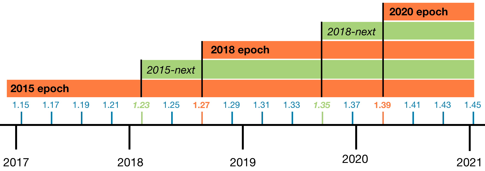

- Feature Name: N/A
- Start Date: 2017-06-26
- RFC PR: (leave this empty)
- Rust Issue: (leave this empty)

# Summary
[summary]: #summary

There has been a long-standing question around Rust's evolution: will there ever
be a Rust 2.0, in the semver sense?

This RFC gives the answer: certainly not in the foreseeable future, and probably
not ever.

Instead, this RFC proposes *epochs*, a mechanism for language evolution without
breakage, which fits neatly into Rust's existing train and release channel
process. It's an attempt to provide the next stage of our core principle of
[stability without stagnation], inspired in part by similar mechanisms in
languages like C++ and Java.

With epochs, it becomes possible to do things like introduce new keywords,
without breaking existing code or splitting the ecosystem. Each crate specifies
the epoch it fits within (a bit like "C++11" or "C++14"), and the compiler can
cope with multiple epochs being used throughout a dependency graph. Thus, we
continue to guarantee that your code will always continue to compile on the
latest stable release (modulo the [usual caveats]), while making it possible to
evolve the language in some new ways.

[stability without stagnation]: https://blog.rust-lang.org/2014/10/30/Stability.html

# Motivation
[motivation]: #motivation

## The status quo

Today, Rust evolution happens steadily through a combination of several mechanisms:

- **The nightly/stable release channel split**. Features that are still under
  development are usable *only* on the nightly channel, preventing *de facto*
  lock-in and thus leaving us free to iterate in ways that involve code breakage
  before "stabilizing" the feature.

- **The rapid (six week) release process**. Frequent releases on the stable
  channel allow features to stabilize as they become ready, rather than as part
  of a massive push toward an infrequent "feature-based" release. Consequently,
  Rust evolves in steady, small increments.

- **Deprecation**. Compiler support for deprecating language features and
  library APIs makes it possible to nudge people toward newer idioms without
  breaking existing code.

All told, the tools work together quite nicely to allow Rust to change and grow
over time, while keeping old code working (with only occasional, very minor
adjustments to account for things like changes to type inference.)

## What's missing

So, what's the problem?

There are two desires that the current process doesn't have a good story for:

- **Changes that may require some breakage in corner cases**. The simplest
  example is adding new keywords: the current implementation of `catch` uses the
  syntax `do catch` because `catch` is not a keyword, and cannot be added even
  as a contextual keyword without potential breakage. There are plenty of
  examples of "superficial" breakage like this that do not fit into the current
  evolution mechanisms.

- **Lack of clear "chapters" in the evolutionary story**. A downside to rapid
  releases is that, while the constant small changes eventually add up to large
  shifts in idioms, there's not an agreed upon line of demarcation between these
  major shifts. That is, we don't have a coherent way to talk about these
  shifts, nor to explain the "big steps" Rust is taking when we talk to those
  outside the Rust community. If you think about the combination of `?` syntax,
  ATCs, `impl Trait`, and specialization all becoming available, for example,
  it's very helpful to have an umbrella moniker like "Rust 2018" to refer to
  that encompasses them all, and the new idioms they lead to.

At the same time, the commitment to stability and rapid releases has been an
incredible boon for Rust, and we don't want to give up those existing mechanisms.

This RFC proposes *epochs* as a mechanism we can layer on top of our existing
release process, keeping its guarantees while addressing its gaps.

# Detailed design
[design]: #detailed-design

## The basic idea

Here's the core idea:

- An *epoch* represents a major shift in Rust features and idioms.

- Epochs are named by the year in which they are introduced, but we do not
  expect a new epoch every year. (At the outset, one epoch every two years is
  more likely; see the next section for more.)

- Each **crate** declares an epoch in its `Cargo.toml` (or, if not, is assumed
  to have epoch 2015, coinciding with Rust 1.0): `epoch = "2018"`. Thus, new
  epochs are *opt in*, and the dependencies of a crate may use older or newer
  epochs than the crate itself.

To be crystal clear: Rust compilers are expected to support multiple epochs, and
a crate dependency graph may involve several different epochs
simultaneously. Thus, **epochs do not split the ecosystem nor do they break
existing code**.

Furthermore:

- Prior to a new epoch, the current epoch will gain a set of deprecations over time.
- When cutting a new epoch, existing deprecations may turn into hard errors, and
  the epoch may take advantage of that fact to repurpose existing usage,
  e.g. introducing a new keyword. This is the only kind of change a new epoch
  can make.

Code that compiles without warnings on the previous epoch (under the latest
compiler release) will compile without warnings or errors on the next epoch
(modulo the [usual caveats] about type inference changes and so
on). Alternatively, you can continue working with the previous epoch on new
compiler releases indefinitely, but your code may not have access to new
features that require new keywords and the like.

[usual caveats]: https://github.com/rust-lang/rfcs/blob/master/text/1122-language-semver.md

## Epoch timing, stabilizations, and the roadmap process

While this RFC will focus largely on the mechanics around deprecation, a key
point is that epochs also give a *name* to large idiom shifts, recognizing that
a significant, coherent set of new features have stabilized and should change
the way you write code and construct APIs.

The proposal is much akin to C++ standards, which are tied to particular years
(e.g. C++11, C++14). Each of these versions represents major enhancements to the
language and changes to idioms. Compilers generally take flags to let you select
*which* standard you wish to compile against. Many other languages (like Java)
take a similar approach.

To some degree, you can understand these as "marketing" releases; they bundle
together a set of changes into a coherent package that's easy to talk about. But
the benefits go beyond marketing: it becomes much easier, on a blog post, to
give context about *which era* of the language you're using without specifying a
particular compiler version.

In the Rust world, we want to layer this kind of narrative on top of our
existing release and roadmap process:

- As today, each year has a [roadmap setting out that year's vision]. Some
  years---like 2017---the roadmap is mostly about laying down major new
  groundwork. Some years, however, they roadmap explicitly proposes to declare a
  new epoch during the year.

- Epoch years are focused primarily on *stabilization* and *polish*. We are
  trying to put together and ship a coherent product, complete with
  documentation and a well-aligned ecosystem. These goals will provide a
  rallying point for the whole community, to put our best foot forward as we
  publish a significant new version of the project.

[roadmap laying out that year's vision]: https://github.com/rust-lang/rfcs/pull/1728

You can see this process graphically below:

The diagram shows every other compiler release due to space constraints. The
releases in red, bold text represent the compiler supporting a new epoch.

Vitally, the rapid release process---including stabilization---continues just as
today. In particular, **epoch releases are *not* feature-based**; there is no
commitment to ship a particular set of features with the first compiler version
supporting a new epoch, and features that miss that original release will
continually have additional chances to stabilize afterward, still within that
epoch. On the other hand, when we declare an epoch year in the roadmap, we will
likely have a pretty decent chance of what's *likely* to ship as stable in the
first epoch release.

### Epoch previews

To make this work, we need one additional concept: epoch *previews*, denoted in
the figure as green, italic compiler releases.

The problem is that for changes that rely on a new epoch, such as introducing a
new keyword, we cannot stabilize them within the existing epoch as-is; that
would be a breaking change. On the other hand, we *want* to stabilize them as
they become ready, rather than tying all of the stabilizations to a high-stakes
epoch release.

We thread the needle by providing an *epoch preview* at some point prior to the
new epoch being shipped: `epoch = "2018-preview"`. This preview includes *all*
of the hard errors that will be introduced in the new epoch, but not yet all of
the stabilizations. It is usable from the stable channel.

There are a few reasons to provide such a preview:

- Most importantly, it clears the way to shipping features for the next epoch on
  the stable channel as they become ready, even if they require some existing
  usages to become errors. Again, keyword introduction is a simple example: the
  `2018-preview` epoch can begin by making it a hard error to use `catch` as an
  identifier (which is allowed today), and then later stabilizing the new
  `catch` feature when it is ready. By "locking in" the hard errors up front,
  however, **the preview of the epoch is guaranteed to be stable**: once code
  compiles on the preview epoch, it will continue to do so as further features
  stabilize.

- The preview epoch also gives a clear picture of exactly what deprecations will
  become errors in the next epoch, providing a nice way to future-proof your
  code for upgrading to the epoch when available.

Putting this all together, in an "epoch year" the roadmap will lay out an
expected set of deprecations-to-become-errors and potential features; early in
the year, an epoch preview will be released which makes all the slated
deprecations into errors. As the year progresses, features will continue
stabilize but some may only be available by opting into the preview epoch (since
they rely on e.g. new keywords). Finally, when we're ready to ship the full new
product, we enable the new epoch and deprecate the preview version (which will
behave identically to it).

There are some alternative ways to achieve similar ends, but with significant
downsides; these are explored in the Alternatives section.

## Constraints on epoch changes

We have already constrained epochal changes to essentially removing deprecations
(and thus making way for new features). But we want to further constrain them,
for two reasons:

- **Limiting technical debt**. The compiler retains compatibility for old
  epochs, and thus must have distinct "modes" for dealing with them. We need to
  strongly limit the amount and complexity of code needed for these modes, or
  the compiler will become very difficult to maintain.

- **Limiting deep conceptual changes**. Just as we want to keep the compiler
  maintainable, so too do we want to keep the conceptual model sustainable. That
  is, if we make truly radical changes in a new epoch, it will be very difficult
  for people to reason about code involving different epochs, or to remember the
  precise differences.

As such, the RFC proposes to limit epochal changes to be "superficial",
i.e. occurring purely in the early front-end stages of the compiler. More
concretely:

- We identify "core Rust" as being, roughly, MIR and the core trait system.
  - Over time, we'll want to make this definition more precise, but this is best
    done in an iterative fashion rather than specified completely up front.
- Epochs can only change the front-end translation into core Rust.

Hence, **the compiler supports only a single version of core Rust**; all the
"epoch modes" boil down to keeping around multiple desugarings into this core
Rust, which greatly limits the complexity and technical debt involved. Similar,
core Rust encompasses the core *conceptual* model of the language, and this
constraint guarantees that, even when working with multiple epochs, those core
concepts remain fixed.

Incidentally, these constraints also mean that epochal changes should be
amenable to a `rustfix` tool that automatically, and perfectly, upgrades code to
a new epoch. It's an open question whether we want to *require* such a tool
before introducing a new epoch.

### What epochs can do

Given those basics, let's look in more detail at a few examples of the kinds of
changes epochs enable. These are just examples---this RFC doesn't entail any
commitment to these language changes.

#### Example: new keywords

We've taken as a running example introducing new keywords, which sometimes
cannot be done backwards compatibly (because a contextual keyword isn't
possible). Let's see how this works out for the case of `catch`.

- First, we deprecate uses of `catch` as identifiers, preparing it to become a new keyword.
- We may, as today, implement the new `catch` feature using a temporary syntax
  for nightly (like `do catch`).
- When the next epoch preview is released, opting into it makes `catch` into a
  keyword, regardless of whether the `catch` feature has been implemented.
- The `catch` syntax can be hooked into an implementation usable on nightly with
  the preview epoch.
- When we're confident in the `catch` feature on nightly, we can stabilize it
  *onto the preview epoch*. It cannot be stabilized onto the current epoch,
  since it requires a new keyword.
- At some point, the new epoch is fully shipped, removing the need for the preview epoch.
- `catch` is now a part of Rust.

#### Example: repurposing corner cases

A similar story plays out for more complex modifications that repurpose existing
usages. For example, some suggested module system improvements (not yet in RFC)
deduce the module hierarchy from the filesystem. But there is a corner case
today of providing both a `lib.rs` and a `bin.rs` directly at the top level,
which doesn't play well with the new feature.

Using epochs, we can deprecate such usage (in favor of the `bin` directory),
then make it an error on the preview epoch. The module system change could then
be made available (and ultimately stabilized) within the preview epoch, before
shipping on the next epoch.

#### Example: repurposing syntax

A more radical example: changing the syntax for trait objects and `impl
Trait`. In particular, we have
sometimes [discussed](https://github.com/rust-lang/rfcs/pull/1603):

- Using `dyn Trait` for trait objects (e.g. `Box<dyn Iterator<Item = u32>>`)
- Repurposing "bare `Trait` to use instead of `impl Trait`, so you can write `fn
  foo() -> Iterator<Item = u32>` instead of `fn foo -> impl Iterator<Item =
  u32>`

Suppose we wanted to carry out such a change. We could do it over multiple steps:

- First, introduce and stabilize `dyn Trait`.
- Deprecate bare `Trait` syntax in favor of `dyn Trait`.
- In a preview epoch, make it an error to use bare `Trait` syntax.
- Ship the new epoch, and wait until bare `Trait` syntax is obscure.
- Re-introduce bare `Trait` syntax, stabilize it, and deprecate `impl Trait` in
  favor of it.

Of course, this RFC isn't suggesting that such a course of action is a *good*
one, just that it is *possible* to do without breakage.

#### Example: type inference changes

There are a number of details about type inference that seem suboptimal:

- Currently multi-parameter traits like `AsRef<T>` will infer the value of one
  parameter on the basis of the other. We would at least like an opt-out, but
  employing it for `AsRef` is backwards-incompatible.
- Coercions don’t always trigger when we wish they would, but altering the rules
  may cause other programs to stop compiling.
- In trait selection, where-clauses take precedence over impls; changing this is backwards-incompatible.

We may or may not be able to change these details on the existing epoch. With
enough effort, we could probably deprecate cases where type inference rules
might change and request explicit type annotations, and then—in the new
epoch—tweak those rules.

### What epochs can't do

There are also changes that epochs don't help with, due to the constraints we
impose. These limitations are extremely important for keeping the compiler
maintainable, the language understandable, and the ecosystem compatible.

#### Example: changes to coherence rules

Trait coherence rules, like the "orphan" rule, provide a kind of protocol about
which crates can provide which `impl`s. It's not possible to change protocol
incompatibly, because existing code will assume the current protocol and provide
impls accordingly, and there's no way to work around that fact via deprecation.

More generally, this means that epochs can only be used to make changes to the
language that are applicable *crate-locally*; they cannot impose new
requirements or semantics on external crates, since we want to retain
compatibility with the existing ecosystem.

#### Example: `Error` trait downcasting

See [rust-lang/rust#35943](https://github.com/mozilla/rust/issues/35943). Due to
a silly oversight, you can’t currently downcast the “cause” of an error to
introspect what it is. We can’t make the trait have stricter requirements; it
would break existing impls. And there's no way to do so only in a newer epoch,
because we must be compatible with the older one, meaning that we cannot rely on
downcasting.

This is essentially another example of a non-crate-local change.

## The full mechanics

We'll wrap up with the full details of the mechanisms at play.

- `rustc` will take a new flag, `--epoch`, which can specify the epoch to
  use. If this flag is left off, epoch 2015 is assumed.
  - This flag should not affect the behavior of the core trait system or passes at the MIR level.
- `Cargo.toml` can include an `epoch` value, which is used to pass to `rustc`.
- `cargo new` will produce a `Cargo.toml` with the latest `epoch` value,
  including `-preview` epochs when applicable.

# How We Teach This
[how-we-teach-this]: #how-we-teach-this

First and foremost, if we accept this RFC, we should publicize the plan widely,
including on the main Rust blog, in a style simlar to [previous posts] about our
release policy. This will require extremely careful messaging, to make clear
that epochs are *not* about breaking Rust code, but instead about providing
compatibility indefinitely while allowing for more forms of evolution than
today.

In addition, the book should talk about the basics from a user perspective,
including:

- The fact that, if you do nothing, your code should continue to compile (with
  minimum hassle) when upgrading the compiler.
- If you resolve deprecations as they occur, moving to a new epoch should also
  require minimum hassle.
- Best practices about upgrading epochs (TBD).

[previous posts]: https://blog.rust-lang.org/2014/10/30/Stability.html

# Drawbacks
[drawbacks]: #drawbacks

There are several drawbacks to this proposal:

- Most importantly, it risks muddying our story about stability, which we've
  worked very hard to message clearly.

  - To mitigate this, we need to put front and center that, **if you do nothing,
  updating to a new `rustc` should not be a hassle**, and **staying on an old
  epoch doesn't cut you off from the ecosystem**.

- It adds a degree of complication to an evolution story that is already
  somewhat complex (with release channels and rapid releases).

  - On the other hand, epoch releases can provide greater clarity about major
    steps in Rust evolution, for those who are not following development
    closely.

- New epochs can invalidate existing blog posts and documentation, a problem we
  suffered a lot around the 1.0 release

  - However, this situation already obtains in the sense of changing idioms; a
    blog post using `try!` these days already feels like it's using "old
    Rust". Notably, though, the code still compiles on current Rust.

  - A saving grace is that, with epochs, it's much more likely that a post will
    mention what epoch is being used, for context. Moreover, with sufficient
    work on error messages, it seems plausible to detect that code was intended
    for an earlier epoch and explain the situation.

These downsides are most problematic in cases that involve "breakage" if they
were done without opt in. They indicate that, even if we do adopt epochs, we
should use them judiciously.

# Alternatives
[alternatives]: #alternatives

## Within the basic epoch structure

Sticking with the basic idea of epochs, there are a couple alternative setups,
that avoid "preview" epochs.

- Rather than locking in a set of deprecations in a preview epoch, we could
  provide "stable channel feature gates", allowing users to opt in to features
  of the next epoch in a fine-grained way, which may introduce new errors.
  When the new epoch is released, one would then upgrade to it and remove all of the gates.

  - The main downside is lack of clarity about what the current "stable Rust"
    is; each combination of gates gives you a slightly different language. While
    this fine-grained variation is acceptable for nightly, since it's meant for
    experimentation, it cuts against some of the overall goals of this proposal
    to introduce such fragmentation on the stable channel.

- We could stabilize features using undesirable syntax at first, making way for
  better syntax only when the new epoch is released, then deprecate the "bad"
  syntax in favor of the "good" syntax.

  - For `catch`, this would look like:
    - Stabilize `do catch`.
    - Deprecate `catch` as an identifier.
    - Ship new epoch, which makes `catch` a keyword.
    - Stabilize `catch` as a syntax for the `catch` feature, and deprecate `do catch` in favor of it.
  - This approach involves significantly more churn than the one proposed in the RFC.

- Finally, we could just wait to stabilize features like `catch` until the
  moment the epoch is released.

  - This approach seems likely to introduce all the downsides of "feature-based"
    releases, making the epoch release extremely high stakes, and preventing
    usage of "ready to go" feature on the stable channel until the epoch is
    shipped.

## Alternatives to epochs

The larger alternatives include, of course, not trying to solve the problems
laid out in the motivation, and instead finding creative alternatives.

- For cases like `catch` that require a new keyword, it's not clear how to do
this without ending up with suboptimal syntax.

The other main alternative is to issue major releases in the semver sense: Rust
2.0. This strategy could potentially be coupled with a `rustfix`, depending on
what kinds of changes we want to allow. Downsides:

- Lack of clarity around ecosystem compatibility. If we allow both 1.0 and 2.0
  crates to interoperate, we arrive at something like this RFC. If we don't, we
  risk splitting the ecosystem, which is extremely dangerous.

- Likely significant blowback based on abandoning stability as a core principle
  of Rust. Even if we provide a perfect `rustfix`, the message is significantly muddied.

- Much greater temptation to make sweeping changes, and continuous litigation
  over what those changes should be.

# Unresolved questions
[unresolved]: #unresolved-questions

- It's not clear what the story should be for the books and other
  documentation. Should we gate shipping a new epoch on having a fully updated
  book? The preview epoch---and the fact that everything is shipped on stable
  prior to releasing the epoch---would make that plausible.

- Do we want to require a `rustfix` for all epoch changes?

- Will we ever consider dropping support for very old epochs? Given the
  constraints in this RFC, it seems unlikely to ever be worth it.
